#### 3.1 구성 파일에서 정의된 빈 간 관계 구현
#### 3.2 @Autowired 애너테이션을 사용한 빈 주입
#### 3.3 순환 의존성 다루기
#### 3.4 스프링 컨텍스트에서 여러 빈 중 선택하기
#### 3.5 요약

---

## 3.1 구성 파일에서 정의된 빈 간 관계 구현

- 빈 애너테이션으로 메서드를 지정하는 구성 클래스에서 정의된 두 빈 간 관계를 구현하는 방법을 배운다.
    - 빈을 생성하는 메서드를 직접 노출하여 빈을 연결한다. (와이어링)
    - 스프링이 메서드 매개변수를 이용하여 값을 제공하도록 활성화 한다. (오토와이어링)
- 와이어링, 오토와이어링 두 방식 모두 두 단계가 있다
  1. 2장에서 배운 대로 스프링 컨택스트에 사람과 앵무새 빈을 추가한다.
  2. 사람과 앵무새 사이의 관계를 설정한다.

  > 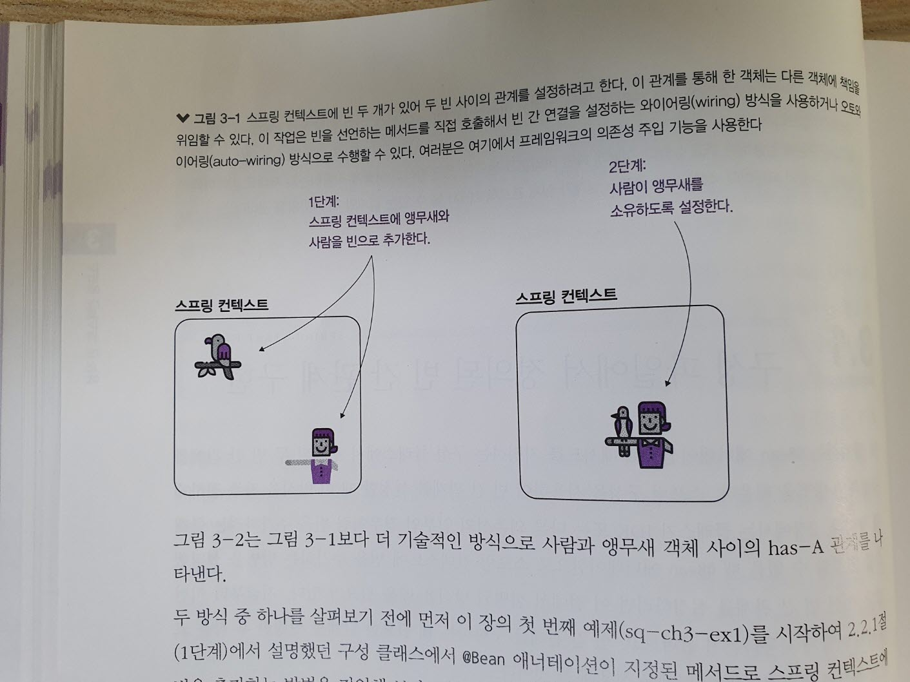
  > 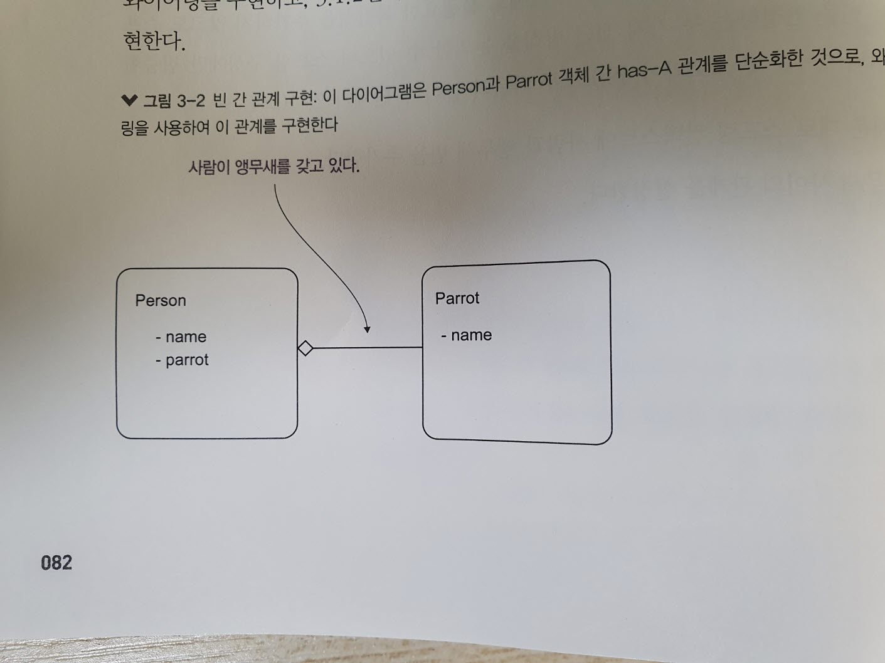

> pox.xml 파일에 의존성 추가

      <dependencies> 
        <dependency> 
            <groupId>org.springframework</groupId> 
            <artifactId>spring-context</artifactId> 
            <version>6.1.6</version> 
        </dependency>
      </dependencies>

> Parrot 클래스

    public class Parrot {

      private String name;
      public String getName() {
        return name;
      }

      public void setName(String name) {
        this.name = name;
      }

      @Override
      public String toString() {
        return "Parrot : " + name;
      }
    }

> Person 클래스

    public class Person {
    
      private String name;
      private Parrot parrot;

      public String getName() {
        return name;
      }

      public void setName(String name) {
        this.name = name;
      }

      public Parrot getParrot() {
        return parrot;
      }

      public void setParrot(Parrot parrot) {
        this.parrot = parrot;
      }

    }

> Person 및 Parrot 빈 정의하기

    @Configuration
    public class ProjectConfig {
    
        @Bean
        public Parrot parrot() {
            Parrot p = new Parrot();
            p.setName("Koko");
            return p;
        }
    
        @Bean
        public Person person() {
            Person p = new Person();
            p.setName("Ella");
            return p;
        }

    }

> Main 클래스 정의

    public class Main {
    
        public static void main(String[] args) {
            var context = new AnnotationConfigApplicationContext(ProjectConfig.class);  <-- 구성 클래스 기반으로 스프링 컨텍스트 인스턴스 생성
    
            Person person = context.getBean(Person.class); <-- 스프링 컨텍스트에서 Person 빈의 참조를 얻는다.
    
            Parrot parrot = context.getBean(Parrot.class); <-- 스프링 컨텍스트에서 Parrot 빈의 참조를 얻는다.
    
            System.out.println("Person's name: " + person.getName());
            System.out.println("Parrot's name: " + parrot.getName());
            System.out.println("Person's parrot: " + person.getParrot());
        }
    }

- Person's parrot: null 인 이유는 아직 아무런 관계설정이 되지 않았음을 의미

### 3.1.1 두 @Bean 메서드 간 직접 메서드를 호출하는 빈 작성

- person, parrot 간의 관계 설정

> 직접 메서드 호출을 사용하는 빈 간 링크 설정

    @Configuration
    public class ProjectConfig {
    
        @Bean
        public Parrot parrot() {
            Parrot p = new Parrot();
            p.setName("Koko");
            return p;
        }
    
        @Bean
        public Person person() {
            Person p = new Person();
            p.setName("Ella");
            p.setParrot(parrot()); <-- 사람의 앵무새 속성에 앵무새 빈의 참조를 설정한다.
            return p;
        }
    }

> 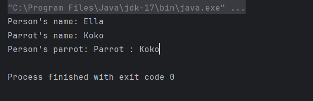
> 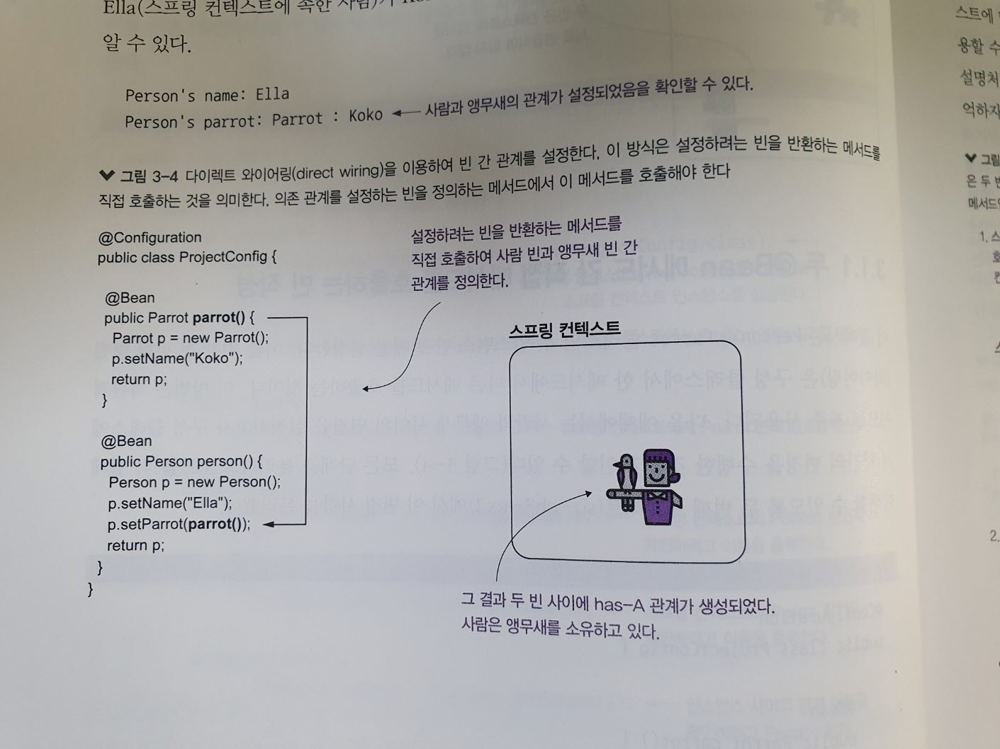

### Parrot 인스턴스의 중복생성인가?

- 스프링은 첫 번째 @Bean 애너테이션 메서드인 parrot()을 호출할 때 앵무새 인스턴스 생성
- 두 번째 @Bean 애너테이션 메서드 person() 을 호출 시 사람 인스턴스 생성
- person()이 parrot()을 직접 호출한다.

> 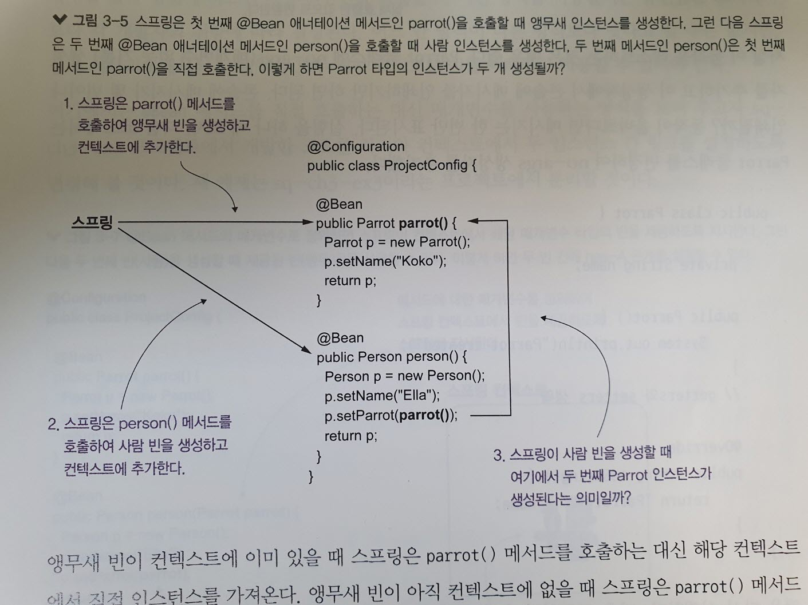

- 앵무새 빈이 컨텍스트에 이미 있을 때 스프링은 parrot() 메서드를 호출하는 대신 해당 컨텍스트에서 직접 인스턴스를 가져온다.
- 앵무새 빈이 아직 컨텍스트에 없을 때 스프링은 parrot() 메서드를 호출하고 빈을 반환한다.

> 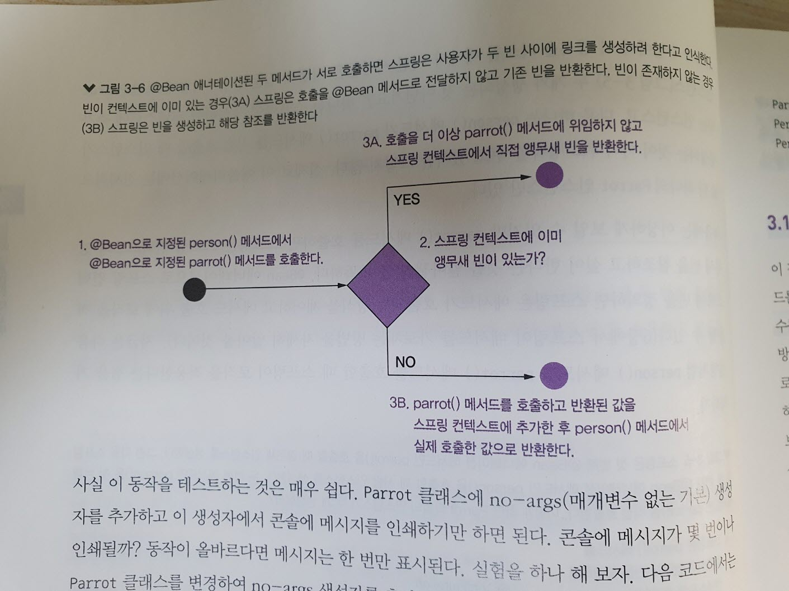

> 동작 테스트

    public class Parrot {
      private String name;
      
      public Parrot(){
        System.out.println("Parrot created");
      }

      public String getName() {
        return name;
      }

      public void setName(String name) {
        this.name = name;
      }

      @Override
      public String toString() {
        return "Parrot : " + name;
      }

    }

> 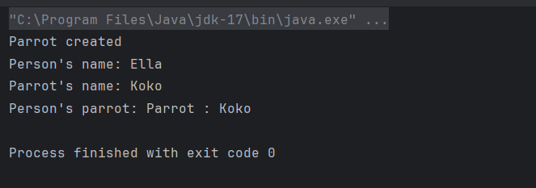

### 3.1.2 @Bean 메서드의 매개변수로 빈 와이어링 하기

- 빈 메서드의 직접 호출에 대한 대안을 알아보자.
- 참조하려는 빈을 정의하는 메서드를 직접 호출하는 대신 해당 객체 타입의 메서드에 매개변수를 추가하고 스프링이 해당 매개변수를 이용하여 값을 제공하는 것에 의존하는 방식이다.

> 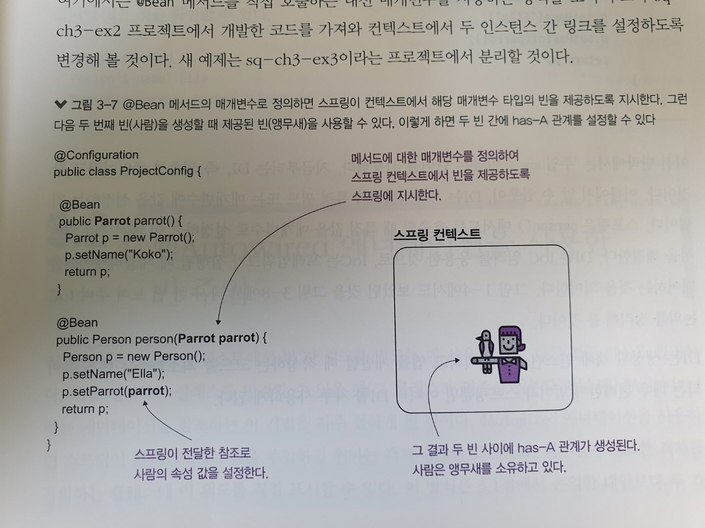

> 메서드의 매개변수를 사용하여 빈 의존성 주입하기

    @Configuration
    public class ProjectConfig {
    
        @Bean
        public Parrot parrot() {
            Parrot p = new Parrot();
            p.setName("Koko");
            return p;
        }
    
        @Bean
        public Person person(Parrot parrot) {  <-- 스프링은 이 매개변수에 빈을 주입한다.
            Person p = new Person();
            p.setName("Ella");
            p.setParrot(parrot());
            return p;
        }
    }

 - DI(Dependency injection) : 의존성 주입

> 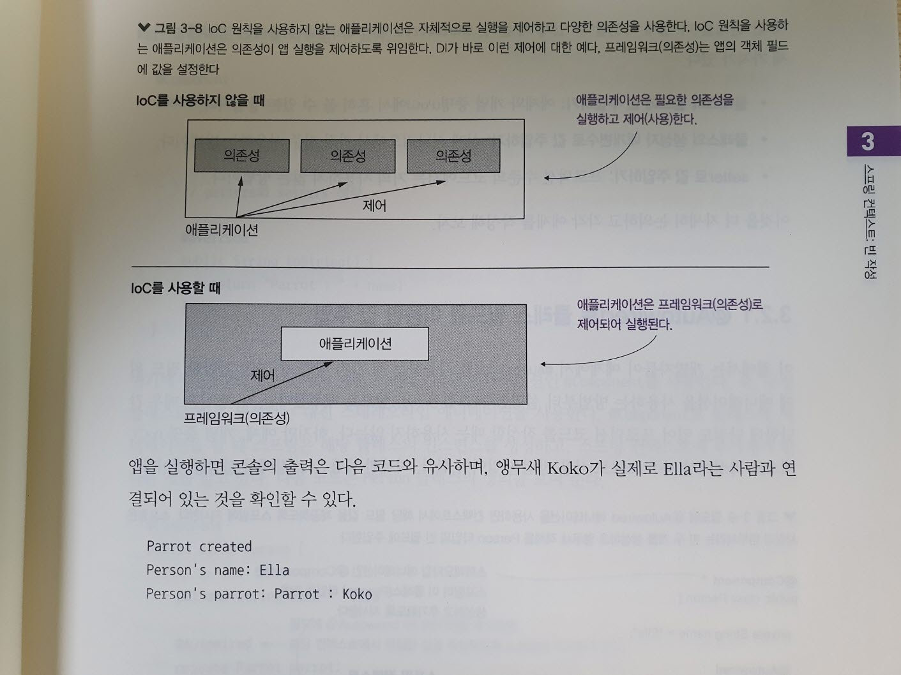

### 3.2 @Autowired 애너테이션을 사용한 빈 주입

- 스프링 컨텍스트에서 빈 간 링크를 만드는데 사용되는 또 다른 접근 방식을 설명한다.
- 빈을 정의하는 클래스를 뵨경할 수 있을 때 @Autowired 참조 기법을 자주 접하게 될 것이다.
    - 클래스의 필드에 값 주입하기 : 예제와 개념 증명에서 흔히 볼 수 있는 방법.
    - 클래스의 생성자 매개변수로 값 주입하기 : 실제 시나리오에서 가장 자주 사용하는 방법이다.
    - setter로 값 주입하기 : 프로덕션 수준의 코드에서 거의 사용하지 않는다.

### 3.2.1 @Autowired 로 클래스 필드를 이용한 값 주입

- 필드 위에 애너테이션을 사용하는 방법

> @Autowired 를 사용하면 컨텍스트에서 해당 필드 값을 제공하도록 스프링에서 지시하고 사람과 앵무새 빈 두 개를 생성하고 앵무새 객체를 Person 타입의 빈 필드에 주입한다.

> 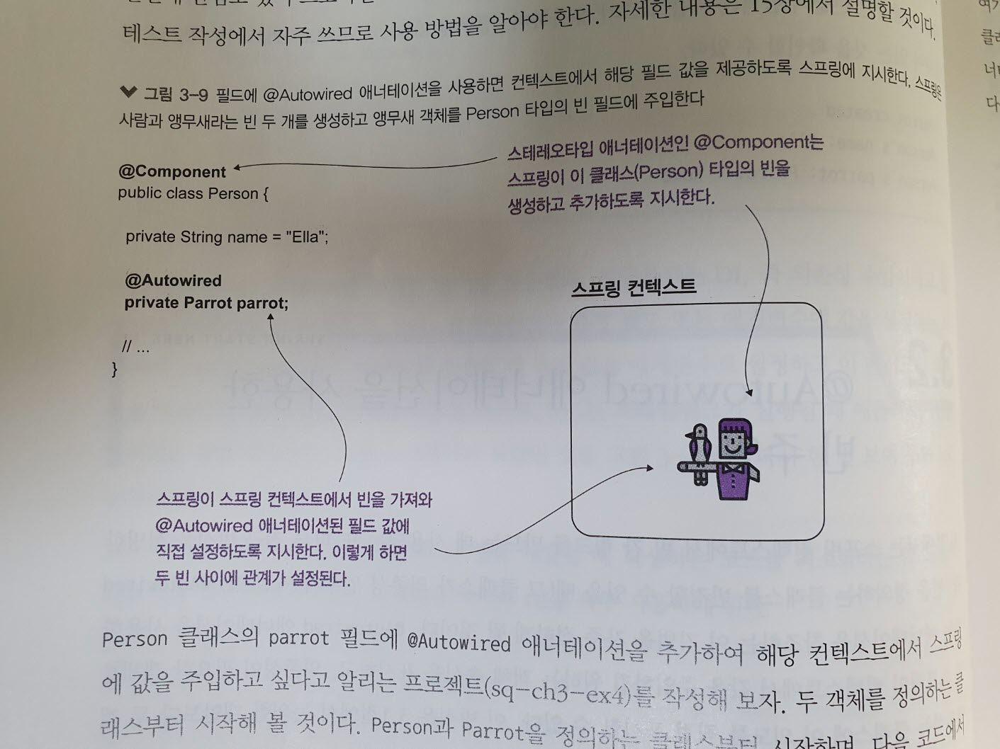

- Parrot 클래스 정의

    @Component
    public class Parrot {
    
      private String name = "Koko";
    
      public String getName() {
        return name;
      }
      
      public void setName(String name) {
        this.name = name;
      }
      
      @Override
      public String toString() {
        return "Parrot : " + name;
      }
    
    }

- 스테레오타입 @Component 사용
  - 구성 클래스로 빈을 생성하는 대신 스테레오타입 애너테이션 사용

- @Component 로 클래스에 애너테이션을 할 때 스프링은 해당 클래스의 인스턴스를 생성하고, 스프링 컨텍스트에 추가해야 한다는 것을 알고 있다.

- Person 클래스 정의

      @Component
      public class Person {
      
      private String name = "Ella";
      
      @Autowired <-- 필드에 @Autowired 애너테이션을 추가하면, 해당 컨텍스트에서 적절한 값을 주입하도록 스프링에 지시하게 된다.
      private Parrot parrot;
      
      }

> 구성 클래스 정의

    @Configuration
    @ComponentScan(basePackages = "beans")
    public class ProjectConfig {
    
    }

> 메인 클래스 실행

    public class Main {
    
      public static void main(String[] args) {
        var context = new AnnotationConfigApplicationContext(ProjectConfig.class);
        
        Person p = context.getBean(Person.class);
        
        System.out.println("Person's name: " + p.getName());
        System.out.println("Person's parrot: " + p.getParrot());
      }
  
    }

> 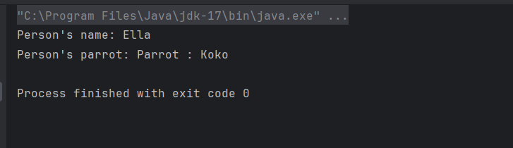

- 그러나 프로덕션 코드에서는 이 방식이 바람직하지 않다.
 
- final 로 만들 수 있는 방법이 없으며, final로 만들면 초기화한 후 값을 변경핮 못하게 할 수 있다.

      @Component
        public class Person {
        
        private String name = "Ella";
        
        @Autowired
        private final Parrot parrot; <-- 초깃값 없이는 final 필드를 정의할 수 없기 때문에 컴파일 실패
      }

### 3.2.2 @Autowired 를 사용하여 생성자로 값 주입

- 스프링이 빈을 생성할 때 객체의 속성에 값을 주입하는 두 번째 방법은 인스턴스를 정의하는 클래스의 생성자를 사용하는 것이다.
- 가장 자주 이용되는 방식이며 이 방법을 통해 필드를 final 로 정의할 수 있어 스프링이 필드를 초기화한 후에는 아무도 필드 값을 변경할 수 없다.

> 생성자의 매개변수를 정의하면 스프링은 생성자를 호출할 때 해당 컨텍스트의 빈을 해당 매개변수 값으로 전달한다.
> 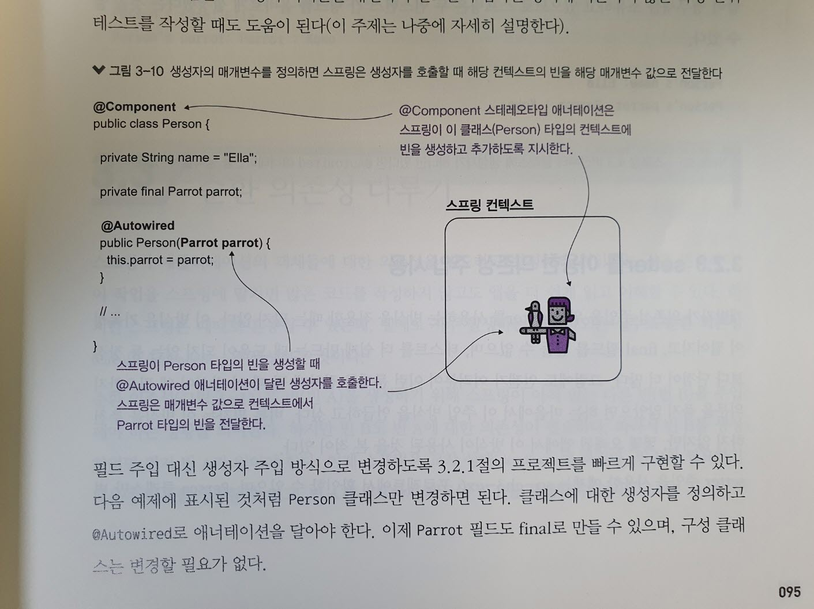

- 필드 주입 대신 생성자 주입으로 빠른 프로젝트 구현
- Person 클래스만 변경
- 클래스에 대한 생성자 정의하고 @Autowired로 애너테이션 표기

> 생성자를 이용하여 값 주입하기

    @Component
    public class Person {
    
      private String name = "Ella";
      
      private final Parrot parrot; <-- 이제 필드를 final로 설정하여 초기화한 후 값을 변경할 수 없도록 한다.
      
      @Autowired <-- 생성자에 @Autowired 사용
      public Person(Parrot parrot) {
        this.parrot = parrot;
      }
    }

> 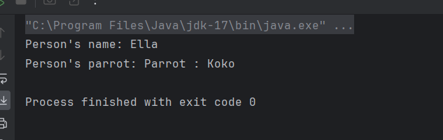

### 3.2.3 setter를 이용한 의존성 주입 사용

- 의존성 주입을 위해 setter를 사용하는 방식을 적용할 때는 많지 않다.
- 가독성 저하
- final 필드 생성 불가
- 테스트의 어려움
- 오래된 앱에서 사용

> setter에 @Autowired 사용

    @Component
    public class Person {
    
      private String name = "Ella";
      
      private Parrot parrot;
      
      @Autowired
      public void setParrot(Parrot parrot) {
        this.parrot = parrot;
      }
    
    }

### 3.3 순환 의존성 다루기

- 순환 의존성은 빈을 생성하기 위해 스프링이 아직 없는 다른 빈을 주입해야 하는 상황을 의미한다.

> 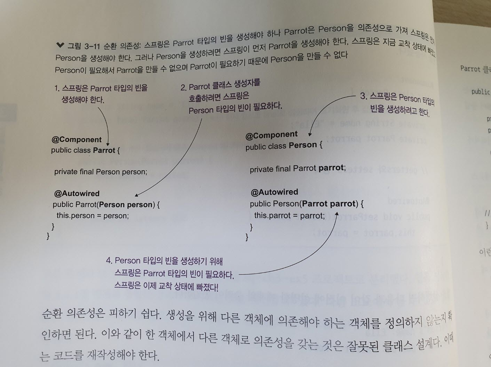

- 순환 의존성은 피하기 쉽다.
  - 생성을 위해 다른 객체에 의존해야 하는 객체를 정의하지 않는지 확인하면 된다.

> 순환 의존성 예시

    @Component
    public class Person {
    
      private final Parrot parrot;
      
      @Autowired
      public Person(Parrot parrot) { <--스프링은 Person 이스턴스를 생성하는 데 Parrot 빈이 필요하다.
        this.parrot = parrot;
      }
    }

    public class Parrot {
    
      private String name = "Koko";
      private final Person person;
      
      @Autowired
      public Parrot(Person person) {
        this.person = person;
      }

    }

- 이런 구성으로 앱을 실행하면 예외가 발생된다.
- 예외 발생시 예외에 지정된 클래스를 찾아 순환 의존성을 제거해야 한다.

---

### 3.4 스프링 컨텍스트에서 여러 빈 중 선택하기

- 스프링에서 매개변수 또는 클래스 필드에 값을 주입해야 하지만 선택할 수 있는 동일한 타입의 빈이 여러 개 있을 때 사용

1. 매개변수의 식별자가 컨텍스트의 빈 중 하나의 빈 이름과 일치하는 경우
2. 매개변수의 식별자가 컨텍스트의 빈 이름과 일치하지 않는 경우
    - 빈 중 하나를 기본으로 표시한 경우 스프링은 기본 빈을 선택
    - @Qualifier 애너테이션을 사용하여 특정 빈을 명시적으로 선택
    - 어떤 빈도 기본 빈이 아니며, @Qualifier를 사용하지 않았다면 앱은 예외를 발생시켜 오류 출력

> 빈이 2개 이상 있을 때 매개변수 주입하기

    @Configuration
    public class ProjectConfig {

      @Bean
      public Parrot parrot1() {
          Parrot p = new Parrot();
          p.setName("Koko");
          return p;
      }
  
      @Bean
      public Parrot parrot2() {
          Parrot p = new Parrot();
          p.setName("Miki");
          return p;
      }
  
      @Bean
      public Person person(Parrot parrot2) { <-- 매개변수 이름(parrot2)이 Miki앵무새의 빈 이름(parrot2)과 일치
      Person p = new Person();
      p.setName("Ella");
      p.setParrot(parrot2);
      return p;
      }

    }

> 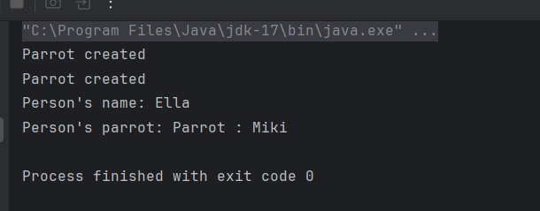

---

- 스프링 컨텍스트타입이 동일한 인스턴스가 두 개 이상 포함되어 있을 때 스프링이 컨텍스트에서 특정 인스턴스를 제공하도록 지시하는 한 가지 방법은 이 인스턴스 이름을 사용하는 것이다.

> 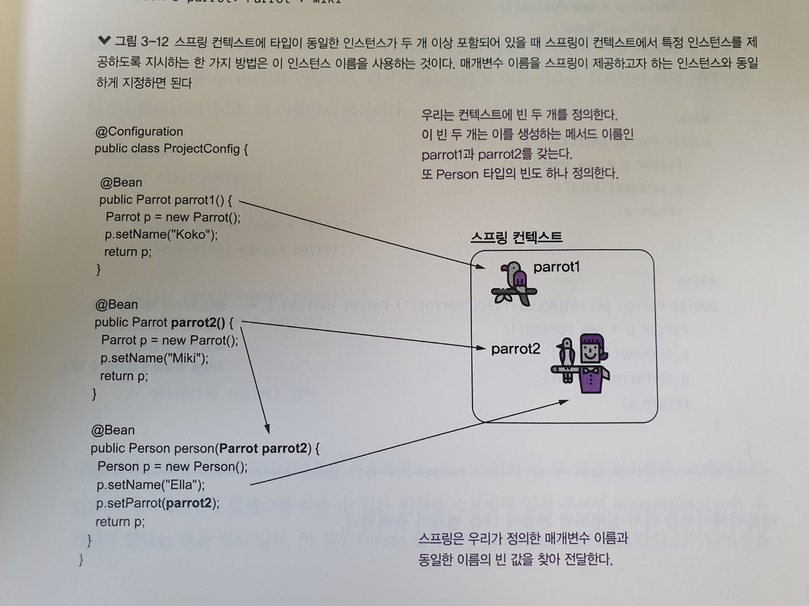

---

> @Qualifier 사용

    @Configuration
    public class ProjectConfig {

        @Bean
        public Parrot parrot1() {
            Parrot p = new Parrot();
            p.setName("Koko");
            return p;
        }
    
        @Bean
        public Parrot parrot2() {
            Parrot p = new Parrot();
            p.setName("Miki");
            return p;
        }
    
        @Bean
        public Person person(@Qualifier("parrot2") Parrot parrot) { <-- @Qualifier 사용하면 컨텍스트에서 특정 빈을 삽입하려는 의도를 명확하게 표시할 수 있다.
            Person p = new Person();
            p.setName("Ella");
            p.setParrot(parrot);
            return p;
        }
    
    }

---

> 구성 클래스에서 Parrot 타입 빈 정의하기

    @Configuration
    @ComponentScan(basePackages = "beans")
    public class ProjectConfig {
    
        @Bean
        public Parrot parrot1() {
            Parrot p = new Parrot();
            p.setName("Koko");
            return p;
        }
        
        @Bean
        public Parrot parrot2() { <-- 현재 설정에서는 parrot2 라는 이름의 빈이  Person 빈에 주입된다.
            Parrot p = new Parrot();
            p.setName("Miki");
            return p;
        }

    }

---

> 메인 실행

    public class Main {
    
        public static void main(String[] args) {
        var context = new AnnotationConfigApplicationContext(ProjectConfig.class);
        
            Person p = context.getBean(Person.class);
        
            System.out.println("Person's name: " + p.getName());
            System.out.println("Person's parrot: " + p.getParrot());
        }

    }

> 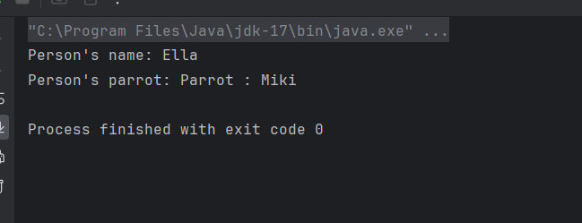

>스프링 컨텍스트에 타입이 동일한 빈이 여러개 포함되어 있다면 스프링은 매개변수화 이름이 일치하는 빈을 선택한다.

> 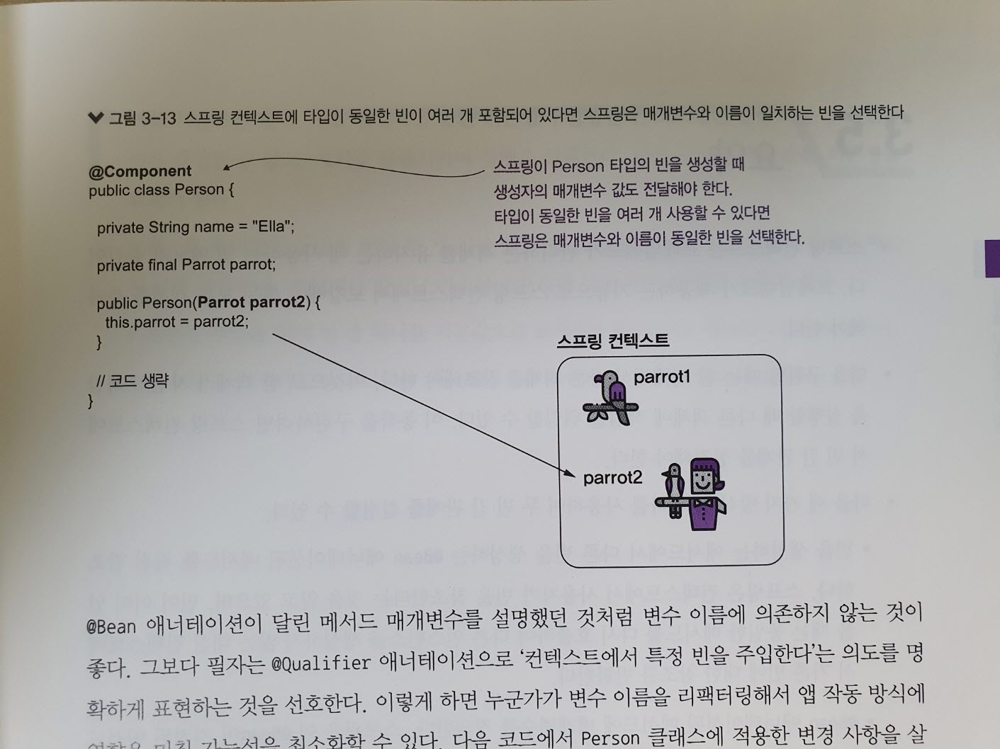 

- @Bean 애너테이션이 달린 메서드 매개변수를 설명했던 것처럼 변수 이름에 의존하지 않는것이 좋다.
- @Qualifier 애너테이션으로 '컨텍스트 빈을 주입한다' 는 의도를 명확하게 표현하는것을 선호
- 변수이름을 리팩터링해서 앱 작동 방식에 영향을 미칠 가능성을 최소화할 수 있다.

>@Qualifier 사용, 빈 이름 지정

    @Component
    public class Person {

      private String name = "Ella";
      private final Parrot parrot;

      public Person(@Qualifier("parrot2") Parrot parrot) { <--스프링은 Person 이스턴스를 생성하는 데 Parrot 빈이 필요하다.
        this.parrot = parrot;
      }
    }

- 실수발생을 낮춘다.

---

### 요약

- 스프링 컨텍스트는 프레임워크가 관리하는 객체를 유지하는 데 사용하는 앱 메모리 공간이다.
- 앱을 구현할 때는 한 객체에서 다른 객체를 참조해야 한다.
- 다음 세 가지 방식 중 하나를 사용하여 두 빈 간 관계를 설정할 수 있다.
  - 빈을 생성하는 메서드에서 다른 빈을 생성하는