# 스프링 교과서

## 4장 스프링 컨텍스트 : 추상화

이 장에서는 스프링 빈과 함께 추상화를 사용하는 방법을 설명한다.

### 4.1 계약 정의를 위한 인터페이스 사용

인터페리스를 사용하여 계약을 정의하는 방법
 - 자바에서 인터페이스는 특정 책임을 선언하는 데 사용하는 추상 구조다.
 - 인터페이스를 구현하는 객체는 이 책임을 정의해야 한다.
 - 동일한 인터페이스를 구현하는 여러 객체는 해당 인터페이스가 선언한 책임을 다른 방식으로 정의할 수 있다.
 - 인터페이스는 '무엇이 발생해야 하는지(필요 대상)'를 지정하는 반면, 인터페이스를 구현하는 모든 객체는 '어떻게 그것이 발생해야 하는지(발생방법)'를 지정한다고 볼 수 있다.

인터페이스란 객체가 필요한 것을 요청하는 방식이다.
 - ✓ 개발 기간을 단축 시킬 수 있다 · ✓ 표준화가 가능하다 · ✓ 서로 관계없는 클래스들에게 관계를 맺어 줄 수 있다 · ✓ 독립적인 프로그래밍이 가능하다.

### 4.1.1 구현 분리를 위해 인터페이스 사용

 이 절에서는 계약이란 무엇인지와 인터페이스를 사용하여 자바 앱에서 계약을 정의하는 방법을 설명한다.

- 비유를 들자면 목적지로 이동하기 위해 우버같은 차량 공유 앱을 사용한다. 일반적으로 차량 공유 서비스를 사용할 때는 차량 외관이나 운전자가 누구인지 신경 쓰지 않는다. 그저 목적지에 가기만 하면 된다.
  - 여기서 차량 공유 앱은 인터페이스이다.
  - 탑승자는 객체이다.

- 배송 앱에서 배송할 패키지의 세부 정보를 인쇄해야 하는 객체를 구현한다고 가정해 보자. 인쇄된 세부 정보는 목적지 주소졀로 정렬되어야 한다. 세부 정보를 인쇄하는 객체는 배송 주소별로 패키지를 정렬하는 책임을 다른 객체에 위임해야 한다.

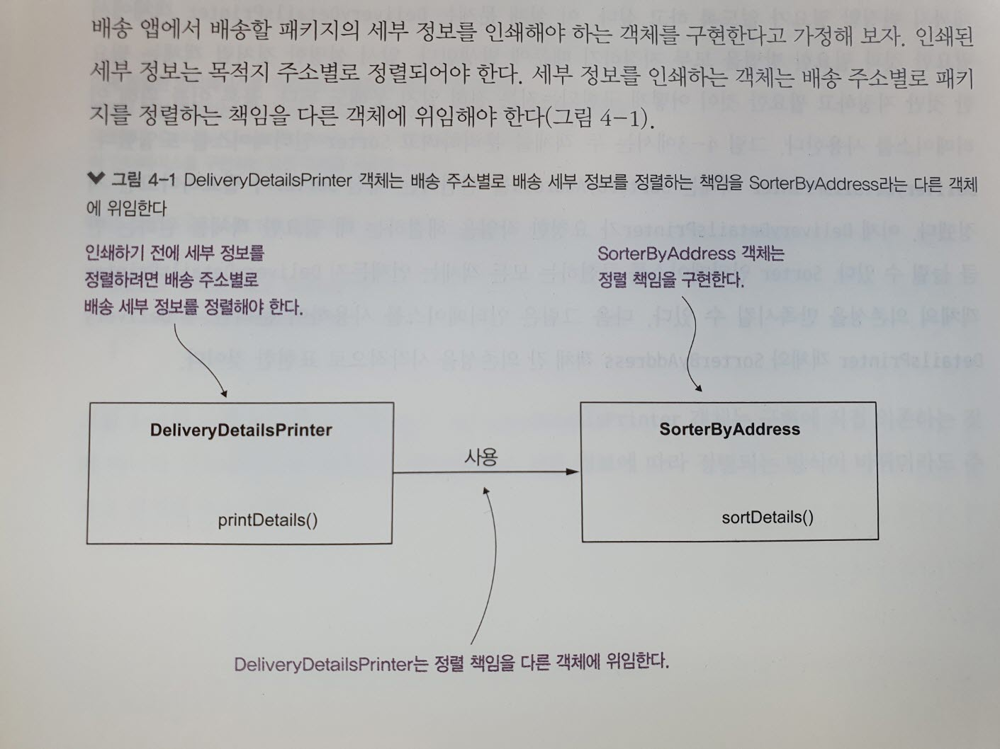

 - DeliveryDetailsPrinter는 SorterByAddress 객체에 정렬 책임을 직접 위임한다.
 - 두 객체는 강력하게 결합되어 있으므로 정렬 책임을 변경하려면 이 책임을 사용하는 객체도 변경해야한다.

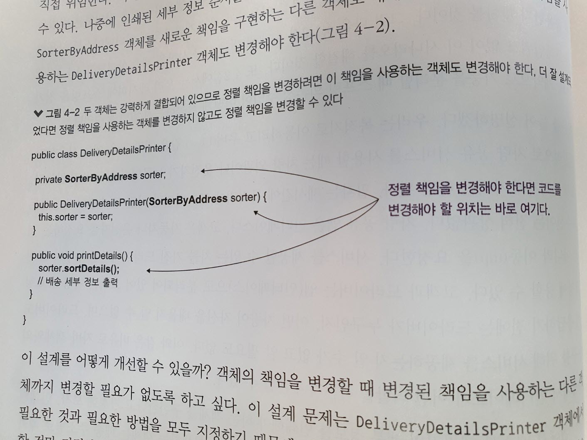

 - 그림 4-3은 두 객체를 분이하려고 Sorter 인터페이스를 도입했다.
 - 인터페이스로 책임을 분리한다. (객체를 나누고 나눈 객체를 의존하는 인터페이스 생성, 그 인터페이스를 의존하는 DeliveryDetailsPrinter)

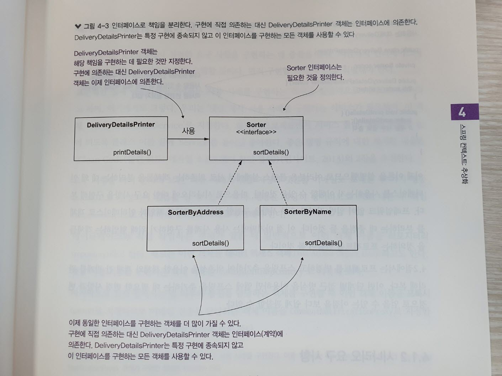

 - Sorter 인터페이스 정의

~~~
public interface Sorter {
  void sortDetails();
}
~~~

 - 그림 4-4와 그림 4-2 비교

> 그림 4-4
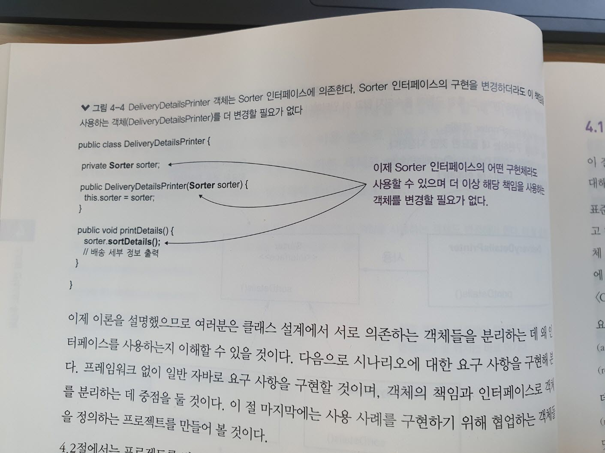
> 그림 4-2

### 4.1.2 시나리오 요구 사항

  기능을 구현하려면 객체를 설계하고 올바른 책임과 추상화를 찾아야 한다.

### 4.1.3 프레임워크 없이 요구 사항 구현

 - 표준적인 실제 애플리케이션에서는 사용 사례를 구현하는 객체를 일반적으로 서비스라 한다.
 - 데이터베리스와 직접 작업하는 객체가 있을 때 일반적으로 이런 객체 이름을 리포지터리, 혹은 데이터 액세스 객체(DAO)라고 한다.
 - 프록시(Proxy)란?
   - 프록시(Proxy)는 "대리"의 의미로, 인터넷과 관련해서 쓰이는 경우, 특히 내부 네트워크에서 인터넷 접속을 할 때에, 빠른 액세스나 안전한 통신등을 확보하기 위한 중계서버를 "프록시 서버"라고 일컫는다. 클라이언트와 Web서버의 중간에 위치하고 있어, 대신 통신을 받아 주는 것이 프록시 서버이다.

> 그림 4-5 CommentService 객체는 '댓글게시' 사용 사례를 구현한다. 이를 위해서는 CommentRepository와 CommentNotificationProxy 객체가 구현한 책임에 위임해야 한다.
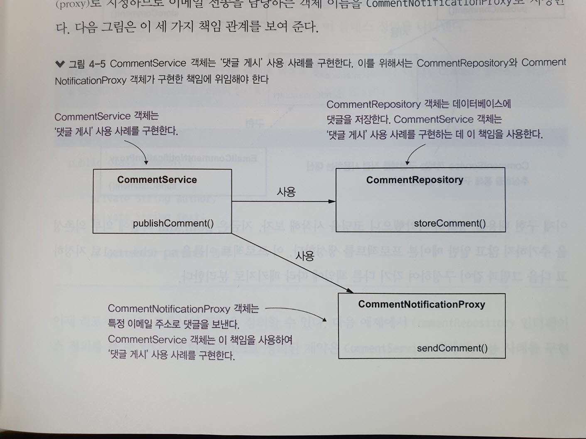

인터페이스를 이용하여 클래스 설계를 분리하는 방법
 - CommentRepository 와 CommentNotificationProxy 를 클래스로 설계하는 대신 기능을 정의하기 위해 이 클래스들을 수현할 수 있는 인터페이스로 설계한다.

> 그림 4-6
>   1. CommentService 객체는 CommentRepository 및 CommentNotificationProxy 인테퍼이스가 제공하는 추상화에 의존한다.
>   2. DBCommentRepository 와 EmailCommentNotificationProxy 클래스는 이 인터페이스를 구현한다.
> 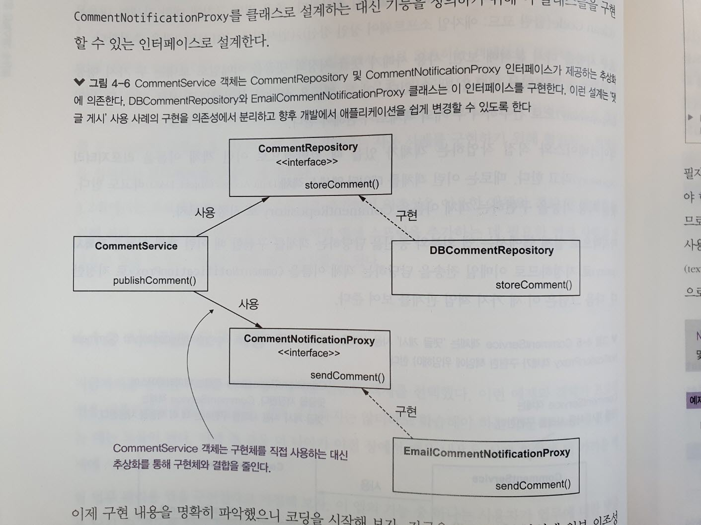

#### 코딩 시작

> 그림 4-7
> 프로젝트 구조
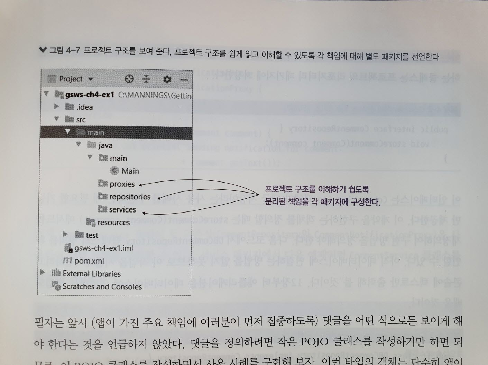

> 프로젝트 구조
> 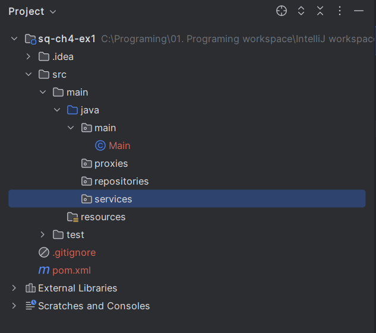

### POJO란
- 스프링 프레임워크(Spring Framework)에서 POJO(Plain Old Java Object)는 특별한 프레임워크나 라이브러리 의존성이 없는 단순한 자바 객체를 의미합니다. 스프링 프레임워크의 핵심 철학 중 하나는 POJO를 사용하여 애플리케이션을 개발하는 것입니다.

- POJO의 특징:
    1. 프레임워크 비의존성: POJO는 특정 프레임워크에 종속되지 않으며, 단순한 자바 클래스입니다. 이는 코드의 재사용성과 테스트 용이성을 높여줍니다.
    2. 간단한 클래스: POJO는 getter/setter 메서드, 비즈니스 로직 메서드 등을 포함한 간단한 클래스입니다. 복잡한 상속 구조나 인터페이스 구현이 필요하지 않습니다.
    3. 어노테이션 또는 XML 설정 가능: 스프링에서는 POJO를 빈(bean)으로 정의하여 사용할 수 있으며, 이를 위해 어노테이션이나 XML 설정을 사용할 수 있습니다.

- POJO타입의 클래스를 작성
    - POJO타입의 객체는 단순히 앱이 사용하는 데이터를 모델링하는 역할을 하기 때문에 모델이라고 한다.

> 예제 4-1 댓글 정의하기

      public class Comment {
      
         private String author;
         private String text;
         
         public String getAuthor() {
            return author;
         }
         
         public void setAuthor(String author) {
            this.author = author;
         }
         
         public String getText() {
            return text;
         }
         
         public void setText(String text) {
            this.text = text;
         }
      }

- 이제 리포지터리와 프록시의 책임을 정의할 수 있다

> 예제 4-2 CommentRepository 인터페이스 정의하기

    public interface CommentRepository {
        void storeComment(Comment comment);
    }

- 이 인터페이스는 CommentService 객체가 댓글 저장이라는 사용 사례를 구현하는 데 필요한 기능만 제공한다.

> 예제 4-3 CommentRepository 인터페이스 구현하기

    public class DBCommentRepository implements CommentRepository {
    
        @Override
        public void storeComment(Comment comment) {
            System.out.println("Storing comment: " + comment.getText());
        }
    }

- 마찬가지로 CommentService 객체에 필요한 두 번째 책임에 대한 인터페이스인 CommentNotificationProxy 를 정의한다.

> 예제 4-4 CommentNotificationProxy 인터페이스 정의

    public interface CommentNotificationProxy {
        void sendComment(Comment comment);
    }

> 예제 4-5 CommentNotificationProxy 인터페이스 구현

    public class EmailCommentNotificationProxy implements CommentNotificationProxy {
        @Override
        public void sendComment(Comment comment) {
            System.out.println("Sending notification for comment: " + comment.getText());
        }
    }

- 이제 CommentService 객체의 두 의존성을 사용하여 객체 자체를 구현할 수 있다.

> 예제 4-6 CommentService 객체 구현

        public class CommentService {
        
            private final CommentRepository commentRepository;
            private final CommentNotificationProxy commentNotificationProxy;
            
            public CommentService(CommentRepository commentRepository,
            CommentNotificationProxy commentNotificationProxy) {
                this.commentRepository = commentRepository;
                this.commentNotificationProxy = commentNotificationProxy;
            }
            
            public void publishComment(Comment comment) {
                commentRepository.storeComment(comment);
                commentNotificationProxy.sendComment(comment);
            }
        }

> 예제 4-7 Main 클래스에서 사용 사례 호출하기

    public class Main {
    
        public static void main(String[] args) {
            var commentRepository = new DBCommentRepository();
            var commentNotificationProxy = new EmailCommentNotificationProxy();
    
            var commentService = new CommentService(commentRepository,
                    commentNotificationProxy);
    
            var comment = new Comment();
            comment.setAuthor("Laurentiu");
            comment.setText("Demo comment");
    
            commentService.publishComment(comment);
        }
    }

> 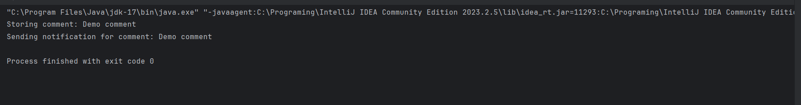

## 4.2 추상화와 함께 의존성 주입

- 이 절에서는 4.1정에서 구현한 클래스 설계 위에 스프링 프레임워크를 적용한다.
- 스프링이 추상화를 사용할 때 의존성 주입을 관리하는 방법을 설명할 수 있다.
- 스프링은 추상화의 개념도 이해한다.
- 프로젝트에 스프링 의존성을 추가한 후 이 애플리케이션의 객체 중 어떤 객체를 스프링에서 관리해야 할지 결정할 것이다.
- 스프링이 어떤 객체를 인식하도록 해야 하는지 정하는 방법도 배운다.

### 4.2.1 스프링 컨텍스트에 포함될 객체 정하기

- 스프링 컨텍스트에 객체를 추가하는 가장 큰 이유는 스프링이 객체를 제어하고 프레임워크가 제공하는 기능으로 객체를 더욱 보강할 수 있도록하려는 것임을 기억해야한다.
    - CommentService : CommentRepository 와 CommentNotificationProxy 의존성 두 개를 갖고 있다.
    - DBCommentRepository : CommentRepository 인터페이스를 구현하며 CommentService의 의존성이다.
    - EmailCommentNotificationProxy : CommentNotificationProxy 인터페이스를 구현하며 CommentService의 의존성이다.

- Comment 인스턴스를 추가하지 않는 이유
    - 프레임워크가 관리할 필요도 없는데 스프링 컨텍스트에 객체를 추가하면 앱에 불필요한 복잡성이 추가되어 앱의 유지 관리가 어려워지고 성능이 저하된다.
    - 스프링 컨텍스트에 객체를 추가하면 프레임워크가 제공하는 특정 기능을 사용하여 객체를 관리할 수 있다.

- 오버엔지니어링이란
    - 프레임워크에서 얻는 이점도 없는데 스프링이 관리할 객체만 추가하는 것이다.

- 스테레오타입 애너테이션을 사용하는것이 스프링 컨텍스트에 빈을 추가하는 가장 편리한 방법이다.
- 스프링이 인스턴스를 생성하고 이런 인스턴스를 컨텍스트에 추가하는 데 필요한 클래스에 스테레오타입 애너테이션을 사용한다.
- 인터페이스나 추상 클래스(Abstract)는 인스턴스화할 수 없기 때문에 스테레오타입 애너테이션을 추가하는 것은 의미가 없다.
- 구문상 사용은 가능하나 유용하지 않다.

> 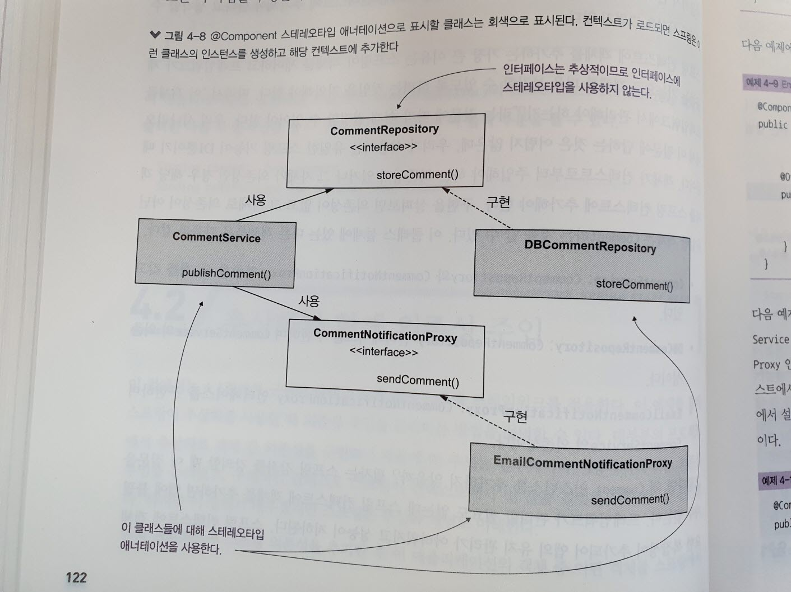

> 예제 4-8 DBCommentRepository 클래스에 @Component 추가하기

    @Component  <-- @Component로 클래스를 표시하면 스프링이 클래스의 인스턴스를 만들고 이를 빈으로 추가하도록 지시한다.
    public class DBCommentRepository implements CommentRepository {
        
        @Override
        public void storeComment(Comment comment) {
            System.out.println("Storing comment: " + comment.getText());
        }

    }

> 예제 4-9 EmailCommentNotificationProxy 클래스에 @Component 추가하기

    @Component
    public class EmailCommentNotificationProxy implements CommentNotificationProxy {
    
        @Override
        public void sendComment(Comment comment) {
            System.out.println("Sending notification for comment: " + comment.getText());
        }

    }

- DBCommentRepository 와 EmailCommentNotificationProxy 에 @Component 애너테이션을 추가하여 CommentService 클래스도 변경한다.
- CommentService 클래스는 다른 두 컴포넌트에 대한 의존성을 CommentRepository 및 CommentNotificationProxy 인터페이스로 선언한다.

> 예제 4-10 CommentService를 컴포넌트로 만들기

    @Component  <-- 스프링은 이 클래스를 빈으로 생성하고 컨텍스트에 추가한다.
    public class CommentService {
    
        private final CommentRepository commentRepository;
        private final CommentNotificationProxy commentNotificationProxy;  <--이 클래스에 생성자가 두 개 이상 있다면 @Autowired를 사용해야 한다.
        
        public CommentService(  <-- 스프링은 이 생성자로 빈을 생성하며, 빈 인스턴스를 생성할 떄 스프링 컨텍스트에서 매개변수의 레퍼런스(or 레퍼런스들)를 주입한다.
        CommentRepository commentRepository, CommentNotificationProxy commentNotificationProxy) {
            this.commentRepository = commentRepository;
            this.commentNotificationProxy = commentNotificationProxy;
        }
        
        public void publishComment(Comment comment) {
            commentRepository.storeComment(comment);
            commentNotificationProxy.sendComment(comment);
        }

    }

- 스테레오타입으로 애너테이션된 클래스를 찾을 수 있는 위치를 스프링에 알려 주고 앱을 테스트하기만 하면 된다.

> 예제 4-11 구성 클래스에서 @ComponentScan 사용하기

    @Configuration  <-- @Configuration 애너테이션은 이 클래스가 구성 클래스임을 나타낸다.
    @ComponentScan(  <-- @ComponentScan애너테이션을 사용하여 스프링에 스테레오타입으로 애너테이션된 클래스를 검색할 패키지를 알려준다.
    basePackages = {"proxies", "services", "repositories"}
    )
    public class ProjectConfiguration {

    }

- 설정 테스트를 위한 새로운 Main 메서드

> 예제 4-12 Main 클래스

    public class Main {
    
        public static void main(String[] args) {
            var context = new AnnotationConfigApplicationContext(ProjectConfiguration.class);
    
            var comment = new Comment();
            comment.setAuthor("Laurentiu");
            comment.setText("Demo comment");
    
            var commentService = context.getBean(CommentService.class);
            commentService.publishComment(comment);
        }
    }

> 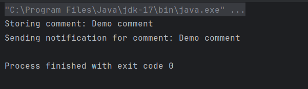

- DI 기능을 사용하면 CommentService 객체와 그 의존성 인스턴스를 직접 생성하지 않아도 되며, 이들 간 관계를 명시적으로 ㅅㄹ정할 필요도 없다.

### 4.2.2 추상화에 대한 여러 구현체 중에서 오토와이어링할 것을 선택

- 서로 다른 두 클래스로 생성된 빈이 두 개 있고, 이 두 빈이 CommentNotificationProxy 인터페이스를 구현한다고 가정해 보자.
- 스프링 컨텍스트에 동일한 타입의 빈이 두 개 이상 있을 때 이런 빈 중 어떤 빈을 주입할지 스프링에 알려야 한다는 것을 배웠다. 또 다음과 같은 두 가지 접근 방법도 배웠다.
    - @Primary 애너테이션으로 구현할 빈 중 하나를 기본값으로 표시한다.
    - @Qualifier 애너테이션으로 빈 이름을 지정한 후 DI를 위해 해당 이름으로 참조한다.

> 그림 4-9 실제 시나리오에서는 동일한 인터페이스에 대한 구현체가 여러 개 존재할 수 있다. 이 인터페이스에 의존성 주입을 사용할 때는 어떤 구현체를 주입할지 스프링에 지정해야 한다.
> 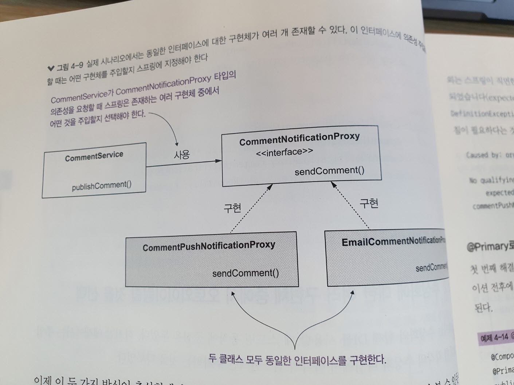

- 이 두 가지 방식이 추상화에서도 작동한다는 것을 증명해 보자.

> 예제 4-13 CommentNotificationProxy 인터페이스에 대한 새로운 구현

    @Component
    public class CommentPushNotificationProxy
            implements CommentNotificationProxy {  <-- 이 클래스는 CommentNotificationProxy 인터페이스를 구현한다.
    
        @Override
        public void sendComment(Comment comment) {
            System.out.println("Sending push notification for comment: " + comment.getText());
        }
    }

    - 이 애플리케이션을 실행 시 스프링이 컨텍스트에서 두 빈 중 어떤 빈을 주입할지 알 수 없어 예외가 발생한다.

- @Primary 로 주입에 대한 기본 구현 표시하기
    - 첫 번째 해결책은 @Primary 를 사용하는것이다.
  > 예제 4-14 @Primary 를 사용하여 기본 구현으로 표시하기

      @Component
      @Primary  <-- @Primary 를 사용하여 DI에 대한 기본 구현으로 표시하기
      public class CommentPushNotificationProxy
            implements CommentNotificationProxy {
    
          @Override
          public void sendComment(Comment comment) {
            System.out.println("Sending push notification for comment: " + comment.getText());
          }

      }

> 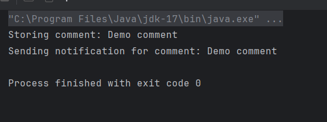

- 구현체가 두 개 있지만, 스프링은 항상 둘 중 하나만 주입하는가? 그렇다면 이 경우에는 왜 두 클래스가 다 필요할까?

> 그림 4-10 우리는 특정 인터페이스에 대한 구현을 이미 제공하는 의존성을 사용할 떄가 있다. 이런 이너페이스에 대한 커스텀 구현이 필요하다면 기본 DI 구현으로 표시하도록 @Primary 를 사용할 수 있다.
> 이렇게 하면 스프링은 의존성을 제공하는 구현이 아닌 여러분이 정의한 커스텀 구현을 주입한다.

> 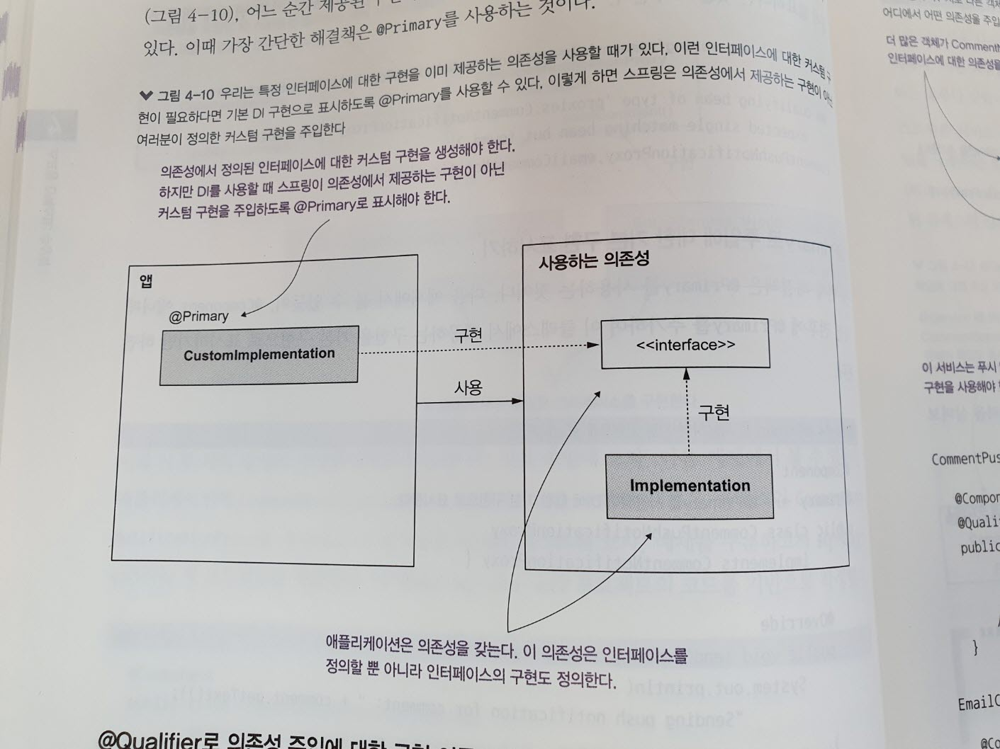

- @Qualifier 로 의존성 주입에 대한 구현 이름 지정하기

> 그림 4-11 서로 다른 객체가 동일한 계약에 대해 서로 다른 구현을 사용해야 하는 경우 @Qualifier 로 이름을 지정하면 스프링이 어디에서 어떤 의존성을 주입해야 하는지 알려 줄 수 있다.

> 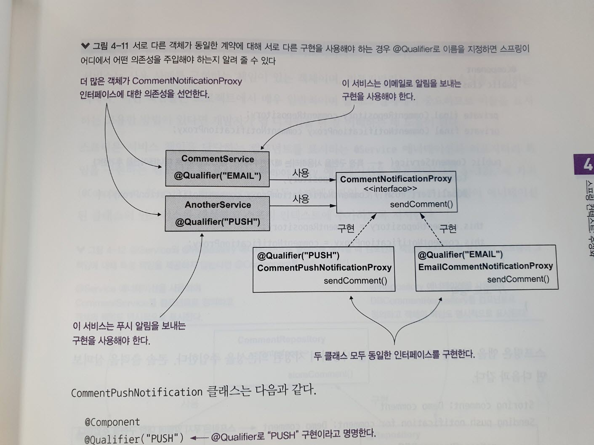

    @Component
    @Qualifier("PUSH")
    public class CommentPushNotificationProxy
            implements CommentNotificationProxy {
    }

    @Component
    @Qualifier("EMAIL")
    public class EmailCommentNotificationProxy
            implements CommentNotificationProxy {
    }

    - 스프링이 이 중 하나를 주입하도록 하려면 @Qualifier 애너테이션으로 구현 이름을 다시 지정하기만 하면 된다.

- 특정 구현을 CommentService 객체의 의존성으로 주입하는 방법을 알아보자.

> 예제 4-15 @Qualifier로 스프링이 주입해야 하는 구현 지정하기

    @Component
    public class CommentService {
    
        private final CommentRepository commentRepository;
        private final CommentNotificationProxy commentNotificationProxy;
    
        public CommentService(  <-- 특정 구현을 사용하려면 매개변수에서는 @Qualifier로 애너테이션을 추가한다.
                CommentRepository commentRepository,
                @Qualifier("PUSH") CommentNotificationProxy commentNotificationProxy) {

            this.commentRepository = commentRepository;
            this.commentNotificationProxy = commentNotificationProxy;
        }
        
        public void publishComment(Comment comment) {
            commentRepository.storeComment(comment);
            commentNotificationProxy.sendComment(comment);
        }

    }

- 스프링은 앱을 실행할 때 @Qualifier를 사용해서 지정된 의존성을 주입한다.

## 4.3 스테레오타입 애너테이션으로 객체의 책임에 집중

- @Service, @Repository 사용방법 알아보기.
    - 서비스는 사용 사례를 구현하는 책임이 있는 객체
    - 리포지터리는 데이터 지속성을 관리하는 객체
- @Component, @Service, @Repository 은 모두 스테레오타입 애너테이션이며 스프링이 애너테이션된 클래스의 인스턴스를 생성하고 스프링 컨텍스트에 추가하도록 지시한다.

>그림 4-12 @Service, @Repository 애너테이션으로 클래스를 설계할 때 컴포넌트 책임을 명시적으로 표시한다. 스프링이 그 책임에 대해 특정 책임을 제공하지 않는다면 @Component를 계속 사용한다
> 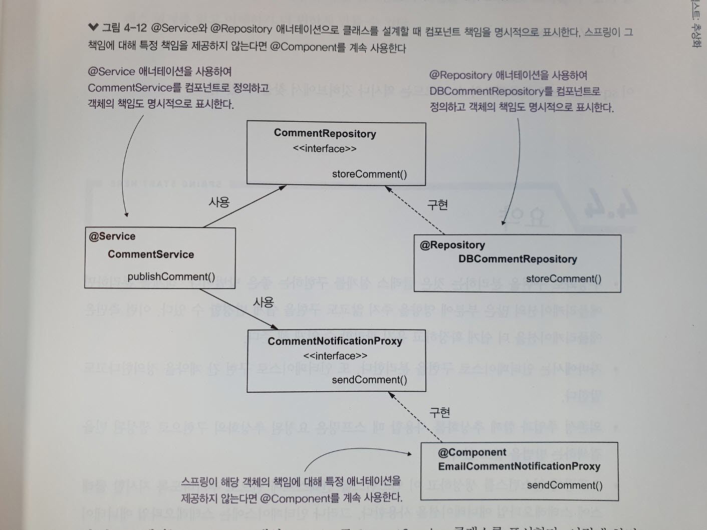

- @Component 대신 @Service 로 CommentService 클래스를 표시한다.
    - 이렇게 하면 객체의 책임성을 명시적으로 표시할 수 있어 클래스를 읽는 모든 개발자가 이런 측면을 더 잘 파악할 수 있다.

    @Service  <-- @Service 를 사용하여 이 객체를 서비스 책임을 가진 컴포넌트로 정의한다.
    public class CommentService {
    
    }
    
    @Repository  <-- @Repository 를 사용하여 이 객체를 리포지터리 책임을 가진 컴포넌트로 정의한다.
    public class DBCommentRepository implements CommentRepository {
    
    }

## 4.4 요약

- 추상화로 구현을 분리하는 것은 클래스 설계를 구현하는 좋은 방법이다.
    - 객체를 분리하면 애플리케이션의 많은 부분에 영향을 주지 않고도 구현을 쉽게 변경할 수 있다.
    - 이런 측면은 애플리케이션을 더 쉽게 확장하고 유지 관리할 수 있게 해 준다.
- 자바에서는 인터페이스로 구현을 분리한다. 또 인터페이스로 구현 간 계약을 정의한다고도 말한다.
- 의존성 주입과 함께 추상화를 사용할 떄 스프링은 요청된 추상화의 구현으로 생성된 빈을 검색하는 방법을 알고 있다.
- 스프링에 인스턴스를 생성하고 이 인스턴스를 컨텍스트에 빈으로 추가하도록 지시할 클랫에 스테레오타입 애너테이션을 사용한다. 그러나 인터페이스에는 스테레오타입 애너테이션을 사용하지 않는다.
- 스프링 컨텍스트에 동일한 추상화에 대한 여러 가지 구현으로 생성된 빈이 많을 때 어떤 빈을 주입할 지 지시하려면 다음 방법을 수행한다.
    - @Primary 애너테이션을 사용하여 그중 하나를 기본값으로 표시한다.
    - @Qualifier 애너테이션으로 빈 이름을 지정한 후 스프링에 해당 빈 이름으로 빈을 주입하도록 지시할 수 있다.
- 서비스(혹은 리포지터리) 책임이 있는 컴포넌트가 있다면 @Service(혹은 @Repository) 스테레오타입 애너테이션을 사용한다.

