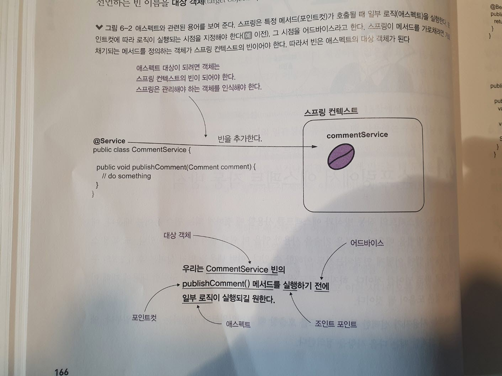

# 스프링 AOP 로 애스팩트 사용

- 애스펙트는 프레임워크가 메서드 호출을 가로채고 그 메서드의 실행을 변경할 수 있는 방법
- 사용자가 선택한 특정 메서드 호출 실행에 영향을 줄 수 있다.
- 실행중인 메서드에 속한 로직 일부를 추출할 수 있다.
- 시나리오에서 코드 일부를 분리하고 분리한 로직을 더 쉽게 이해할 수 있다.

- 스프링 애스펙트(Aspect)는 스프링 프레임워크의 핵심 기능 중 하나인 AOP(Aspect-Oriented Programming, 관점 지향 프로그래밍)를 구현하는데 사용되는 구성 요소입니다. AOP는 관심사의 분리를 통해 애플리케이션의 모듈성을 향상시키고, 횡단 관심사를 중앙 집중적으로 관리할 수 있게 합니다. 횡단 관심사란 로깅, 트랜잭션 관리, 보안 등 애플리케이션의 여러 부분에서 공통적으로 사용되는 기능을 말합니다.

스프링 AOP의 예제
~~~

import org.aspectj.lang.annotation.Aspect;
import org.aspectj.lang.annotation.Before;

@Aspect
public class LoggingAspect {

    @Before("execution(* com.example.service.*.*(..))")
    public void logBefore() {
        System.out.println("메서드 호출 전에 로깅합니다.");
    }
}
~~~

--- 

- 애스펙트를 학습해야 하는 또 다른 중요한 이유는 스프링이 제공하는 많은 중요한 기능을 구현할 때 애스펙트를 사용하기 때문이다.
- 애스펙트가 사용되는 기능의 적절한 예는 트랜잭션성이다. (13장에서 진행)
- 애스펙트에 의존하는 또 다른 중요한 기능은 보안 구성으로, 앱이 자체 데이터를 보호하고 원치않는 사람이 데이터를 보거나 변경하지 않게 만드는데 도움을 준다.

> 그림 6-1 애스펙트로 로그 분리하기
> 

## 6.1 스프링에서 애스펙트 작동 방식

- 애스펙트는 사용자가 선택한 특정 메서드를 호출할 때 프레임워크가 실행하는 로직의 일부다. 애스펙트를 설계할 때는 다음 사항을 정의한다.
  - 특정 메서드를 호출할 때 스프링이 실행하길 원하는 코드는 무엇인지 정의한다. 이를 애스펙트라 한다.
  - 앱이 언제 (메서드 호출리 아닌 호출 전, 후) 이 애스펙트 로직을 실행해야 하는지 정의한다. 이를 어드바이스라 한다.
  - 프레임워크가 어떤 메서드를 가로채기해서 해당 애스펙트를 실행해야 하는지 정의한다. 이를 포인트컷이라 한다.

- 의존성 주입과 마찬가지로 애스펙트를 사용하려면 애스펙트를 적용하려는 객체를 관리할 수 있는 프레임워크가 필요하다.
- 애스펙트가 가로챈 메서드를 선언하는 빈 이름을 대상 객체라고 한다.

> 그림 6-2 애스펙트와 관련된 용어를 보여준다. 스프링은 특정 메서드가 호출될 때 일부 로직을 실행한다. 포인트컷에 따라 로직이 실행되는 시점을 지정해야 한다, 그 시점을 어드바이스라고 한다. 스프링이 메서드를 가로채려면 가로채기되는 메서드를 정의하는 객체가 스프링 컨텍스트의 빈이어야 한다, 따라서 빈은 애스펙트의 대상 객체가 된다.
> 

- 스프링은 어떻게 각 메서드 호출을 가로채서 애스펙트 로직을 적용할까?
- 객체는 스프링 컨텍스트 빈이어야 한다.
- 스프링은 실제 빈 대신 프록시 객체를 제공한다.
- 이제 getBean() 메서드를 직접 사용하든 DI를 사용하든 컨텍스트에서 빈을 얻을 때는 언제나 빈 대신 프록시 객체를 받게 된다.
- 이렇게 감싸는 방식을 위빙이라 한다.

> 그림 6-3 애스펙트를 위빙한다. 즉 스프링은 실제 빈에 대한 참조를 제공하는 대신 프록시 객체에 대한 참조를 제공하고 메서드 호출을 가로채며 애스펙트 로직을 관리한다.
> 

- 다음은 메서드를 호출할 때 애스펙트가 메서드 호출을 가로채지 못한 경우와 가로채는 경우를 비교한다.

> 그림 6-4 메서드가 애스펙트화되지 않은 경우 호출은 해당 메서드로 직접 전달된다. 메서드에 대한 애스펙트를 정의하면 호출은 프록시 객체를 통과한다. 프록시 객체는 애스펙트로 정의된 로직을 적용한 후 실제 메서드에 호출을 위임한다.
> 

## 6.2 스프링 AOP 를 사용한 애스펙트 구현

### 6.2.1 간단한 애스펙트 구현

- 시나리오를 해결하는 간단한 애스펙트를 구현하는 방법

> pom.xml 파일 의존성 추가

~~~
        <dependency>
            <groupId>org.springframework</groupId>
            <artifactId>spring-context</artifactId>
            <version>6.1.6</version>
        </dependency>
        <dependency>
            <groupId>org.springframework</groupId>
            <artifactId>spring-aspects</artifactId>
            <version>6.1.6</version>
        </dependency>
~~~

> Comment 모델 클래스

~~~
public class Comment {

  private String text;
  private String author;
  
  // getters, setters 생략
}
~~~

- 예제 6-1에서는 CommentService 클래스 정의를 찾을 수 있다.
- 스프링 컨텍스트의 빈으로 만들고자 CommentService 클래스에 @Service 스테레오 타입 애너테이션을 추가했다.
- CommentService 클래스는 시나리오의 사용 사례를 나타내는 piblishComment(Comment comment) 메서드를 정의한다.

- 이 예제에서 System.out 을 사용하는 대신 Logger 타입의 객체를 사용하여 콘솔에 메세지를 작성한다.
- 실제 앱에서는 콘솔에 메시지를 작성할 때 System.out 을 사용하지 않고, 일반적으로 로깅 기능을 사용자 정의하고 로깅 메세지를 표준화하는 데 더 많은 유연성을 제공하는 로깅 프레임워크를 사용한다.
- 로깅 프레임워크에 대한 몇 가지 좋은 옵션은 다음과 같다.
  - Log4j(http://logging.apache.org/log4j/2.x/)
  - Logback(http://logback.qos.ch/)
  - JDK 와 함께 제공되는 자바 로깅 API(http://mng.bz/v4Xq)

- 로깅 프레임워크는 스프링 사용 여부와 관계없이 모든 자바 앱과 호환된다.

> 예제 6-1 예제에 사용되는 Service 클래스

~~~
@Service  <--스테레오타입 애너테이션을 사용하여 이 클래스를 스프링 컨텍스트의 빈으로 만든다.
public class CommentService {

  private Logger logger =   <-- 사용 사례를 호출할 때마다 앱의 콘솔에 메세지를 로깅하려고 logger 객체를 사용한다.
          Logger.getLogger(CommentService.class.getName());

  public void publishComment(Comment comment) {  <-- 이 방법은 시연에 대한 사용 사례를 정의한다.
    logger.info("Publishing comment:" + comment.getText());
  }
}
~~~

- 이 예제에서는 프로젝트에 다른 의존성을 추가하지 않으려고 JDK 로깅 기능을 사용한다.
- logger 객체를 선언할 때 매개변수로 이름을 지정해야 한다.
- 클래스 이름을 사용할 때도 많은데, 이 예제에서는 CommentService.class.getName()을 사용했다.
- 또 구성 클래스를 추가하여 스프링에 스테레오 타입 애너테이션된 클래스를 검색할 위치를 알려야 한다.

>  @ComponentScan 으로 스프링에 스테레오타입 애너테이션된 클래스를 검색할 위치를 알려 준다.

~~~
@Configuration
@ComponentScan(basePackages = "services")  <-- @ComponentScan 으로 스프링에 스테레오타입 애너테이션된 클래스를 검색할 위치를 알려 준다.
public class ProjectConfig {

}
~~~

- 서비스 클래스의 publishComment() 메서드를 호출하는 Main 클래스를 작성하고 현재 동작을 관찰해 보자.

> 예제 6-2 앱 동작을 테스트하려고 Main 클래스 사용하기

~~~
public class Main {

  public static void main(String[] args) {
    var c = new AnnotationConfigApplicationContext(ProjectConfig.class);
    var service = c.getBean(CommentService.class);  <-- 컨텍스트에서 CommentService 빈을 가져온다.

    Comment comment = new Comment();  <-- Comment 인스턴스를 생성하여 publishComment() 메서드의 매개변수로 전달한다.
    comment.setText("Demo comment");
    comment.setAuthor("Natasha");
    service.publishComment(comment);  <-- publishComment() 메서드를 호출한다.
  }
}
~~~

- publishComment() 메서드에서 출력한 내용을 볼 수 있으며, 이것이 우리가 논의한 예제를 해결하기 전 앱 모습이다.

- 애스펙트를 생성하려면 다음 단계를 따라야 한다.
  1. 구성 클래스에 @EnableAspectJAutoProxy 애너테이션을 추가하여 스프링 앱에서 애스펙트 메커니즘을 활성화한다.
  2. 새 클래스를 생성하고 @Aspect 애너테이션을 추가한다. @Bean 또는 스테레오타입 애너테이션을 사용하여 스프링 컨텍스트에 이 클래스에 대한 빈을 추가한다.
  3. 애스펙트 로직을 구현할 메서드를 정의하고 스프링에 어드바이스 애너테이션을 사용하여 언제 어떤 메서드를 가로챌 것인지 지시한다.
  4. 애스펙트 로직을 구현한다.

> 그림 6-5 애스펙트를 구현하려면 네 가지 쉬운 단계를 따른다. 먼저 앱에서 애스펙트 기능을 활성화해야 하고 애스펙트 클래스를 생성하고 메서드를 정의한다. 다음으로 스프링에 언제 어떤 것을 가로챌 것인지 지시한다. 마지막으로 애스펙트 로직을 구현한다.
> 

- 1단계 : 앱에서 애스펙트 메커니즘 활성화하기
  - 첫 단계에서는 앱에서 어떤 메커니즘을 사용할 것인지 스프링에 지시해야 한다.
  - 스프링에서 제공하는 특정 메커니즘을 사용할 때마다 특정 애너테이션으로 구성 클래스에 애너테이션을 지정하여 명시적으로 활성화해야 한다.
  - 예제에서는 @EnableAspectJAutoProxy 애너테이션을 사용하여 애스펙트 기능을 활성화해야 한다.

> 예제 6-3 스프링 앱에서 애스펙트 메커니즘 활성화하기

~~~
@Configuration
@ComponentScan(basePackages = "services")
@EnableAspectJAutoProxy   <-- 스프링 앱에서 애스펙트 메커니즘을 활성화한다.
public class ProjectConfig {

}
~~~

---

- 2단계 : 애스펙트를 정의하는 클래스를 생성하고 이 클래스의 인스턴스를 스프링 컨텍스트에 추가하기
  - 스프링 컨텍스트에서 이 애스펙트를 정의하는 새로운 빈을 만들어야 한다.
  - 이 객체에 메서드가 있고, 이 메서드가 특정 메서드 호출을 가로채 특정 로직을 보강한다.

> 예제 6-4 애스펙트 클래스 정의하기

~~~
@Aspect
public class LoggingAspect {

  public void log() {
    //추가 구현
  }

}
~~~

- 다음 방식으로 이 클래스의 인스턴스를 스프링 컨텍스트에 추가할 수 있다.
  - 빈 애너테이션 사용하기

    ~~~
    @Configuration
    @ComponentScan(basePackages = "services")
    @EnableAspectJAutoProxy   <-- 스프링 앱에서 애스펙트 메커니즘을 활성화한다.
    public class ProjectConfig {
    
      @Bean  <-- LoggingAspect 클래스 인스턴스를 스프링 컨텍스트에 추가한다.
      public LoggingAspect aspect() {
        return new LoggingAspect();
      }
    
    }
    ~~~
    
   - 스프링은 관리해야 하는 모든 객체를 알아야 하므로 이 객체를 스프링 컨텍스트에서 빈으로 만들어야 한다
   - @Aspect 애너테이션은 스테레오타입 애너테이션이 아니다. @Aspect를 사용하면 이 클래스가 애스펙트 정의를 구현한다고 스프링에 알려 줄 수 있지만 스프링이 이 클래스에 대한 빈을 생성해 주는것은 아니다.

- 3단계 : 어드바이스 애너테이션으로 스프링에 언제 어떤 메서드를 가로챌지 지시하기
  - 애스펙트 클래스를 정의하고 어드바이스 선택 후 메서드에 적절히 애너테이션 한다.
  - @Around 애너테이션을 어떻게 추가하는지 확인할 수 있다.

> 예제 6-5 어드바이스 애너테이션으로 특정 메서드에 애스펙트 적용하기

~~~
@Aspect
public class LoggingAspect {

  @Around("execution(* service.*.*(..))")  <-- 어떤 메소드를 가로챌지 정의한다.
  public Object log(ProceedingJoinPoint joinPoint) {
    joinPoint.proceed();  <-- 실제 가로채는 메서드에 위임한다.
  }
}
~~~

- @Around 애너테이션을 사용하는 것 외에도 애너테이션 값으로 특이한 문자열 표현식을 사용했고, 애스펙트 메서드에 매개변수도 추가한 것을 볼 수 있다.

~~~
    // @Around 애노테이션을 사용하여 특정 지점(Pointcut)에서 이 메서드를 실행하도록 합니다.
    // 여기서는 service 패키지 아래의 모든 클래스의 모든 메서드가 그 대상입니다.
    @Around("execution(* service.*.*(..))")
~~~

> 그림 6-6 예제에 AspectJ 포인트컷 표현식이 사용된다.
> 

- 4단계 : 애스펙트 로직 구현하기
  1. 메서드를 가로챈다.
  2. 가로챌 메서드가 호출되기 전에 콘솔에 메세지를 출력한다.
  3. 가로챌 메서드가 호출된다.
  4. 가로챌 메서드가 호출된 후 콘솔에 메세지를 출력한다.

> 그림 6-7 애스펙트 동작을 시각적으로 보여 준다. LoggingAspect 는 메서드 호출 전후에 무언가를 표시하여 메서드 실행을 감싼다. 이렇게 하면 간단한 애스펙트 구현을 확인할 수 있다.
> 

> 예제 6-6 애스펙트 로직 구현하기

~~~
@Aspect
public class LoggingAspect {

  private Logger logger = Logger.getLogger(LoggingAspect.class.getName());

  @Around("execution(* services.*.*(..))")
  public void log(ProceedingJoinPoint joinPoint) throws Throwable {
    logger.info("Method will execute");
    joinPoint.proceed();
    logger.info("Method executed");
  }
}
~~~

- ProceedingJoinPoint 매개변수의 proceed() 메서드는 가로챌 메서드인 CommentService 빈의 publishComment() 를 호출한다.
- proceed()를 호출하지 않는다면 애스펙트는 가로챌 메서드에 위임되지 않는다.

> 그림 6-8 애스펙트의 매개변수인 ProceedingJoinPoint 의 proceed() 메서드를 호출하지 않는다면 애스펙트는 가로챌 메서드에 더 이상 위임하지 않는다. 이 경우 가로챌 메서드 대신 해당 컴포넌트가 단순히 실행된다.
> 

> 그림 6-9 애스펙트는 가로채려는 메서드로 위임하지 않기로 결정할 수 있다. 이 동작은 메서드 호출자에게 속임수를 쓰는 것처럼 보인다. 호출자는 실제로 호출한 로직이 아닌 다른 로직을 실행한다.
> 

### 6.2.2 가로챈 메서드의 매개변수 및 반환 값 변경

> CommentService 클래스

~~~
@Service
public class CommentService {

  private Logger logger = Logger.getLogger(CommentService.class.getName());

  public String publishComment(Comment comment) {
    logger.info("Publishing comment:" + comment.getText());
    return "SUCCESS";  <-- 시연을 위해 메서드는 값을 반환
  }
}
~~~

- 애스펙트는 가로챈 메서드 이름 및 매개변수를 쉽게 찾을 수 있다.
- 애스펙트 메서드의 ProceedingJoinPoint매개변수는 가로챈 메서드를 나타낸다.
- 이 매개변수를 사용하여 가로챈 메서드와 관련된 모든 정보를 가져올 수 있다.

> 예제 6-7 애스펙트 로직에서 메서드 이름 및 매개변수 가져오기

~~~
@Aspect
public class LoggingAspect {

  private Logger logger = Logger.getLogger(LoggingAspect.class.getName());

  @Around("execution(* services.*.*(..))")
  public Object log(ProceedingJoinPoint joinPoint) throws Throwable {
    String methodName = joinPoint.getSignature().getName();
    Object [] arguments = joinPoint.getArgs();

    logger.info("Method " + methodName +
        " with parameters " + Arrays.asList(arguments) +
        " will execute");

    Object returnedByMethod = joinPoint.proceed();

    logger.info("Method executed and returned " + returnedByMethod);

    return returnedByMethod;
  }

}
~~~

> 그림 6-10 애스펙트는 메서드 호출을 가로채 매개변수와 가로챈 메서드의 실행 후 반환 값에 접근할 수 있다. main() 메서드는 애스펙트가 호출을 가로챘는지 알 수 없다.
> 

> 예제 6-8 애스펙트의 동작을 관리하려고 반환 값 출력하기

~~~
public class Main {

  private static Logger logger = Logger.getLogger(Main.class.getName());

  public static void main(String[] args) {
    var c = new AnnotationConfigApplicationContext(ProjectConfig.class);

    var service = c.getBean(CommentService.class);

    Comment comment = new Comment();
    comment.setText("Demo comment");
    comment.setAuthor("Natasha");

    String value = service.publishComment(comment);

    logger.info(value);  <-- publishComment() 메서드의 반환 값을 출력한다.
  }
}
~~~

- 다음 항목들을 이용하여 가로챈 메서드의 실행을 변경할 수 있다.
  - 메서드로 전송된 매개변수 값 변경하기
  - 호출자가 받는 반환 값 변경하기
  - 호출자에게 예외를 던지거나 가로챈 메서드에서 캐치 및 처리하기

- 다음 예제는 프로젝트에서는 가로챈 메서드에서 반환되는 값이나 매개변수를 바꾸어 호출을 변경하는 방법을 보여준다.

> 그림 6-11 애스펙트가 가로챈 메서드에 사용되는 매개변수와 그 메서드 호출자가 반환받는 값을 변경할 수 있다.
> 

> 예제 6-9 매개변수 및 반환 값 바꾸기

~~~
@Aspect
public class LoggingAspect {

  private Logger logger = Logger.getLogger(LoggingAspect.class.getName());

  @Around("execution(* services.*.*(..))")
  public Object log(ProceedingJoinPoint joinPoint) throws Throwable {
    String methodName = joinPoint.getSignature().getName();
    Object [] arguments = joinPoint.getArgs();

    logger.info("Method " + methodName +
        " with parameters " + Arrays.asList(arguments) +
        " will execute");

    Comment comment = new Comment();
    comment.setAuthor("Jenny");
    comment.setText("Some other text!");
    Object [] newArguments = {comment};

    Object returnedByMethod = joinPoint.proceed(newArguments);

    logger.info("Method executed and returned " + returnedByMethod);

    return "FAILED";
  }

}
~~~

### 6.2.3 애너테이션된 메서드 가로채기

- 애너테이션을 사용하여 애스펙트 별로 가로채야 하는 메서드를 표시하는 방법
  1. 커스텀 애너테이션을 정의하고 런타임에 액세스할 수 있도록 한다. 이 애너테이션을 @ToLog라고 할 것이다.
  2. 커스텀 애너테이션된 메서드를 가로채도록 애스펙트에 지시하고자 애스펙트 메서드에 대한 다른 AspectJ 포인트컷 표현식을 사용한다.

> 그림 6-12 애너테이션된 메서드를 가로채는 단계이다. 애스펙트가 가로채야 하는 메서드에 애너테이션을 달 때 사용할 애너테이션을 만들어야 한다. 그런 다음 다른 AspectJ 포인트컷 표현식을 사용하여 생성한 커스텀 애너테이션된 메서드를 가로채도록 애스펙트를 구성한다.
> 

- 애스펙트 로직을 변경할 필요 없다

- 다음 코드에는 커스텀 애너테이션의 선언이 있다.
- @Retention 이 포함된 리텐션 정책 정의는 매우 중요하다.
- 리텐션 정책을 RUNTIME으로 설정하여 다른 사람이 애너테이션을 가로챌 수 있도록 명시적으로 지정해야 한다.
- @Target 애너테이션은 이 애너테이션을 사용할 수 있는 언어 요소를 지정한다.

---

- 다음 예제에서 세 가지 메서드를 정의하는 CommentService 클래스 정의를 확인할 수 있다.

> 예제 6-10 메서드 세 개를 정의하는 CommentService 클래스 

~~~
@Service
public class CommentService {

  private Logger logger = Logger.getLogger(CommentService.class.getName());

  public void publishComment(Comment comment) {
    logger.info("Publishing comment:" + comment.getText());
  }

  @ToLog  <-- 애스펙트가 가로채기하려는 메서드에 대해 커스텀 애너테이션을 사용한다.
  public void deleteComment(Comment comment) {
    logger.info("Deleting comment:" + comment.getText());
  }

  public void editComment(Comment comment) {
    logger.info("Editing comment:" + comment.getText());
  }
  
}
~~~

- @ToLog 표현식은 애너테이션된 모든 메서드를 참조한다.

> 예제 6-11 포인트컷 표현식을 변경하여 애스펙트를 애너테이션된 메서드에 적용하기

~~~
@Aspect
public class LoggingAspect {

  private Logger logger = Logger.getLogger(LoggingAspect.class.getName());

  @Around("@annotation(ToLog)")
  public Object log(ProceedingJoinPoint joinPoint) throws Throwable {
  // 코드 생략 
  }
}
~~~

> 그림 6-13 AspectJ 포인트컷 표현식을 사용하여 애스펙트 로직을 우리가 정의한 커스텀 애너테이션이 달린 모든 메서드에 적용할 수 있다.
> 

### 6.2.4 사용 가능한 다른 어드바이스 애너테이션

- 스프링은 @Around 외에 다음 어드바이스 애너테이션을 제공한다.
  - @Before : 가로채기된 메서드가 실행되기 전에 애스펙트 로직을 정의하는 메서드를 호출한다.
  - @AfterReturning : 메서드가 성공적으로 반환된 후 애스펙트 로직을 정의하는 메서드를 호출하고 반환된 값을 애스펙트메서드에 매개변수로 제공한다. 가로채기된 메서드가 예외를 던지면 애스펙트 메서드는 호출되지 않는다.
  - @AfterThrowing : 가로채기된 메서드가 예외를 던지면 에스펙트 로직을 정의하는 메서드를 호출하고 예외 인스턴스를 애스펙트 메서드의 매개변수로 전달한다.
  - @After : 메서드가 성공적으로 반환했는지 또는 예외를 던졌는지 여부와 관계없이 가로채기된 메서드 실행 후에만 애스펙트 로직을 정의하는 메서드를 호출한다.

- 이런 어드바이스 애너테이션은 @Around 와 동일한 방식으로 사용된다. 
- 특정 메서드 실행을 위한 애스펙트 로직을 짤 때는 AspectJ 포인트컷 표현식을 제공하면 된다.
- 애스펙트 메서드는 ProceedingJoinPoint 매개변수를 받지 않으며, 가로챈 메서드에 언제 위임할지 결정할 수도 없다.

---

- ex5 프로젝트에서 @AfterReturning 을 사용하는 예제를 찾을 수 있다. 다음 코드에서  @AfterReturning 애너테이션이 사용된 것을 확인해 보면 @Around 와 방식이 같음을 알 수 있다.

~~~
@Aspect
public class LoggingAspect {

  private Logger logger = Logger.getLogger(LoggingAspect.class.getName());

  @AfterReturning(value = "@annotation(ToLog)", returning = "returnedValue")
  public void log(Object returnedValue) {
    logger.info("Method executed and returned " + returnedValue);
  }

}
~~~

## 6.3 애스펙트 실행 체인

- 메서드에 보안 제한을 적용하고 해당 메서드 실행을 기록하는 책임을 처리하는데 두 애스펙트를 사용할 수 있다.
  - SecurityAspect : 이 애스펙트는 보안 제한을 적용한다. 이 애스펙트는 메서드를 가로채고 호출의 유효성을 검사하며 일부 조건에서는 호출을 가로챈 메서드로 전달하지 않는다.
  - LoggingAspect : 이 애스펙트는 가로챈 메서드 실행의 시작과 끝을 로깅한다..

- 동일한 메서드에 애스펙트 여러 개가 연결되어 있을 떄 해당 애스펙트는 차례로 실행되어야 한다.
- 한 가지 방법은 SecurityAspect를 먼저 실행한 후 LoggingAspect로 위임하고 나서 LoggingAspect는 가로챈 메서드에 위임하는 것이다.
- 두 번째 옵션은 LoggingAspect 가 먼저 실행된 후 SecurityAspect로 위임하고, SecurityAspect는 결국 가로챈 메서드에 추가로 위임하는 것이다.
- 이런식으로 애스펙트는 실행 체인을 생성한다.

애스펙트를 다른 순서로 실행하면 결과가 달라질 수 있기 때문에 애스펙트가 실행되는 순서가 중요하다.
- 예를 들어 SecurityAspect 가 모든 경우에 실행을 위임하지 않는다는 것을 알고 있을 떄 이 애스펙트를 먼저 실행하도록 선택하면 때때로 LoggingAspect가 실행되지 못할 수 있다.

애스펙트 실행 순서 정의
- 기본적으로 스프링은 동일한 실행 체인에 있는 두 애스펙트가 호출되는 순서를 보장하지 않는다. 애스펙트 정의하고 프레임워크가 아무 순서로 실행하게 그대로 두면 된다.
- 애스펙트 실행 순서를 정의해야 한다면 @Order 애너테이션을 사용할 수 있다. 이 애너테이션은 특정 애스펙트의 실행 체인에서 순서 번호를 받는다. 해당 애스펙트의 숫자가 작을수록 더 일찍 실행된다. 두 값이 같으면 실행 순서가 지정되지 않는다.

> 그림 6-14 애스펙트 실행 순서는 중요하다. 앱 요구 사항에 따라 실행할 애스펙트에서 특정 순서를 정해야 한다.
> 

ex6 프로젝트에서 애스펙트 두 개를 정의하여 CommentService 빈의 publishComment() 메서드를 가로챈다.

> 예제 6-12 LoggingAspect 클래스 구현하기

~~~
@Aspect
public class LoggingAspect {

  private Logger logger = Logger.getLogger(LoggingAspect.class.getName());

  @Around(value = "@annotation(ToLog)")
  public Object log(ProceedingJoinPoint joinPoint) throws Throwable {
    logger.info("Logging Aspect: Calling the intercepted method");
    Object returnedValue = joinPoint.proceed();
    logger.info("Logging Aspect: Method executed and returned " + returnedValue);
    return returnedValue;
  }

}
~~~

이 예제에서 정의하는 두 번째 애스펙트는 다음 예제에 표시된 것처럼 SecurityAspect 로 명명한다.
예제를 단순하게 유지하고 논의에 집중할 수 있도록 하기 위해 이 애스펙트에서는 특별한 작업을 수행하지 않지만, LoggingAspect와 마찬가지로 콘솔에 메세지를 출력하므로 언제 실행되는지 쉽게 관찰할 수 있다.

> 예제 6-13 SecurityAspect 클래스 구현하기

~~~
@Aspect
public class SecurityAspect {

  private Logger logger = Logger.getLogger(SecurityAspect.class.getName());

  @Around(value = "@annotation(ToLog)")
  public Object log(ProceedingJoinPoint joinPoint) throws Throwable {
    logger.info("Security Aspect: Calling the intercepted method");
    Object returnedValue = joinPoint.proceed();
    logger.info("Security Aspect: Method executed and returned " + returnedValue);
    return returnedValue;
  }

}
~~~

CommentService 클래스는 이전 예제에서 정의한 것과 비슷하다. 하지만 가독성을 위해 다음 예제처럼 정의할 수 있다.

> 예제 6-14 CommentService 클래스 구현하기

~~~
@Service
public class CommentService {

  private Logger logger = Logger.getLogger(CommentService.class.getName());

  @ToLog
  public String publishComment(Comment comment) {
    logger.info("Publishing comment:" + comment.getText());
    return "SUCCESS";
  }

}
~~~

두 애스펙트 모두 스프링 컨텍스트에서 빈이어야 한다는 점을 기억하라. 이 예제에서는 컨텍스트에 빈을 추가하는 데 @Bean 애너테이션 방식을 사용한다.

> 예제 6-15 Configuration 클래스에서 애스펙트 빈 선언하기

~~~
@Configuration
@ComponentScan(basePackages = "services")
@EnableAspectJAutoProxy
public class ProjectConfig {

  @Bean
  public LoggingAspect loggingAspect() {
    return new LoggingAspect();
  }

  @Bean
  public SecurityAspect securityAspect() {
    return new SecurityAspect();
  }
}
~~~

- main() 메서드는 CommentService 빈의 publishComment() 메서드를 호출한다.

다음 그림은 이 실행 체인을 시각화하고 콘솔에 출력한 로그를 이해하는 데 도움을 준다.

> 그림 6-15 실행 흐름을 보여 준다. LoggingAspect가 먼저 메서드 호출을 가로챈다. LoggingAspect 는 실행 체인에서 SecurityAspect 에 추가 위임하고 SecurityAspect 는 가로챈 메서드에 호출을 추가로 위임한다. 가로챈 메서드는 SecurityAspect 로 반환되고 이 메서드는 다시 LoggingAspect 로 반환된다.
> 

LoggingAspect 와 SecurityAspect 의 실행 순서를 바꾸려면 @Order 애너테이션을 사용한다.

ex7 프로젝트로 @Order애너테이션을 사용하여 SecurityAspect 실행 위치를 지정하는 방법을 살펴보자.

~~~
@Aspect
@Order(1)
public class SecurityAspect {

}
~~~

LoggingAspect 는 다음 코드에서 볼 수 있듯이 @Order 를 사용하여 이 애스펙트를 더 높은 우선순위에 배치한다.

~~~
@Aspect
@Order(2)
public class LoggingAspect {

}
~~~

다음 그림은 실행 체인을 시각화하고 콘솔에 출력한 로그를 이해하는 데 도움을 준다.

> 그림 6-16 에스펙트 순서를 변경한 후 실행 흐름이다. 처음 메서드 호출을 가로챈 SecurityAspect 는 실행 체인에서 LoggingAspect에 추가 위임하고 LoggingAspect 는 호출을 다시 가로챈 메서드에 위임한다. 가로챈 메서드는 LoggingAspect 에 반환하고 LoggingAspect는 다시 SecurityAspect 로 반환한다.
> 

## 6.4 요약

애스펙트는 메서드 호출을 가로채는 객체로 가로챈 메서드를 실행하기 전후나 아예 대체 로직을 실행시킬 수도 있다. 이를 통해 비드니스 구현에서 코드 일부를 분리하여 앱을 더 쉽게 유지 관리 할 수 있다.

- 애스펙트를 사용하면 메서드 실행과 함께 실행되는 로직을 해당 메서드에서 완전히 분리해서 작성할 수 있다. 이렇게 하면 코드를 읽는 사람은 비즈니스 구현과 관련된 부분만 볼 수 있다.
- 하지만 애스펙트는 위험한 도구가 될 수 있다. 애스펙트로 코드를 오버엔지니어링하면 앱을 유지관리하기가 어렵다. 모든 곳에 애스펙트를 사용할 필요 없다. 따라서 사용할 때는 실제로 구현에 도움이 되는지 확인해야 한다.
- 애스펙트는 트랜젝션 및 보안 메서드 같은 많은 필수 스프링 기능을 지원한다.
- 스프링에서 애스펙트를 정의하려면 애스펙트 로직을 구현하는 클래스에 @Aspect 애너테이션을 추가한다. 하지만 스프링은 이 클래스의 인스턴스를 관리해야 하므로 스프링 컨텍스트에 해당 타입의 빈도 추가해야 한다는 점을 기억하라.
- 스프링에 어떤 메서드를 가로채야 하는지 알려 주려면 AspectJ 포인트컷 표현식을 사용한다. 이런 표현식을 어드바이스 애너테이션에 값으로 작성한다. 스프링은 다섯 가지 어드바이스 애너테이션(@Around, @Before, @After, @AfterThrowing, @AfterReturning) 을 제공한다. 대부분은 가장 강력한 @Around를 사용한다.
- 여러 애스펙트가 동일한 메서드의 호출을 가로챌 수 있다. 이 경우 @Order 애너테이션을 사용하여 애스펙트가 실행할 순서를 정의하면 좋다.

