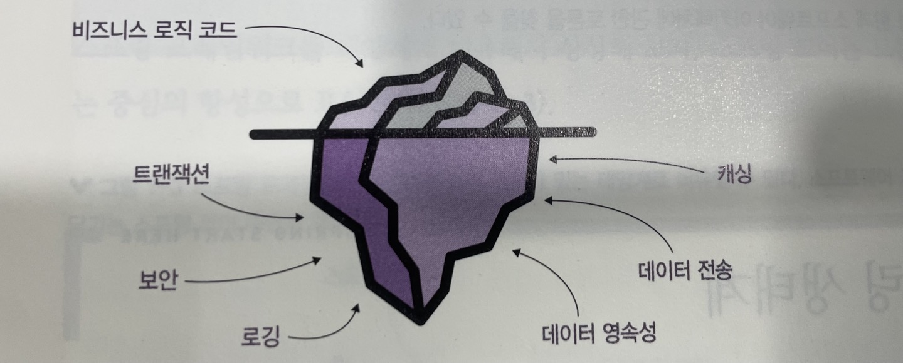
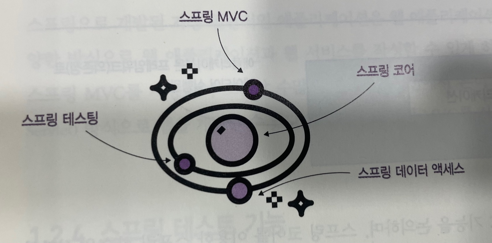
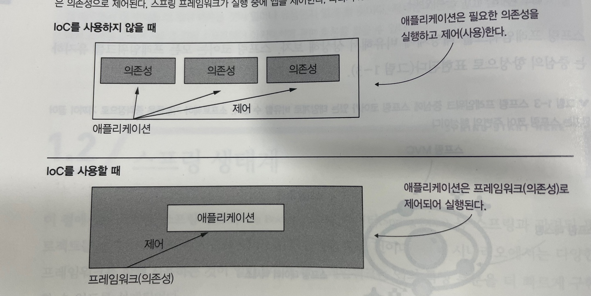

## 1장 현실 세계의 스프링
스프링 프레임워크, 줄여서 스프링은 자바 생태계 일부인 애플리케이션 프레임워크이다  
애플리케이션 프레임워크는 애플리케이션을 개발하는 기본 구조를 제공하는 공통 소프트웨어 기능으 집합이다 
즉, 틀은 다 만들어져 있고, 그 틀에 맞춰서 안에 내용만 우리의 입맛대로 바꾸면 된다.  
JAVA+스프링이 인기를 끌면서 JVM 언어도 스프링을 더 자주 사용하기 시작했다. ex) 코틀린 (안드로이드 개발 언어)  

### 마이크로서비스 아키텍처(MSA)로 진화
애플리케이션 프레임워크는 우리가 애플리케이션을 구축하는 기능의 집합으로, 앱을 구축하는데 사용할 수 있는 광범위한 도구와 기능을 제공한다  
프레임워크가 제공하는 모든 기능을 사용할 필요는 없으며, 만들려는 앱을 요구사항에 따라 사용할 프레임워크를 적절히 선택해서 사용하면 된다  

이케아 같은 상점에서 옷장을 구입한다고 생각해보자  
이케아에서 파는 옷장은 조립된 옷장이 아니기에 만드는데 꼭 필요한 부품과 조립 방법이 적힌 설명서가 있을 것이다  
옷장을 주문했는데, 꼭 필요한 부품 대신에 테이블,옷장 등 어떤 가구든 조립할 수 있는 부품을 받았다고 생각해보자  
옷장을 만들려면 그것을 조립할 수 있는 알맞은 부품을 찾아야 한다  
애플리케이션 프레임워크가 이케아 로 비유하면 될 것 같다  
우리는 이케아에서 우리가 원하는 것을 만들기 위해서 적절하게 부품을 사서 원하는 가구를 만들면 된다  

프레임워크 아이디어는 새로운 것이 아니다. 소프트웨어 개발 역사를 통틀어 프로그래먿르은 여러 애플리케이션에서 작성한 코드 일부를 재사용할 수 있음을 관찰했다  
구현된 어플리케이션이 많지 않은 초기에 각 애플리케이션은 고유했고 특정 프로그래밍 언어를 사용하여 원점에서부터 개발했다  
소프트웨어 개발 영역이 확장되고 점점 더 많은 애플리케이션이 시장에 출시되기 시작하면서 이런 많은 애플리케이션의 요구 사항이 유사하다는 것을 쉽게 알 수 있었다. 아래 예시를 보자  
- 로깅, 오류, 경고, 정보 메세지는 모든 앱에서 발생한다.
- 대부분 애플리케이션은 트랜잭션을 사용하여 데이터 변경을 처리한다(트랜잭션은 데이터 일관성을 관리하는 중요한 메커니즘을 나타냄)
- 애플리케이션 대부분은 공통으로 발생하는 동일한 취약점에 보호 메커니즘을 사용한다.
- 애플리케이션 대부분은 유사한 방법으로 상호 통신한다.
- 애플리케이션 대부분은 캐싱 또는 데이터 압축처럼 성능을 향상하는데 유사한 메커니즘을 사용한다.

애플리케이션 프레임워크 엔진을 구성하는 코드보다 비즈니스 로직은 훨씬 작다  
비즈니스 로직: 애플리케이션의 비즈니스 요구사항을 구현하는 코드를 의미한다  
모든 앱은 비즈니스 로직보다 보안,로깅,데이터 일관성 등 다른 여러 측면을 더 많이 다룬다 
또 비즈니스 로직은 기능적 관점에서 애플리케이션을 다른 애플리케이션과 구분 짓게 만드는 요소다  
차량 공유 시스템과 소셜 네트워킹 앱처럼 이 두 앱을 이용하는 경우의 사용 사례는 다르다 

다른 조치를 취하기는 하지만 둘 모두 데이터 저장, 데이터 전송, 로깅, 보안 구성, 캐싱 등이 필요하다  
다양한 애플리케이션에서 비업무용으로 구현한 이것을 재사용할 수 있다, 매번 같은 기능을 다시 작성하면은 비효율적이기 이므로 재사용을 한다  
- 다시 개발하지 않고, 재사용함으로써 시간,비용 줄임
- 누군가 테스트한 코드이기 때문에, 버그를 불러올 가능성이 적다
- 동일한 기능을 이해하는 많은 개발자들이 있기 때문에 조언을 구하기 편한다.

### 스프링 생태계
이 절에서는 스프링, 스프링 부트, 스프링 데이터 등 스프링과 관련된 프로젝트를 설명한다  
스프링을 단순히 프레임워크라고 하지만, 실제로는 훨씬 더 복잡하다, 스프링은 여러 프레임워크의 생태계다  
일반적으로 개발자가 스프링 프레임워크를 언급할 때는 아래 부분을 언급한다
1) Spring core: 기본 기능을 포함하는 스프링의 기반 부분 중 하나이다.
- Spring Context: 스프링이 앱의 인스턴스를 관리할 수 있게 하는 스프링 프레임워크의 기본 기능
- Aspect: 스프링이 앱에서 정의한 메소드를 가로채고 조작하는 기능
- SpEL: 특정 언어를 사용하여 스프링 구성 내용을 작성하는 기능
즉, 스프링 코어가 앱에 통합하는데 사용되는 메커니즘을 담고 있다는 사실을 곧 이해할 수 있을거다.
2) SpringMVC: HTTP 요청을 처리하는 웹 어플리케이션을 개발할 수 있게하는 프레임워크 일부분
3) Spring Data Access: SQL 과 연결하고 앱 영속성 계층을 구현하는데 사용할 수 있는 기본 도구를 제공한다.
4) 스프링 테스팅: 스프링 어플리케이션 테스트를 작성하는데 필요한 도구를 담고있다.

스프링 프레임워크를 태양계에 비유해보자, 스프링 코어는 모든 프레임워크를 유지하는 중심이다 

#### 스프링 코어의 이해: 스프링 기초
스프링 코어는 앱에 통합되는 기본 메커니즘을 제공하는 스프링 프레임워크 일부분이다  
<b>스프링은 제어역전(IoC) 원칙으 기반으로 작동한다</b>  
이 원칙을 사용하면 앱이 실행을 제어하는 대신 다른 소프트웨어 부분, 스프링 프레임워크에 제어 권한을 넘긴다  
우리는 @Configuration 을 이용하여 앱 로직을 정의하도록 작성된 코드 관리 방법을 프레임워크에게 지시한다  
제어 역전(IoC) 에서 역전은 앱이 자체 코드로 실행을 제어하거나 의존성을 사용하지 못하는 대신 프레임워크(의존성)이 앱과 앱의 코드를 제어한다는 의미이다  
> 제어: 인스턴스 생성, 메소드 호출 같은 작업을 말한다 
> > 프레임워크는 앱에서 정의한 클래스으 객체를 생성할 수 있다
> >> 우리가 작성하는 Configuration 을 기반으로 스프링은 메소드를 가로채서 다양한 기능으로 보강한다.
> >>> ex) 스프링은 특정 메소드를 가로채서 메소드 실행중에 나타날 수 있는 오류를 기록할 수 있다.

2~5장에서는 스프링 IoC 기능을 논의하며, 스프링 코어를 이용한 스프링 학습을 시작한다  
IoC 컨테이너는 애플리케이션의 스프링 구성요솨 애플리케이션의 구성 요소를 프레임워크에 결합한다  
종종 스프링 컨텍스트라고 하는 IoC 컨테이너를 사용하여 특정 객체를 스프링에 전달해서 프레임워크가 구성한 방식으로 객체를 사용할 수 있게 한다  
스프링은 IoC 컨테이너에 추가된 인스턴스를 제어할 수 있으며, 가능한 작업 중 하나는 이 인스턴스의 동작인 메소드를 가로채는 것이다   **(??)**
이 기능을 메소드 애스펙팅 이라고 하며, 스프링 AOP 는 프레임워크가 앱과 상호작용하는 일반적인 방법 중 하나이다. 이 특성은 스프링 AOP 를 필수 요소 중 하나롬 만들기도 한다

#### 스프링 데이터 액세스 기능을 사용한 앱 영속성 구현
애플리케이션 대대분에서는 처리하는 데이터를 유지하는 것이 중요하다  
DB 와 협업이 기본 주제이며, 스프링에서는 많은 경우에 데이터 영속성을 관리하는데 데이터 액세스 모듈을 사용한다  
Spring data access 는 JDBC, Hibernate, MySQL 등 객체 관계형 매핑 프레임워크와 통합, 트랜잭션 관리가 포함된다  

#### 웹 앱 개발을 위한 스프링 MVC 기능
스프링으로 개발된 가장 일반적인 애플리케이션은 웹 어플리케이션이며, 스프링 생태계 내에서 다양한 방식으로 웹 어플리케이션과 웹 서비스를 작성할 수 있게 하는 많은 도구 세트를 제공한다  
스프링 MVC 를 사용하여 오늘날 수 많은 애플리케이션에서 흔히 사용되는 표준 자바 서블릿 방식으로 웹을 개발할 수 있다

#### 스프링 테스트 기능
스프링 테스트 모듈은 단위,통합 테스트를 작성하는데 사용할 수 있는 다양한 도구 세트를 제공한다  
필자 경험에 따르면 테스트를 이해하지 못하는 개발자는 성숙한 개발자라고 할 수 없다. 테스트에 관심을 가져야 한다.

#### 스프링 생태계의 프로젝트
스프링 생태계에는 잘 통합되어 더 큰 세계를 형성하는 다른 프레임워크의 큰 집합이 포함되어 있다  
ex) jpa,security, cloud, batch 등등 여러가지 추상화된 프로젝트가 있다  
여기서 말하는 프로젝트는, 독립적으로 개발된 스프링 생태계의 한 부분을 의미한다  
각 프로젝트에는 기능을 확장하는 별도의 작업 팀이 있으며, 스프링 공식 사이트에서 내용을 참고할 수 있다  

#### 스프링 데이터로 영속성 기능 확장
스프링 데이터 프로젝트는 최소한의 코드 작성으로 쉽게 데이터베이스에 연결하고 영속성 계층을 사용할 수 있도록 해 주는 스프링 생태계의 한 부분을 구현한다  
이 프로젝트는 SQL 및 NoSQL 기술을 모두 활용하며, 데이터 영속성을 이용한 작업 방식을 단순화하는 고수준 계층을 생성한다  

#### 스프링부트
스프링부트는 구성보다 관례 개념을 도입한 스프링 생태계의 프로젝트 중 하나이다  
이 개념의 주요 사상은 프레임워크 모든 구성을 사용자가 직접 설정하는 대신 스프링 부트가 필요에 따라 정의할 수 있는 기본 구성을 제공하는 것이다  
그 결과 알려진 규칙을 따르고 앱은 서로 차이가 크지 않아 코드를 덜 작성하게 된다  
따라서 앱마다 모든 구성을 새로 작성하는 대신 기본 구성에서 시작하여 관례와 다른 부분을 변경하는 것이 더 효율적이다  
이 책에서는 시작하는데 필수적인 프로젝트인, 스프링 코어, 스프링 데이터, 스프링 부트를 사용한다  

### 실제 시나리오에서 스프링
이 절에서는 스프링 프레임워크를 사용하기에 매우 적합한 애플리케이션 시나리오 몇가지를 제시한다  
프레임워크는 백엔드 전용으로 국한되지 않는다, 자동화 테스트 앱 개발 또는 독립형 데스크톱 시나리오 같은  
다양한 종류의 애플리케이션 팀이 스프링을 성공적으로 사용하는 것을 보여주었다  
다음은 일반적으로 스프링이 적합한 공통적인 사례이다
1) 백엔드 앱 개발
2) 자동화 테스트 프레임워크 개발
3) 데스크톱 앱 개발
4) 모바일 앱 개발

#### 백엔드 앱 개발에서 스프링 사용

