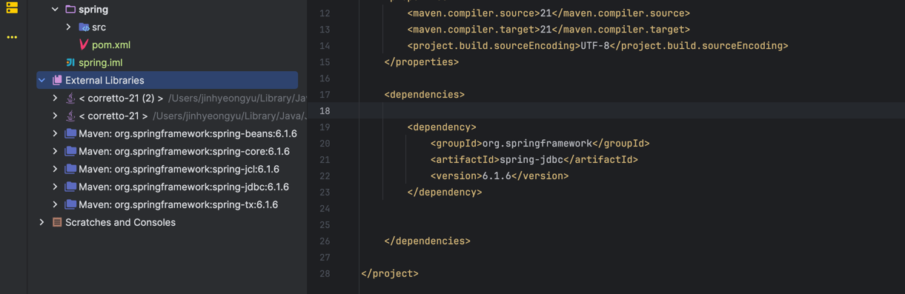
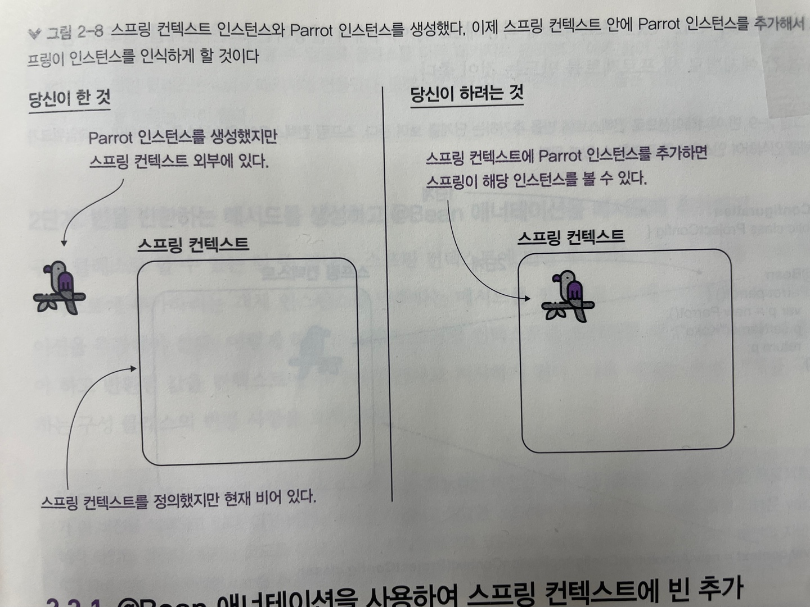
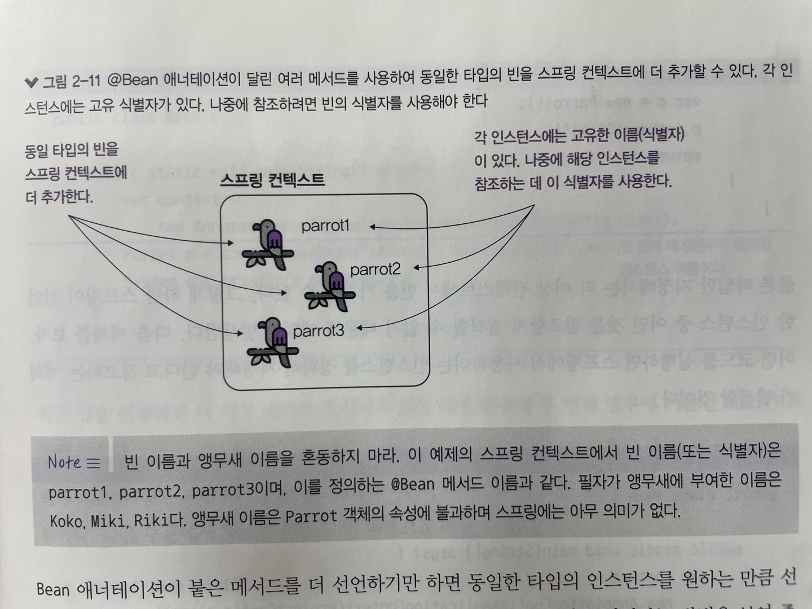

## 스프링 컨텍스트: 빈 정의(2장)
이 장에서는 매우 중요한 스프핑 프레임워크 요소인 **컨텍스트**로 작업하는 방법을 배웁니다 <br>
컨텍스트는 스프링 앱에서 **애플리케이션 컨텍스트(Application Context)** 라고도 합니다 <br>

컨텍스트를 프레임워크가 관리할 모든 객체 인스턴스를 추가하는 앱의 메모리 공간이라고 생각해보자 <br.
기본적으로 스프링으 애플리케이션에 정의한 어떤 객체도 알지 못한다 <br>
스프링이 객체를 볼 수 있게 하려면 컨텍스트에 객체를 추가해야 한다 <br>

스프링은 컨텍스트 안의 인스턴스를 사용하여 앱이 제공하는 다양한 기능에 앱을 연결한다 <br>
이 책에서는 트랜잭션, 테스트 기능 등 중요한 기능의 기본을 배울 것입니다<br>

스프링 컨텍스트 어떤 것이며 어떻게 작동하는지 배우는 것은 스프링 사용 방법을 배우는 첫 걸음이다 <br>
스프링 컨텍스트는 사용자가 정의한 인스턴스를 스프링이 제어할 수 있게 해주는 복잡한 메커니즘이다 <br>
위 방식으로 스프링은 프레임워크가 제공하는 기능을 사용할 수 있다 <br>

이 장에서는 스프링 컨텍스트에 객체 인스턴스를 추가하는 방법을 배웁니다 <br>
이런 객체 인스턴스를 빈(bean) 이라고 부릅니다 <br>

### 메이븐 프로젝트 생성 
어플리케이션 빌드 도구 -> 대표적으로 Maven, Gradle 2가지가 있다 <br>

**빌드도구가 수행하는 작업**
- 앱에 필요한 의존성 내려 받기
- 테스트 실행
- 구문이 정의한 규칙 준수 여부 검증
- 보안 취약점 확인
- 앱 컴파일
- 실행 가능한 아카이브에 앱 패키징

```java
repositories {
    mavenCentral()
}
```

위 레포지토리에서 의존성(JAR)을 내려받는것 알아야 한다 <br>


### 스프링 컨텍스트에 새로운 빈 추가
이번에는 스프링 컨텍스트에 빈(bean) 같은 새로운 객체 인스턴스를 추가하는 방법을 알아볼 것입니다 <br>
스프링 컨텍스트에 빈을 추가하는 방법에는 여러 가지가 있으며, 스프링이 빈을 관리하고 제공하는 기능을 앱에 플러그인할 수 있음을 알 수 있다 <br>
즉 언제 어떤 방법을 선택해야 하는지 알 필요가 있습니다 <br>
1) @Bean
2) 스테레오타입 어노테이션 사용
3) 프로그래밍 방식

3가지 정도가 있습니다. <br>

먼저 프레임워크를(스프링X) 참조하지 않는 프로젝트를 만들어 보았습니다, 그런 다음 스프링 컨텍스트를 사용하는데 필요한 의존성을 추가하고 생성해보자 <br>
```java
public class Parrot {
	private String name;


	public String getName () {
		return name;
	}

	public void setName (String name) {
		this.name = name;
	}

}

```

```java
public class Main {
	public static void main (String[] args) {
		Parrot p = new Parrot();
		System.out.println(p.getName());
		p.setName("바보 앵무새");
		System.out.println(p.getName());
	}
}
```

> null <br>
> 바보 앵무새
<br>

이제 위 프로젝트에 spring 의존성을 추가합니다.
```java
        <dependency>
            <groupId>org.springframework</groupId>
            <artifactId>spring-jdbc</artifactId>
            <version>6.1.6</version>
        </dependency>
        <dependency>
             <groupId>org.springframework</groupId>
             <artifactId>spring-context</artifactId>
              <version>6.1.6</version>
        </dependency>

```

눈여겨보야할 점은 스프링이 모듈형으로 설계되었다는 점이다 <br>
모듈형은 스프링 에코시스템의 일부 기능을 사용할 때 앱에 스프링 전체를 추가할 필요 없이 사용할 부분만 추가하면 된다는 의미이다 <br>
> 모듈 == 부품  으로 이해하면 좋다

위 스프링 컨텍스트 의존성만 추가한 것을 볼 수 있는데, 이는 스프릥 컨텍스트를 사용하는데 필요한 종속성을 가져오라고 메이븐에 지시하는 것이다 <br>
이 책 전반에서는 구현하는 내용에 따라 프로젝트에 다양한 종속성을 추가하기는 하지만 항상 필요한 것만을 추가한다 <br>
> 일반적으로 스프링 의존성은 org.springframework 그룹 ID 의 일부분이다

프로젝트에 위 의존성이 추가되면 스프링 컨텍스트 인스턴스를 생성할 수 있다 <br>
```java
public class Parrot {
  private String name;
  // getter
  // setter
}

public static void main (String[] args) {
    var context = new AnnotationConfigApplicationContext(); // 스프링 컨텍스트의 인스턴스 생성
}
```

- var == 타입추론, 컴파일시 자동으로 타입을 찾아서 매칭을 시킨후 컴파일을 한다.
  - 보통 한번쓰고 버리는 인스턴스에 사용한다.

위에서 AnnotationConfigApplicationContext 인스턴스 생성을 통해 스프링 컨텍스트를 만들었습니다 <br>
그리고 스프링 컨텍스트에 Parrot 객체를 추가하는 방법으로 `@Bean` 어노테이션을 사용해볼 것입니다

위 사진처럼 @Bean 어노테이션을 선언을 해주던가, 아니면 다른 방법을 해서 스프링 컨텍스트에 인스턴스를 추가하면 스프링이 해당 인스턴스를 볼 수 있다 <br>

#### @Bean 어노테이션을 사용하여 스프링 컨텍스트에 Bean 추가
스프링에서 빈을 추가하는 방법을 배우는 이유는 스프링이 Bean 일부인 객체만 관리할 수 있기 때문이라는 점을 알아야 합니다 <br>
@Bean 어노테이션을 사용하여 스프링 컨텍스트에 빈을 추가할 때 따라야 하는 단계가 있다
1) @Configuration 어노테이션이 지정된 프로젝트 구성 클래스를 정의한다. -> 스프링 컨텍스트를 구성하는데 사용할 구성 클래스를 정의한다.
2) 컨텍스트에 추가하려는 객체 인스턴스를 반환하는 메소드를 구성 클래스에 추가하고 @Bean 어노테이션으로 메소드에 주석을 추가한다.
3) 스프링이 1에서 정의한 클래스를 사용하게 한다. 우리는 구성 클래스를 사용하여 다양한 프레임워크 구성을 작성한다.

```java
@Configuration // 설정 파일을 정의하겠다는 어노테이션
public class ProjectConfig {
	
	@Bean // 스프링 컨텍스트에 아래 메소드 등록하겠다는 뜻
	Parrot parrot() {
		var p = new Parrot();
		p.setName("Koko");
		return p;
	}
}
```

@Configuration 은 스프링 어플리케이션에서 스프핑이 특정 작업을 수행하도록 지시하는데 사용하는 특수한 클래스 입니다.<br>
예를 들어 스프링에 빈을 생성하거나 특정 기능을 활성화 하도록 지시할 수 있습니다 <br>
(이 책에서는 @Configuration 이 지정된 클래스를 구성 클래스라고 합니다)

#### 1단계: 프로젝트에서 구성 클래스 정의하기
스프링 관련 구성 클래스를 정의하기 위해서 @Configuration 을 선언합니다
```java
@Configuration
public class ProjectConfig {
	
}
```

#### 2단계: 빈을 반환하는 메소드를 생성하고 @Bean 어노테이션을 메소드에 추가하기
SpringContext 에 Bean 을 추가해보겠습니다. 이를 위해서는 컨텍스트에 추가하려는 객체 인스턴스를 반환하는 메소드를 정의하고 <br>
그 메소드에 @Bean 어노테이션을 추가해야 한다 <br>
이렇게하면 스프링이 스프링 컨텍스트를 초기화 할 때 이 메소드를 호출해야 하고 반환된 값을 스프링 컨텍스트에 추가해야 한다고 지시한다 <br>
```java
@Configuration
public class ProjectConfig {

	@Bean
	Parrot parrot() {
		var p = new Parrot();
		p.setName("Koko");
		return p;
	}
}

```

메소드에 사용한 이름에는 동사가 포함되어 있지 않다는 점을 알아야 합니다 -> 스프링 컨텍스트에서 빈을 추가하는데는 이 규칙을 따르지 않는다<br>

#### 3단계: 새로 생성된 구성 클래스로 스프링이 컨텍스트를 초기화하도록 만들기 
스프링에 빈이 되어야 하는 객체 인스턴스를 알려주는 @Configuration 클래스를 정의했다 <br>
이제 스프링 컨텍스트가 초기화할 때 이 구성 클래스를 사용하도록 해야 합니다 <br>
```java
public class Main {
	public static void main (String[] args) {
		var context = new AnnotationConfigApplicationContext(ProjectConfig.class);

	}
}
```

스프링 컨텍스트 인스턴스가 생성될 때 구성 클래스를 매개변수로 전송하여 스프링이 이를 사용하도록 지시합니다 <br>

현재 Parrot 인스턴스가 실제로 컨텍스트가 포함되었는지 확인하려면 아래 코드를 출력해봅니다
```java
public class Main {
	public static void main (String[] args) {
		
		var context = new AnnotationConfigApplicationContext(ProjectConfig.class);
		Parrot p = context.getBean(Parrot.class);
		System.out.println(p.getName());
	}
	
}
```

> koko

실행시 Koko 라는 결과를 볼 수 있습니다.<br> 
객체에서 따로 수정을 한 적이 없는데, @Bean 등록을 하며 setter 를 통해 수정을 했습니다. 그 결과 값이 출력되는 것입니다<br>

스프링 컨텍스트의 목적은, 스프링이 관리해야 할 것으로 생각되는 인스턴스를 추가하는 것입니다 <br>
실제 앱에서는 모든 객체를 스프링 컨텍스트에 추가하지 않는다<br>

그럼 혹시 동일한 타입의 객체를 둘 이상 추가할수 있을까? <br>
그렇다면 이런 객체를 어떻게 개별적으로 참조할 수 있을까?
> @Bean 어노테이션이 달린 여러 메소드를 사용하여 동일한 타입의 Bean 의 스프링 컨텍스트에 더 추가할 수 있다
> >그리고 각 인스턴스에는 고유 식별자가 있다, 나중에 참조하기 위해선 빈의 식별자를 사용해야 한다.


동일한 타입의 빈을 스프링 컨텍스트에 많이 추가해도, 각 인스턴스 별 고유 식별자를 통해서 사용가능하다 <br>

@Bean 어노테이션이 붙은 메소드를 선언하기만 하면 동일한 타입의 인스턴스를 원하는 만큼 선언할 수 있다 <br>
물론 타입만 지정해서는 더 이상 스프링 컨텍스트에서 빈을 가져올 수 없다 <br>
그렇게하면 스프링이 선언한 인스턴스 중 어떤 것을 참조할지 짐작할 수 없기 때문에 예외가 발생한다 <br>
```java
public static void main (String[] args) {
  var context = new AnnotationConfigApplicationContext(ProjectConfig.class);
  Parrot p = context.getBean("parrot2", Parrot.class);
}
```

종류가 같은 빈이 여러개 있을 때는 컨텍스트에서 빈을 참조할 때 다른 방법을 선택할 수 있다 <br>
스프링 컨텍스트에 동일한 종류의 빈이 여러개 있다면 그 중 하나를 기본 빈으로 만들 수 있다 <br>
```java
@Bean
@Primary
Parrot parrot2() {
	var p = new Parrot();
	p.setName("zz");
	return p;
}
```

따로 스프링 컨텍스트에서 이름을 지정하지 않고 Parrot 을 참조한 경우 스프링은 기본적으로 Miki 를 선택합니다 <br>

### 스테레오 타입 어노테이션으로 스프링 컨텍스트에 빈 추가


