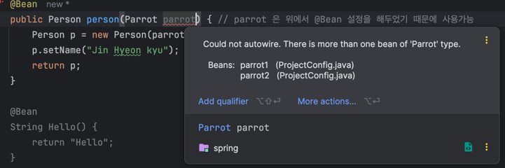

## 스프링 컨텍스트: 빈 작성(3장)
2장에서는 스프링 컨텍스트(스프링이 관리할 객체 인스턴스를 추가할 수 있는 앱 메모리의 공간)에 객체를 추가하는 방법을 배웠다 <br>
스프링은 IoC원칙 즉 프레임워크가 제어권을 가져야 하기 때문에, 어떤 객체를 제어해야 할지 스프링에게 알려줘야 한다 <br>

스프링이 제공하는 기능으로 앱 객체를 보강하려면 해당 객체에 대한 제어가 필요하다<br>

이 장에서는 스프링 컨텍스트에 추가한 빈을 액세스하는 방법을 설명한다 <br>
@Bean 어노테이션을 사용하여 구성 클래스에서 정의할 두 bean 사이의 관계를 구현하는 하는 것에서 시작한다 <br>
- bean 을 생성하는 메소드를 직접 노출하여 빈을 연결한다(이를 **와이어링** 이라고 한다) <br>
- 스프링이 메소드 매개변수를 이용하여 값을 제공하도록 활성화한다(이를 **오토와이어링** 이라고 한다) -> DI <br>

### 구성 파일에서 정의된 빈 간 관계 구현
스프링 구성을 사용하면 빈 간 관계를 설정할 때 이 방식을 자주 접하게 될 것이다 <br>
스프링 컨텍스트에 앵무새와 사람 이라는 두 인스턴스가 있다고 가정해보자, 우리는 이 인스턴스를 생성하고 컨텍스트에 추가하고 사람이 앵무새를 소유하도록 만들고 싶다 <br>
이를 위해서는 두 인스턴스를 연결해야한다, 연결하는 방법은 스프링 컨텍스트에서 빈을 연결하는 두 가지 접근 방식을 논의할 수 있다 ex) 와이어링, 오토와이어링 <br>

```java
public class Parrot {
	private String name;	
    // getter, setter, toString
}

public class Person {
	private String name;
	private Parrot parrot;
    // getter, setter
}
```

위 객체 2개를 선언하고 @Bean 어노테이션을 사용하여 빈 두개를 정의한다 -> 빈을 정의하여 스프링 컨텍스에 넣는다(or 관리를 요청한다)
```java
@Configuration
public class ProjectConfig {

	@Bean
	Parrot parrot () {
		var p = new Parrot();
		p.setName("Koko");
		return p;
	}

	@Bean
	public Person person () {
		Person p = new Person();
		p.setName("Jin Hyeon kyu");
		return p;
	}

}
```

위 코드를 작성하고 Main 클래스로 가서 두 인스턴스의 연결 여부를 확인할 수 있다. 
```java
		Person person = context.getBean(Person.class);
		Parrot parrot = context.getBean(Parrot.class);
		System.out.println("parrot = " + parrot.getName());
		System.out.println("person = " + person.getName());
		System.out.println("person's parrot = " + person.getParrot()); // 사람과 앵무새 관계 체크
```

> parrot = Koko <br>
person = Jin Hyeon kyu <br>
person's parrot = null

위 출력 결과를 보면 사람과 앵무새의 관계는 Null 로 나온다 <br>
두 객체 다 빈으로 등록되어 스프링 컨텍스트에 있지만, 아직 아무런 관계가 설정되어 있지 않다 <br>

#### 두 @Bean 메소드 간 직접 메소드를 호출하는 빈 작성
1) 다이렉트 와이어링
```java
@Configuration
public class ProjectConfig {

	@Bean
	Parrot parrot () {
		var p = new Parrot();
		p.setName("Koko");
		return p;
	}

	@Bean
	public Person person () {
		Person p = new Person();
		p.setName("Jin Hyeon kyu");
		p.setParrot(parrot()); // 위 메소드 참조
		return p;
	}

}
```

위 처럼 코드를 작성하면 출력결과에서 연관관계가 나온다. -> 다이렉트 와이어링 이라고한다 <br>
Bean 등록을 할 때 직접 관계를 설정해줘서, 빈을 반환하는 메소드를 직접 호출하는 것을 의미한다 <br>
위 코드처럼 의존 관계를 설정하는 빈을 정의하는 메소드에서 이 메소드를 호출해야 한다 <br>

스프링 컨텍스트에 기존에 Parrot() 빈이 있을 경우, 호출을 더 이상 parrot() 메소드에 위임하지 않고, 스프링 컨텍스트에서 직접 parrot 를 반환한다 <br>
테스트 해보고 싶다면 parrot 클래스에 기본 생성자에다가 출력 코드를 넣어 실행 시켜보면 된다 


#### @Bean 매소드의 매개변수로 빈 와이어링하기
@Bean 메소드의 매개변수로 정의하면 스프링이 컨텍스트에서 해당 매개변수 타입의 빈을 제공하도록 지시한다 <br>
그런 다음 빈이 정의된 후 다른 빈을 생성할 때, 이미 생성된 빈을 사용할 수 있다, 이렇게 두 빈 간에 has-A 관게를 설정할 수 있다 <br>
```java
@Configuration
public class ProjectConfig {

	@Bean
	Parrot parrot () {
		var p = new Parrot();
		p.setName("Koko");
		return p;
	}

	@Bean
	public Person person (Parrot parrot) { // parrot 은 위에서 @Bean 설정을 해두었기 때문에 사용가능 -> 스프링은 이 매개변수에 앵무새 빈을 주입한다
		Person p = new Person();
		p.setName("Jin Hyeon kyu");
		p.setParrot(parrot); // 위 메소드 참조
		return p;
	}

}
```

의존성 주입 DI 라고 한다 <br>
의존성 주입은 프레임워크가 특정 필드 또는 매개변수에 값을 설정하는 기법이다 <br>
DI 는 프레임워크가 특정 필드 또는 매개변수에 값을 설정하는 기법이다 <br>
스프링은 person() 메소드를 호출할 때 특정한 값을 매개변수로 설정하고 이 메소드의 의존성을 해결한다 <br>

DI 는 IoC 원리를 응용한 것으로 IoC 는 프레임워크가 실행될 때 애플리케이션을 제어하는 것을 의미한다 <br>
DI 는 생성된 객체 인스턴스를 관리하고 앱을 개발할 때 작성하는 코드를 최소화하는데 도움이 되는 매우 편리한 방법이라 스프링뿐만 아니라 DI를 자주 사용하게 된다 <br>
IoC 를 사용하여 인스턴스 제어를 스프링 어플리케이션에게 넘긴다.

### @Autowired 어노테이션을 사용한 빈 주입
@Autowired 사용하는 방법
- 클래스의 필드에 값 주입하기: 예제에서 흔함, 테스트에서 사용
- 클래스의 생성자 매개변수로 값 주입하기: 실제 시나리오에서 가장 자주 사용하는 방법
- setter 로 값 주입하기: 거의 사용 안함

#### @Autowired 로 클래스 필드를 이용한 값 주입
이 방식은 매우 간단한데 단점도 있어 프로덕션 코드를 작성할 때는 사용하지 않는다 <br>
```java
@Component // 스프링 컨텍스트에 인스턴스 추가
public class Person {
	private String name = "jin";
	
	@Autowired // 스프링 컨텍스트에서 빈을 가져와 이 어노테이션 필드 값에 인스턴스 매핑을 한다.
    private Parrot parrot;
}
```

한번 전체적인 코드를 봐보자
```java
@Component
public class Parrot {
	private String name = "jin";
}

@Component
public class Person {
	private String name = "Jin Hyeon kyu";
	
	@Autowired
	private Parrot parrot;
}
```

위 처럼 코드를 작성하고 Main 을 출력해보면, 값이 잘 출력이 될 것이다 <br>

그럼 프로덕션 코드에서 이 방식이 바람직하지 않은 이유는 뭘까?<br>
이 방식이 잘못된 것은 아니지만, 앱을 유지 관리하고, 테스트할 수 있도록 만들기 위해서는 지양해야한다<br>
final 을 이용하여 필드를 관리하려고 하는데 final 을 사용하기 위해서는 초기값 즉 생성자가 없이는 정의를 할 수 없다 <br>

#### @Autowired 사용하여 생성자로 값 주입
스프링이 빈을 생성할 때 객체의 속성에 값을 주입하는 두 번째 방법은 인스턴스를 정의하는 클래스의 생성자를 사용하는 것이다 <br>
이 방법을 이용하면 필드를 final 로 정의할 수 있어 스프링이 필드를 초기화한 후에는 아무도 필드 값을 변경할 수 없다 <br>

생성자를 호출할 때 값을 설정할 수 있다는 점은 스프링이 대신 필드를 주입하는 방식에 의존하지 않는 특정 단위테스트를 작성할 때도 도움이 된다 <br>

```java
private final Person person;

@Autowired
public Person(Parrot parrot) {
	this.parrot = parrot;
}
```

필드 주입 대신 생성자 주입 방식을 사용하여 필드를 final 로 구성할 수 있다 <br>

#### setter 를 이용한 의존성 주입 사용
```java
@Component
public class Person {
	private String name = "jin";
	private Parrot parrot;
	
	@Autowired
    public void setParrot(Parrot parrot) {
		this.parrot = parrot;
    }
}
```

### 순환 의존성 다루기
스프링이 애플리케이션의 객체들에 대한 의존성을 빌드하고 설정하게 위임하는 것은 편리하다 <br>
이 작업을 스프링에 맡기면 많은 코드를 작성하지 않고도 앱을 더 쉽게 읽고 이해할 수 있다 <br>

하지만 스프링은 가끔 혼동될 수 있다, 실제로 자주 발생하는 실수로 인해 즉 순환 의존성을 생성하는 것이다 (순환 참조라고도 한다) <br>

순환 의존성은, 빈을 생성하기 위해 스프링이 아직 없는 다른 빈을 주입해야 하는 상황을 의미한다 <br>
```java
@Component
public class Person {
	private String name = "Jin Hyeon kyu";

	private final Parrot parrot;

	@Autowired
	public Person (Parrot parrot) {
		this.parrot = parrot;
	}

}

@Component
public class Parrot {
	private String name = "jin";

	@Autowired
	public Parrot (Person person) {
		this.person = person;
	}

	private final Person person;

}
```

위 코드를 보면, Parrot 도 Person 을 참조하고, Person 도 Parrot 을 참조한다 <br>

위 코드를 실행하면 순환참조 에러가 발생한다 <br>
순환 참조를 피하기 위해서는 생성을 위해 다른 객체에 의존해야 하는 객체를 정의하지 않는지 확인하면 된다 <br>
이와 같이 한 객체에서 다른 객체로 의존성을 갖는 것은 잘못된 클래스 설계이다 <br>

### 스프링 컨텍스트에서 여러 빈 중 선택하기
스프링 컨텍스트에 Parrot 빈이 3개가 있다고 가정해보자 <br>
Parrot 타입 값을 매개변수에 주입하도록 스프링을 구성하면 스프링은 어떻게 동작할까? <br>
1) 매개변수의 식별자가 컨텍스트의 빈 중 하나의 빈 이름과 일치하는 경우, 스프링은 매개변수와 이름이 동일한 빈을 선택한다
2) 매개변수의 식별자가 컨텍스트의 빈 이름과 일치하지 않는 경우에는 다음과 같은 선택지가 있다
- 빈 중 하나를 기본으로 표시한 경우 @Primary 어노테이션 사용한 빈을 선택한다
- @Qualifier 을 사용하여 특정 빈을 명시적으로 선택한다
- 예외를 발생시켜 실패한다.

```java
	@Bean
	public Parrot parrot1() {
		var p = new Parrot();
		p.setName("parrot1");
		return p;
	}

	@Bean
	public Parrot parrot2() {
		var p = new Parrot();
		p.setName("parrot2");
		return p;
	}


	@Bean
	public Person person(Parrot parrot) { // 어떤 bean 을 가리키는지 모름
		Person p = new Person(parrot1());
		p.setName("Jin Hyeon kyu");
		return p;
	}
```


위 코드를 작성하면 위 에러 문구가 뜬다. <br>
위 에러를 해결하기 위해서는 person() 에 파라미터를 명시적으로 작성해야 한다.
```java
	@Bean
	public Person person(Parrot parrot2) { // 어떤 bean 을 가리키는지 모름
		Person p = new Person(parrot1());
		p.setName("Jin Hyeon kyu");
		
```

실무에서는 매개변수 이름에 의존하는 것을 피하고 싶을 것이다 <br>
그래서 명시적으로 특정 빈을 주입하려는 의도를 표현하고자 @Qualifier 를 사용한다<br>
```java
	@Bean
	public Person person(@Qualifier("parrot2") Parrot parrot) { 
		Person p = new Person(parrot1());
		p.setName("Jin Hyeon kyu");
		return p;
	}
```

요약을 하자면, 스프링 컨텍스트에 타입이 동일한 빈이 여러개 포함되어 있다면 스프링은 매개변수와 이름이 일치하는 빈을 선택한다.