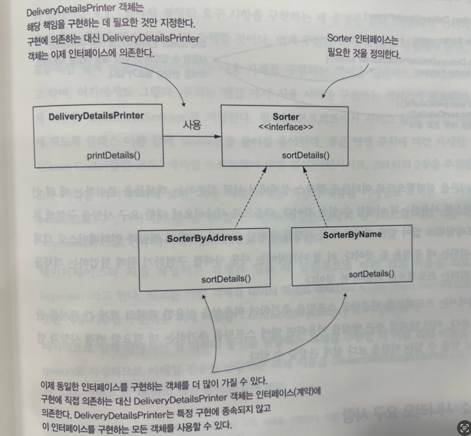
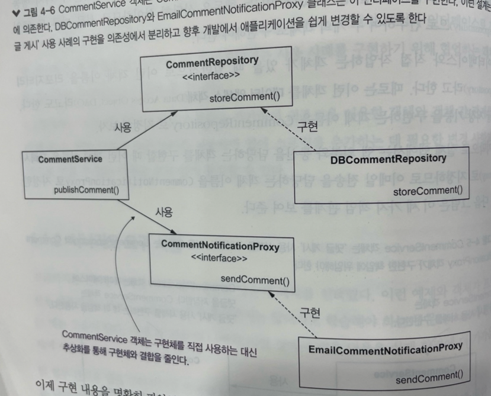

## 4장 스프링 컨텍스트: 추상화
- 계약 정의를 위한 인터페이스 사용
- 추상화와 함께 의존성 주입
- 스테레오타입 어노테이션으로 객체의 책임에 집중

싱글톤을 보장을 할 시 메모리에 남아있어서 계속 가져다가 주는데, 스프링 컨텍스트 <br>

실제 프로젝트에서 구현을 분리하는데 추상화를 사용할 때가 많아 매우 중요한 개념이다 <br>
우리는 구현을 분리함으로써 애플리케이션의 유지 관리 및 테스트를 편하게 할 수 있다 <br>
이번에는 인터페이스를 사용하여 계약을 정의하는 방법을 다시 한 번 살펴본다 <br>

이 주제에 접근하기 위해 먼저 객체 책임을 논하고 객체가 앱의 표준 클래스 설계에 어떻게 적용되는지 알아볼 것이다 <br>
스프링을 사용하지 않은 작은 시나리오를 구현하되, 요구사항을 구현하고 추상화로 앱 의존 객체를 분리하는데 중점을 둔다 <br>

### 계약 정의를 위한 인터페이스 사용
자바에서 인터페이스는 특정 책임을 선언하는 데 사용하는 추상화 구조이다 <br>
인터페이스를 구현하는 객체는 이 책임을 정의해야 한다 <br>
동일한 인터페이스를 구현하는 여러 객체는 해당 인터페이스가 선언한 책임을 다른 방식으로 정의한다 <br>
인터페이스는 무엇이 발생해야 하는지(필요 대상) 을 지정하는 반면, 인터페이스를 구현하는 객체는 '어떻게 그것이 발생해야 하는지(발생 방법)' 을 지정한다<br>

인터페이스란 객체가 필요한 것을 요청하는 방식이다 <br>

#### 구현 분리를 위해 인터페이스 사용
ex) 차량 공유 앱은 인터페이스 이다. <br>
누가 운전하는지, 무슨 차를 타는지 상관없이, 목적지에 가기만 하면 된다 <br>

```java
public class DeliveryDetailsPrinter {
	private SorterByAddress sorter;
	
	public DeliveryDetailsPrinter(SorterByAddress sorter) {
		this.sorter = sorter;
    }
	
	public void printDetails() {
		sorter.sortDetails();
    }
}
```

위 코드는 만약에 정렬 대상을 변경해야 하는 요구 사항이 들어오면, 두 객체의 코드를 모두 변경해야 한다 <br>

이 설계를 어떻게 개선할 수 있을까? <br>
객체의 책임을 변경할 때 변경된 책임을 사용하는 다른 객체까지 변경할 필요가 없도록 하고 싶다 <br>

이 설계 문제는 DeliveryDetailsPrinter 에서 필요한 것과 필요한 방법 두가지 모드를 정의하기 떄문에 발생한다 <br>
앞서 말한 것처럼 객체는 필요한 것만 지정하고 필요한 것이 어떻게 구현되는지는 알 필요가 없다 🌟중요🌟<br>

📌 객체지향 5대원칙 ISP - 인터페이스 분리 원칙을 따른다 <br>
구현에 직접 의존하는 대신 객체는 인터페이스에 의존하게 끔 만드는 것이다 <br>
<br>

```java
public interface Sorter {
	void sortDetails();
}
```

위 처럼 인터페이스를 선언하고 사용해야 한다 <br>

#### 시나리오 요구 사항
팀 업무 관리용 앱을 구현한다고 하자, 이 앱의 기능 중 하나는 사용자가 업무에 대한 댓글을 남길 수 있도록 하는 것이다

#### 프레임워크 없이 요구 사항 구현
표준적인 실제 어플리케이션에서 사용 사례를 구현하는 객체를 일반적으로 서비스 라고 한다 <br>
DB 와 직접 작업하는 객체 이름을 레포지토리 라고 한다 or DAO 라고도 함 <br>

구현간에 직접적으로 결합하면 안된다, 무조건 인터페이스를 사용하여 구현을 분리해야 한다 <br>
아래 사진은 추상화로 이 클래스 설게를 분리하는 방법을 보여준다 <br>
<br>
```java
public class Comment {
	private String author;
	private String text;
	
	// getter & setter
}
```

이제 레포지토리와 프록시의 책임을 정의할 수 있다 <br>

```java
public interface CommentRepository {
	void storeComment (Comment comment);
}
```

이 인터페이스는 댓글 저장이라는 기능을 선언했다 <br>
나중에 계약을 구현하기 위해서는 위 메소드를 재정의하여 어떻게 구현할 것인지 생각해야한다 <br>
```java
// CommentRepository 구현하기
@Slf4j
public class DBCommentRepository implements CommentRepository {
	@Override
    public void storeComment(Comment comment) {
		log.info("Storing comment: {}",comment.getText());
    }
}
```

마찬가지로 CommentService 객체에 필요한 두 번째 책임에 대한 인터페이스를 정의해보자
```java
public interface CommentNotificationProxy {
	void sendComment(Comment comment);
}

@Slf4j
public class EmailCommentNotificationProxy implements  CommentNotificationProxy {
	@Override
    public void sendComment(Comment comment) {
		log.info("Sending notification for comment: {}",comment.getText());
    }
}
```

```java
	public static void main (String[] args) {
		var commentRepository = new DBCommentRepository();
		var emailCommentNotificationProxy = new EmailCommentNotificationProxy();

		CommentService commentService = new CommentService(commentRepository, emailCommentNotificationProxy);

		var comment = new Comment();
		comment.setAuthor("JIN HYEON KYU");
		comment.setText("나는 천재야");

		commentService.publishComment(comment);
	}
```

> Storing Comment : 나는 천재야 <br>
Sending Comment : 나는 천재야

위 출력 결과가 나옵니다. 

### 추상화와 함께 의존성 주입
위에서 설계한 자바 스타일 위에 스프링 프레임워크를 적용해볼 것이다 <br>
이 예제를 통해 스프링이 추상화를 사용할 때 의존성 주입을 관리하는 방법을 설명할 수 있다 <br>

대부분의 프로젝트에서 추상화로 객체 간 의존성을 구현하기 때문에 이 주제는 필수적이다 <br>

#### 스프링 컨텍스트에 포함될 객체 정하기
스프링 컨텍스트에 객체를 추가하는 가장 큰 이유는 스프링이 객체를 제어하고 프레임워크가 제공하는 기능으로 객체를 더욱 보강할 수 있도록 하려는 것이다 <br>
따라서 '이 객체를 프레임워크에서 관리해야 하는가?' 라는 질문에 따라 쉽게 결정할 수 있어야 한다 <br>

객체가 스프링 컨텍스트로부터 주입해야 하는 의존성이 있거나 그 자체가 의존성인 경우 해당 객체를 스프링 컨텍스트에 추가해야 한다 <br>
위 설계를 보면 의존성이 없는 객체는 Comment 라고 볼 수 있다. 의존성이 있고 없고는 보통 비즈니스 로직에서 차이가 난다고 생각한다 <br>
- CommentService: CommentRepository, CommentNotificationProxy 의존성 두 개를 갖고 있다.
- DBCommentRepository: CommentRepository를 구현하며 CommentService 의 의존성이다.
- EmailCommentNotificationProxy: CommentNotificationProxy 인터페이스를 구현하며 CommentService 의 의존성이다 

왜 Comment 인스턴스를 추가하지 않을까? <br>
스프링 프레임워크가 관리할 필요가 없는데, 스프링 컨텍스트에 인스턴스를 추가하면 앱에 불필요한 복잡성이 추가되어 앱의 유지 관리가 어려워지고 성능이 저하된다 <br>

인터페이스나 추상 클래스는 인스턴스화 할 수 없기 때문에 스프링 빈으로 등록하는 것은 의미가 없다 <br>

DI 기능을 사용하면 CommentService 객체와 그 의존성 인스턴스를 직접 생성하지 않아도 되며 <br>
이들 간 관계를 명시적으로 설정할 필요가 없다

#### 추상화에 대한 여러 구현체 중에서 Autowired 할 것을 선택
서로 다른 클래스로 생성된 빈이 2개 있고, 이 두빈이 CommentNotificationProxy 인터페이스를 구현한다고 가정해보자 <br>
스프링 컨텍스트에 동일한 타입의 빈이 2개 이상 있으면, @Primary, @Qualifier 을 사용해서 명시해준다 <br>

실무에서는 동일한 인터페이스에 대한 구현체가 여러 개 존재할 수 있다 <br>
이 인터페이스에 의존성 주입을 사용할 때는 어떤 구현체를 주입할지 스프링에 지정해야 한다 <br>

```java
@Component
public class CommentPushNotiProxy implements CommentNotificationProxy{
	@Override
	public void sendComment (Comment comment) {
		System.out.println("Sending comment " + comment.getText());
	}
}

@Component
public class EmailCommentNotificationProxy implements CommentNotificationProxy{
	@Override
	public void sendComment (Comment comment) {
		System.out.println("Sending Comment : " + comment.getText());
	}

}
```

이 어플리케이션을 그대로 실행하면 스프링이 컨텍스트에서 두 빈중 어떠한 빈을 주입할지 알 수 없어 예외가 발생한다. <br>

1) @Primary 로 주입에 대한 기본 구현 표시하기
```java
@Primary // DI에 대한 기본 구현으로 표시한다.
@Component
public class CommentPushNotiProxy implements CommentNotificationProxy{
	@Override
	public void sendComment (Comment comment) {
		System.out.println("Sending comment " + comment.getText());
	}

}
```

구현체가 두 개 있지만, 스프링은 항상 둘 중 하나만 주입을 해야할까? <br>
그렇다면 이 경우에는 왜 두 클래스가 다 필요할까? 라는 질문이다 <br>

2) @Qualifer 로 의존성 주입에 대한 구현 이름 지정하기
동일한 인터페이스에 대한 구현이지만, 서비스 단에서 서로 다른 객체에 의존한다 <br>
즉 서로 다른 객체가 동일한 것에 대해 서로 다른 구현을 사용해야 하는 경우 @Qualifer 로 이름을 지정하면 스프링이 어디에서 어떤 의존성을 주입해야 하는지 알려줄 수 있다 <br>
```java
@Qualifier("PUSH")
@Component
public class CommentPushNotiProxy implements CommentNotificationProxy{
	@Override
	public void sendComment (Comment comment) {
		System.out.println("Sending comment " + comment.getText());
	}

}

@Qualifier("EMAIL")
@Component
public class EmailCommentNotificationProxy implements CommentNotificationProxy{
	@Override
	public void sendComment (Comment comment) {
		System.out.println("Sending Comment : " + comment.getText());
	}

}
```

스프링이 이 중 하나를 주입하도록 하려면 @Quailfier 어노테이션으로 구현 이름을 다시 지정하기만 하면 된다 <br>

위 로직을 사용하는 방법은
```java
@Component
public class CommentService {
	private final CommentRepository commentRepository;
	private final CommentNotificationProxy commentNotificationProxy;

	public CommentService (CommentRepository commentRepository, @Qualifier("PUSH") CommentNotificationProxy emailCommentNotificationProxy) {
		this.commentRepository = commentRepository;
		this.commentNotificationProxy = emailCommentNotificationProxy;
	}

	// 기능을 의존성에 위임하는 사용 사례를 구현한다.
	public void publishComment (Comment comment) {
		commentRepository.storeComment(comment);
		commentNotificationProxy.sendComment(comment);
	}

}
```

위 로직을 사용해서, 인터페이스를 사용할 꺼긴한데 빈에 등록된 어떠한 인터페이스를 사용해야 할지 스프링이 모를 때 @Qualifier 를 사용해서 한다 <br>

### 스테레오타입 어노테이션으로 객체의 책임에 집중
실제 프로젝트는 컴포넌트 목적을 정의하기 위해 명시적인 스테레오 타입을 사용한다 <br>
보통 @Service @Repository 이 두 어노테이션을 많이 사용한다 <br>

서비스는 사용 사례 즉 비즈니스 로직을 구현하는 객체이며, <br>
레포지토리는 데이터 DB 를 관리하는 객체이다 <br>

스트레오 타입(@Component, @Repository, @Service) 대표적으로 3개가 있다 <br>
스프링에서 객체에 대한 아무런 책임도 없지만 스프링 컨텍스트에 등록해야 한다면 @Component 를 사용한다 <br>

객체의 책임성을 명시적으로 표시하기 위해 위 어노테이션들을 사용한다. 
```java
@Service
public class CommentService { }
@Repository
public class CommentRepository { }
```

### 용어 정리
- POJO: 의존성이 없는 단순 객체, 속성과 메소드로만 기술된다.
- 의존성 주입: private final CommentService commentService 이런식으로 클래스 전역 에 선언을 해두는 것을 의미함.

### 질문
1) p129~ 131 잘 이해가 안됌
