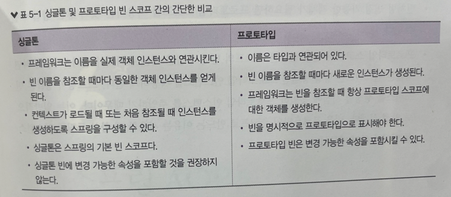

## 5장 - 스프링 컨텍스트: 빈의 스코프 및 수명주기 
스프링에서는 빈을 생성하고 수명 주기를 관리하는 여러가지 방식이 있다. 이것을 스코프 라고 한다 <br>
스프링 앱에서 자주 볼 수 있는 두 가지 스코프인 싱글톤 과 프로토타입이 있다 <br>
- Spring Bean 의 LifeCycle 을 관리하는 용어 -> 스코프 -> 스코프 안에는 싱글톤, 프로토타입 2가지가 있음

### Singleton Bean 스코프 사용
싱글톤 빈 스코프는 스프링 컨텍스트에서 빈을 관리하는 기본 방식을 정의한다. 이 방식은 실무에서 가장 많이 접하게 될 빈 스코프일 것이다 <br>

싱글톤 빈의 인스턴스를 생성하는 두 가지 방식(eager, Lazy) 를 사용해야 하는 위치를 논의해보자 <br>

#### 싱글톤 빈의 작동 방식
스프링 동작에서 시작해보자 <br>
특히 싱글톤은 스프링에서 가장 많이 사용되는 기본 빈 스코프 이므로 이 스코프를 사용할 때 무엇을 기대할 수 있는지 알아야 한다 <br>

스프링은 컨텍스트를 로드할 때 싱글톤 빈을 생성하고 빈에 이름(빈 ID) 를 할당한다 <br>
특정 빈을 참조할 때 항상 동일한 인스턴스를 얻기 때문에 이 스코프 이름을 싱글톤 이라고 한다 <br>

하지만 스프링 컨텍스트에서 이름이 다른 경우 동일한 타입의 인스턴스를 더 많이 가질 수 있음에 유의해야 한다 <br>

디자인패턴-싱글톤 패턴을 안다면 어플리케이션에 특정 타입의 인스턴스가 하나만 있어야 한다고 생각할 수 있으므로 스프링 동작이 이상해 보일 수 있다 <br>
스프링에서 싱글톤 개념은 동일한 타입의 여러 인스턴스를 허용하며, 싱글톤은 이름별로 고유하지만 앱 단위(프로젝트 단위)로 고유하지 않다는 것을 의미한다.<br>
즉 스프링에서 싱글톤은 스프링 컨텍스트에 해당 타입의 인스턴스가 하나마 있다는 것을 의미하지 않는다. 단지 인스턴스에 이름이 할당되고 동일한 인스턴스가 항상 그 이름을 통해 참조된다는 의미를 갖는다 <br>
즉 같은 객체를 반환해도 이름만 다르다면 상관없다는 뜻 <br>


#### @Bean 으로 싱글톤 스코프의 Bean 선언하기
@Bean 어노테이션을 이용하면 스프링 컨텍스트에 인스턴스를 추가할 수 있다. <br>
빈을 참조할 때마다 동일한 인스턴스를 얻는다는 것을 증명해보자 <br>

```java
@Configuration
public class ProjectConfig {
	@Bean
    public CommentService commentService() {
		return new CommentService();
    }
}
```

위 코드를 작성하면 스프링 컨텍스트에 commentService 라는 빈이 추가가 된다. 그걸 이제 테스트 해보자
```java
public class Main {
	public static void main (String[] args) {
        var c = new AnnotationConfigApplicationContext(ProjectConfig.class);
		var cs1 = c.getBean("commentService",CommentService.class);
		var cs2 = c.getBean("commentService",CommentService.class);
		
		boolean b1 = cs1 == cs2; // true
		System.out.println(b1);
	}
}
```
@Bean 이 아니라, 스테레오 타입으로 인스턴스를 추가했어도 결과는 똑같다는걸 알아야 한다 <br>
이 예제는 commentService 라는 이름을 명시적으로 사용했다. 만약 똑같은 인스턴스를 반환하는 빈이 2개라면<br>
1) @Bean(name="설정할이름") -> @Qualifire("설정한 이름")
2) @Primary 이 빈 부터 호출 해주세요~ 하는것

등 방법이 있다. <br>

만약 싱글톤 빈이 아니라면, cs1 과 cs2 는 false 가 나왔을 것이다. 왜냐하면 동일한 참조 값을 반환하지 않기 때문이다 <br>

#### 스테레오 타입 어노테이션으로 싱글톤 빈 선언하기
서비스 클래스 2개가 레포지토리에 종속되는 클래스 설계 시나리오를 생각해보자
```java
@Repository
public class CommentRepository {}

@Service
public class CommentService {
	@Autowired
	private CommentRepository commentRepository;
}
@Service
public class UserService {
	@Autowired
    private CommentRepository commentRepository;
}
```

- CommentRepository 를 빈에 추가한다.
- CommentService 를 빈에 추가한다.
    - 빈에 추가된 CommentRepository 를 가져와서 사용한다. -> @Autowired 를 사용하여 빈을 주입받는다.
- UserService 를 빈에 추가한다.
    - 빈에 추가된 CommentRepository 를 가져와서 사용한다.

위 구성을 사용하기 위해선 스트레오타입 어노테이션이 달린 클래스를 찾을 수 있는 위치만 스프링에 알려주면 된다 <br>
```java
@ComponentScan(basePackages={"services", "repositories"})
```

스프링부트를 사용하면 위 설정은 필요가 없다 <br>

이제 Main 클래스 통해서 두 서비스에 대한 참조를 가져오고 의존성을 비교하여 스프링이 두 서비스 다 동일한 인스턴스를 주입했는지 보자
```java
public class Main5 {
	public static void main (String[] args) {
		var c = new AnnotationConfigApplicationContext(ProjectConfig.class);
		var s1 = c.getBean(CommentService.class);
		var s2 = c.getBean(UserService.class);

		boolean  b=  s1.getCommentRepository() == s2.getCommentRepository();
		System.out.println(b);
	}
}
```

> true

가 나올 것이다.

#### 실제 시나리오의 싱글톤 빈
이제는 싱글톤 빈으로 작업할 때 주의 해야 할 사항을 논의할 차례이다 <br>
싱글톤 빈의 스코프는 앱의 여러 컴포넌트가 하나의 객체 인스턴스를 공유할 수 있다고 가정하기 때문에 가장 중요하게 고려해야할 점은 불변 이어야 한다는 것이다 <br>

대부분 실제 앱은 여러 스레드로 작업들을 실행한다 <br>
이런 시나리오에서는 여러 스레드가 동일한 객체 인스턴스를 공유한다 <br>
이런 스레드가 인스턴스를 변경하면 레이스 컨디션(경쟁 상태)가 발생한다 <br>
-> 스레드끼리 서로 CPU 를 할당받기 위해 경쟁하는 상태를 말하는 것 <br>

경쟁 상태는 멀티스레드 아키텍처에서 여러 스레드가 공유자원을 변경하려고 할 때 발생한다 <br>
경쟁 상태가 발생하면 개발자는 스레드를 적절히 동기화를 하여 예기치 않은 실행 결과나 오류를 방지해야 한다 <br>

이 경쟁 조건은 빈이 동시성을 위해 설계되지 않으면 예기치 않은 결과나 실행 예외를 유발한다 <br>

속성이 변경되는 가변 싱글톤 빈을 사용하려면 주로 스레드 동기화를 사용하여 동시성이 있는 빈이 되도록 직접 만들어야 한다 <br>

하지만 싱글톤 빈은 동기화 되지 않도록 설계되었다 <br>
싱글톤 빈은 일반적으로 어플리케이션에 근간이 되는 클래스를 설계를 정의하고, 책임을 위임하는 데 사용된다 <br>

기술적으로는 동기화가 가능하지만 좋은 방법은 아니다 <br>
동시성이 있는 인스턴스에서 스레드를 동기화하면 앱 성능에 큰 영향을 미칠 수 있다 <br>

생성자 주입의 장점은 인스턴스를 불변으로 만들 수 있다는 것이다 (빈의 필드를 final 로 정의) <br>

스프링 컨텍스트에서 객체 빈을 만들어야 한다면 불변인 경우에만 싱글톤으로 만들어야 한다 -> 변경 가능한 싱글톤 빈을 설계하지 마라<br>

#### 즉시 지연 및 인스턴스 생성 방식
대부분의 경우 스프링은 컨텍스트를 초기화 할 때 모든 싱글톤 빈을 생성하는데, 이것은 기본 스프링의 동작이다 <br>
지금까지는 우리는 기본 동작만 사용했는데, 이를 **즉시 인스턴스 생성** 이라고 한다 <br>

다른 방식인 **지연 인스턴스 생성** 또한 있다 <br>
지연 인스턴스 방식은 스프링 컨텍스트를 생성할 때 싱글톤 인스턴스를 생성하지 않는다 <br>
그 대신 빈을 참조할 때 각 인스턴스를 생성한다 <br>

스프링 부트에서 @ComponentScan 어노테이션을 사용할 필요가 없는 경우가 많습니다. <br>
이는 스프링 부트가 자동으로 컴포넌트를 스캔하고 애플리케이션의 기본 패키지를 포함한 하위 패키지들을 모두 스캔하기 때문입니다. <br>
하지만 특정 상황에서는 @ComponentScan을 명시적으로 사용할 수도 있습니다.

```java
@Service
public class CommentService{
	public CommentService() {
      System.out.println("CommentService bean 생성");
    }
}
```

Main 클래스에는 스프링 컨텍스트의 인스턴스만 생성한다 <br>
여기에서 관찰해야 할 점은 그 누구도 빈을 생성하지 않았다 <br>

하지만 스프링은 컨텍스트에 인스턴스를 생성하고 저장한다 <br>
서버를 실행할 때 빈 클래스의 생성자에서 출력 메시지를 보고 스프링이 인스턴스를 생성한다 <br>

```java
public static void main (String[] args) {
  var c = new AnnotationConfigApplicationContext(ProjectConfig.class);
}
```

위 코드를 실행 시키면<br>
> CommentService bean 생성

이번 예제에서는 @Lazy 어노테이션을 추가해서 변경한다<br>
누군가 빈을 사용할 때만 생성하도록 스프링에 지시했기 때문에 앱을 실행할 때 콘솔에 앞의 메시지가 더 이상 출력되지 않는 것을 볼 수 있다 <br>
```java
@Lazy // 누군가 처음 이 빈을 참조할 때만 스프링에 빈을 생성하도록 지시한다.
@Service
public class CommentService1 {

  public CommentService1 () {
    System.out.println("CommentService1 instance created!");
  }

}
```

그러면 언제 즉시(eager) 인스턴스를 사용하고 언제 지연(Lazy) 인스턴스를 사용해야 할까? <br>
대부분의 경우 컨텍스트 인스턴스가 생성될 때 프레임워크가 처음부터 모든 인스턴스를 생성하도록 하는 것이 더 편리하다 <br>
지연 로딩 방식을 장점은 무언가 잘못되어 프레임워크가 빈을 생성할 수 없다면, 앱을 시작할 때 이 문제를 체크할 수 있다 <br>

보통은 기본적으로 즉시 인스턴스 생성 방식을 사용한다 <br>
### Prototype Bean 스코프 사용
싱글톤 빈 대신 프로토타입 빈을 사용할 수 있다 <br>

#### 프로토타입 빈의 동작 방식
프로토타입 빈에 대한 참조를 요청할 때 마다 스프링은 새로운 객체 인스턴스를 생성한다 <br>
프로토타입 빈의 경우 스프링은 객체 인스턴스를 직접 생성하고 관리하지 않는다 <br>

스프링 프레임워크는 객체의 타입을 관리하고 빈에 대한 참조를 요청받을 때 마다 새로운 인스턴스를 생성한다 <br>
프로토타입 = 커피 나무 라고 생각을 하자 <br>

빈의 스코프를 변경하려면 @Scope 라는 새 어노테이션을 사용해야 한다 <br>

기본 작업은 다 싱글톤 빈 스코프로 작동이 된다 <br>
@Scope(BeanDefinition.SCOPE_PROTOTYPE) 어노테이션을 붙이면 프로토타입 스코프으로 작동이 된다<br>

프로토타입 빈을 사용하면 빈을 요청하는 각각의 스레드가 서로 다른 스레드가 서로 다른 인스턴스를 얻는다 <br>
그러므로 더 이상 동시성 문제가 발생하지 않는다 <br>
따라서 변경 가능한 프로토타입 빈을 정의하는 것으 문제가 되지 않는다 <br>

#### @Bean 으로 프로토타입 스코프의 빈 선언하기
```java
public class CommentService6 {
}
@Configuration
public class ProjectConfig6 {
	
	@Bean
	@Scope(BeanDefinition.SCOPE_PROTOTYPE)
	public CommentService6 commentService6() {
		return new CommentService6();
	}
}
```

빈을 요청할 때마다 새로운 인스턴스를 얻는 다는 것을 증명하고자 테스트를 해보자
```java
public class Main6 {
	public static void main (String[] args) {
		var c = new AnnotationConfigApplicationContext(ProjectConfig6.class);

		var cs1 = c.getBean("commentService6", CommentService6.class);
		var cs2 = c.getBean("commentService6", CommentService6.class);

		System.out.println(cs1==cs2); // 값(스택) 비교
		System.out.println(cs1.equals(cs2)); // 힙 주소 비교
		System.out.println(cs1);
		System.out.println(cs2);
	}
}

```
> false <br>
false <br>
org.exmplae.spring.ch6.CommentService6@52bf72b5 <br>
org.exmplae.spring.ch6.CommentService6@37afeb11 <br>

위 결과를 보면 서로 다른 주소를 가지고 있는 것을 볼 수 있다. 즉 두 인스턴스가 다르다는 것을 증명한다 <br>

#### 스테레오 타입 어노테이션으로 프로토타입 빈 스코프 빈 선언하기
```java
@Service
public class CommentService6 {
	
	@Autowired
	private CommentRepo6 commentRepo6; // bean 주입 받기

	public CommentRepo6 getCommentRepo6 () {
		return commentRepo6;
	}

}
@Service
public class UserService6 {
  @Autowired
  private CommentRepo6 commentRepo6;

  public CommentRepo6 getCommentRepo6 () {
    return commentRepo6;
  }

}
```

#### 실무에서 프로토타입 빈 관리
지금부터 사용 사례와 프로덕션 앱에서 프로토타입 스코프의 빈을 사용해야 하는 경우에 더 중점을 두고 보자 <br>

프로토타입 빈이 적합한 시나리오와 싱글톤 빈을 이용하여 프로토타입 빈을 피해야 하는 시나리오를 보자 <br>

프로토타입 빈을 싱글톤 빈만큼 자주 접하지는 않지만, 빈을 프로토타입으로 만들지 결정하는 데 사용할 수 있는 좋은 패턴이 있다 <br>
싱글톤 빈은 변경되는 객체와는 그다지 좋은 관계는 아니다 <br>

예시를 한번 보자 -> Service 클래스는 가변 객체를 사용하여 로직을 구현한다.
```java
public class CommentProcessor {
	private Comment comment;

	public void setComment (Comment comment) {
		this.comment = comment;
	}

	public Comment getComment () {
		return this.comment;
	}

	public void processComment(Comment comment) {
		// comment 속성 변경
	}

	public void validateComment(Comment comment) {
		// comment 속성 검증
	}

}

@Service
public class CommentService6_1 {

  public void sendComment(Comment c) {
    CommentProcessor cp = new CommentProcessor();
    cp.setComment(c);
    cp.processComment(c);
    cp.validateComment(c);

    c = cp.getComment(); // 수정된 Comment 인스턴스를 가져와 추가로 사용한다.
  }
}

```

일단 CommentProcessor 객체는 스프링 컨텍스트 안에 있는 빈도 아니다 <br>

일반적으로 스프링에서 객체에 특정 기능을 보강하려는 경우가 있다면(=DI 장점을 누리려면) 언제나 그 객체는 빈이 되어야 한다 <br>

그러면 CommentProcessor 를 빈으로 만들어야 한다 <br>
근데 싱글톤 스코프로 정의할 수 있을까? 이 빈을 싱글톤으로 정의하고 여러 스레드가 이 빈을 동시에 사용하면 <br>
스레드 끼리 레이스 컨디션 상태에 빠진다 <br>

어떤 스레드에서 어떤 댓글을 제공했는지 알수가 없다 <br>
```java
@Scope(BeanDefinition.SCOPE_PROTOTYPE)
@Component
public class CommentProcessor {
	@Autowired // 빈에 등록된 CommentRepo6 를 주입받아서 사용하겠다
	private CommentRepo6 commentRepo6;

}
```

이제 스프링 컨텍스트에서 CommentProcessor 를 가져올 수있다 <br>

보통 어플리케이션 개발 시 프로토타입 빈과 가변 인스턴스를 피하는 것을 선호한다 <br>


### 질문
p153 (그림5-7) -> 그럼 평소에 실행하는 싱글톤 빈은 한개의 스레드에서 여러 인스턴스를 다 생성하나? <br> 
p158 내용 이해가 안됌, 왜 스프링 컨텍스트에서 관리를 할 필요가 없지?
p160 예제 5-10 이 이해가 잘 안됌 