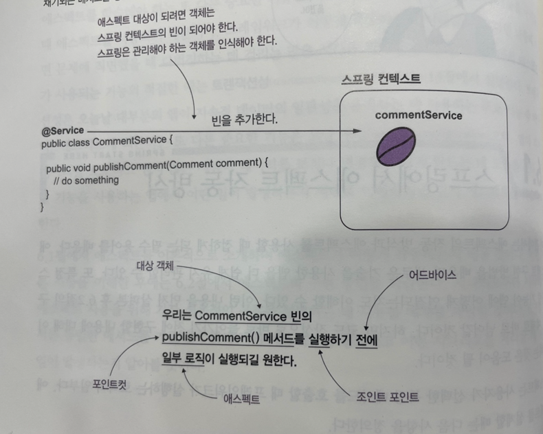

# 6장 - 스프링 AOP 로 애스펙트 사용
지금까지 우리가 사용한 유일한 스프링 기능은 IoC 원칙 기반의 DI 이다 <br>
DI 를 사용하면 프레임워크가 사용자가 정의한 객체를 관리하고, 필요한 곳에서 그 객체를 사용하도록 요청할 수 있다 <br>

빈을 참조하게 하려면 대부분 @Autowired 를 사용하며, 스프링 컨텍스트에서 이런 객체를 요청한 곳에 객체를 주입한다 -> DI

IoC 원칙에 기반을 둔 또 다른 강력한 기술인 **Aspects** 의 사용 방법을 알아보자

애스펙트는 프레임워크가 메소드 호출을 가로채고 그 메소드의 실행을 변경할 수 있는 방법으로 <br>
사용자가 선택한 특정 메소드 호출 실행에 영향을 줄 수있다 <br>

-> 스프링 인터셉터랑 비슷한 느낌???? <br>

이 방법을 실행하면 실행중인  메소드에 속한 로직 일부를 추출할 수 있는데, 특정 시나리오에서는 코드 일부를 분리하면 해당 메소드를 더 쉽게 이해할 수 있다 <br>
이것을 통해서 개발자는 메소드 로직을 읽을 때 로직과 관련된 세부 사항에만 집중할 수 있다 <br>

에스펙트는 강력한 도구이므로 신중하게 사용하지 않으면 원하는 목적과는 반대로 유지 관리하기 어려워질 수 있다 <br>
이런 접근 방식을 애스펙트(관점) 지향 프로그래밍 이라고 한다 <br>

애스펙트를 학습해야하는 이유는 스프링이 제공하는 많은 중요한 기능을 구현할 때 애스펙트를 사용하기 때문이다 <br>
스프링에서 애스펙트가 사용되는 기능의 적절한 예는 트랜잭션성 이다 <br>

## 스프링에서 애스펙트 작동 방식
애스펙트는 사용자가 선택한 특정 메소드르 호출할 때 프레임워크가 실행하는 로직의 일부다 
- 특정 메소드를 호출할 때 스프링이 실행하기 **원하는 코드**는 무엇인지 정의한다. 이를 **애스펙트**라고 한다 (무엇인지)
- 앱이 **언제**(메소드 호출 전 후) 이 애스펙트 로직을 실행해야 하는지 정의한다 이를 **어드바이스** 라고한다. (언제)
- 프레임워크가 **어떤** 메소드를 가로채기 해서 해당 애스펙트를 실행해야 하는지 정의한다 이를 **포인트컷** 라고한다 (어떤)

애스펙트 용어와 함께 애스펙트 실행을 트리거 하는 이벤트를 정의해주는 **조인트 포인트** 개념도 있다.
스프링에서 이런 이벤트는 항상 메소드 호출이다 <br>

의존성 주입과 마찬가지로 애스펙트를 사용하려면 애스펙트를 적용하려는 객체를 관리할 수 있는 프레임워크가 필요하다 <br>
스프링 컨텍스트에 빈을 추가하고 프레임워크가 빈을 제어해서 사용자가 정의한 애스펙트를 적용할 수 있습니다 <br>
애스펙트가 가로챈 메소드를 선언하는 빈 이름을 대상 객체 라고 한다 <br>

#### 정리
스프링은 특정 메소드(포인트컷) 이 호출될 때, 일부 로직(애스펙트)를 실행한다 <br>
포인트컷에 따라 로직이 실행되는 시점(어드바이스을 지정해야 한다<br>
스프링이 메소드를 가로채려면 가로채기 되는 메소드를 정의하는 객체가 스프링 컨텍스트에 빈으로 등록되 있어야한다 -> 빈에 등록된 객체만 애스펙트 할 수 있다 <br>
 <br>

그렇다면 스프링은 어떻게 각 메소드 호출을 가로채서 애스펙트 로직을 적용할까?<br>
스프링은 실제 메소드 대신 애스펙트 로직을 호출하는 객체를 제공한다 <br>
스프링은 실제 빈 대신 **프록시** 객체를 제공한다 <br>
이제 컨텍스트의 getBean() 메소드를 직접 사용하든, DI 를 사용하든 컨텍스트에서 빈을 얻을 때는 빈 대신 프록시 객체를 받는다 <br>
이렇게 감싸는 방식을 **위빙**(실제 빈 대신 프록시 객체 이용) 이라고 한다.<br>

평소처럼 빈을 등록을 해도, 빈이 애스펙트 대상인걸 스프링이 확인하면 <br>
실제 객체를 주입하지 않고, 프록시 객체를 주입한다는 소리이다 <br>
프록시 객체는 가로챈 메소드에 대한 호출을 모두 관리하고 애스펙트 로직을 적용할 수 있다 <br>

애스펙트 대상인 객체를 콘솔에 출력하면 **EnhancedBySpring** 이라는 메시지가 출력이 될 것이다. <br>

메소드가 애스펙트화 되지 않은 경우 호출은 메소드로 직접(다이렉트)로 전달된다 <br>

만약 애스펙트를 정의하고 호출을 하면 스프링이 제공하는 프록시 객체를 1차적으로 가서 먼저 설정해둔 메소드를 실행하고<br>
다음으로 진짜 실행해야할 메소드로 호출을 위임한다.

## 스프링 AOP 를 사용한 애스펙트 구현
서비스 클래스로 여러 사용 사례를 구현하는 애플리케이션이 있다고 가정해보자 <br>

### 간단한 애스펙트 구현
```java
@Service
public class CommentService6 {
	// JDK 로깅 기능
	private Logger logger = Logger.getLogger((CommentService6.class.getName()));

	public void publishComment(Comment comment) {
		logger.info("Publishing comment " + comment.getText());
	}
}
```

#### 애스펙트 구현 단계
#### 1) 스프링 앱에서 애스펙트를 활성화 한다
첫번째는 어플리케이션에서 어떤 메커니즘을 사용할 것인지 스프링에 지시해야 한다 <br>
스프링에서 제공하는 특정 메커니즘을 사용할 때 마다 특정 어노테이션으로 구성 클래스에 어노테이션을 지정하여 <br>
명시적으로 활성화 해야 한다 <br>

대부분 이런 어노테이션 이름은 'Enable' 로 시작한다 <br>
예제에서는 @EnableAspectJAutoProxy 어노테이션을 사용하여 애스펙트 기능을 활성화 해야 한다 <br>
```java
@EnableAspectJAutoProxy // 스프링 앱에서 애스펙트 메커니즘 활성화 한다.
```

#### 2) 애스펙트 클래스를 생성하고 스프링 컨텍스트에 애스펙트 빈을 추가한다.
```java
@ComponentScan(basePackages = {"*"})
@EnableAspectJAutoProxy // 스프링 앱에서 애스펙트 메커니즘 활성화 한다.
@Configuration
public class ProjectConfig6 {

	@Bean
	@Scope(BeanDefinition.SCOPE_PROTOTYPE)
	public CommentService6 commentService6() {
		return new CommentService6();
	}

	// LoggingAspect 클래스 인스턴스를 스프링 컨텍스트에 추가한다.
	@Bean
	public LoggingAspect aspect() {
		return new LoggingAspect();
	}
}
```

스프링은 관리해야 하는 모든 객체를 알아야 하므로 이 객체를 스프링 컨텍스트에서 빈으로 만들어야 한다는 점을 기억하자 <br>

또한 @Aspect 어노테이션은 스테레오 타입 어노테이션이 아니다 <br>
@Aspect 를 사용하면 이 클래스가 애스펙트 정의를 구현한다고 스프링에 알려 줄 수 있지만 스프링이 이 클래스에 대한 빈을 생성해주는 것은 아니다<br>

#### 3) 애스펙트 로직을 구현할 메소드를 정의하고 어드바이스 어노테이션을 사용하여 언제 어떤 것을 가로챌지 스프링에 지시한다.
```java
	@Around("execution(* spring.*.*(..))")
	public void log(ProceedingJoinPoint proceedingJoinPoint) throws Throwable {
		proceedingJoinPoint.proceed();
	}
```

- @Around 어떤 메소드 호출을 가로채야 하는지 지정한다.
- 위 @Around 안에 뜻은 , 메소드의 리턴ㅌ타입, 클래스, 매개변수 관계없이 스프링이 spring 에 속한 패키지에 있는 틀래스에 정의된 모든 메소드를 가로챈다 <br>
```java
	@Around        ("execution    (*                               spring                  .*                   .*                (..))")
// 메소드 호출 가로챔   ~이 호출될 때    (*) 가로챌 메소드 리턴타입 아무거나 가능 ("spring")패키지에 속해야함   (*)어떤 클래스들 상관없  (모든 메소드 가로챔)   (매개변수 아무거나 가능)
```

#### 4) 애스펙트 로직을 구현한다.
1) 메소드 가로챈다
2) 가로챌 메소드가 호출되기 전에 콘솔에 메시지를 출력한다.
3) 가로챌 메소드가 호출된다.
4) 가로챌 메소드가 호출된 후 콘솔에 메시지를 출력한다.

```java
@Aspect
public class LoggingAspect {
	
	private final Logger log = Logger.getLogger(LoggingAspect.class.getName());

	@Around("execution(* CommentService6.*.*(..))")
	public void log(ProceedingJoinPoint proceedingJoinPoint) throws Throwable {
		log.info("Method will execute"); // 가로챌 메소드 실행하기 전 출력
		proceedingJoinPoint.proceed(); // 가로챌 메시지 출력
		log.info("Method done"); // 가로챈 메소드를 실행한 후 메시지를 출력
	}

}
```

proceed() 메소드는 가로챌 메소드인 CommentService6 빈 안에 메소드 들의 호출한다 <br>
proceed() 를 호출하지 않는다면 애스펙트는 가로챌 메소드에 위임되지 않는다 <br>

만약 호출하지 않는다면 애스펙트는 가로챌 메소드에 더 이상 위임하지 않고 가로챌 메소드 대신에 해당 컴포넌트가 단순히 실행된다 <br>

애스펙트는 모든 호출을 가로채지 않는다 <br>

또 proceed() 메소드가 Throwable 을 던지는 것을 확인해야 한다 <br>

proceed() 메소드는 가로챈 메소드에서 발생하는 모든 예외를 던지도록 설계되었다 <br>

#### 가로챈 메소드의 매개변수 및 반환 값 변경
서비스 메소드를 호출하는데 사용된 매개변수와 메소드가 반환된 내용을 기록하려고 한다고 가정해 보자 <br>
```java
@Service
public class CommentService6 {
	// JDK 로깅 기능
	private Logger logger = Logger.getLogger((CommentService6.class.getName()));

	public String publishComment(Comment comment) {
		logger.info("Publishing comment " + comment.getText());
		return "Success";
	}
}
```

애스펙트는 가로챈 메소드 이름 및 매개변수를 쉽게 찾을 수 있다 <br>
애스펙트 메소드의 Proceeding JoinPoint 매개변수는 가로챈 메소드를 나타낸다 <br>
이 매개변수를 사용하여 가로챈 메소드와 관련된 모든 정보를 가져올 수 있다 <br>
```java
String methodName = joinPoint.getSignature().getName();
Object[] arguments = joinPoint.getArgs();
```

이제 세부 정보를 로깅하도록 애스펙트를 수정한다 <br>
```java
	@Around("execution(* CommentService6.*.*(..))")
	public Object log(ProceedingJoinPoint proceedingJoinPoint) throws Throwable {
		String methodName = proceedingJoinPoint.getSignature().getName();
		Object[] args = proceedingJoinPoint.getArgs();

		log.info("MethodName is : " + methodName + " with parameters : " + Arrays.asList(args) + " will execute");
		Object result = proceedingJoinPoint.proceed(); //
		log.info("Method executed and returned : " + result); // 가로챈 메소드를 실행한 후 메시지를 출력
		return result;
	}
```

```java
public class Main6 {
	private static Logger log = Logger.getLogger(Main6.class.getName());
	public static void main (String[] args) {

		var c = new AnnotationConfigApplicationContext(ProjectConfig6.class);

		var service6 = c.getBean(CommentService6.class);
		Comment comment = new Comment();
		comment.setText("jin");
		comment.setAuthor("kyu");
		String value = service6.publishComment(comment);
		log.info(value);
	}
}

```

앱을 실행하면 가로챈 메소드가 출력한 메시지 출력을 하고 애스펙트가 출력한 반환값이 출력되고 main() 메소드가 출력이 된다.<br>

가로챈 메소드의 호출을 매우 유연하게 변경할 수 있다 <br>
애스펙트를 통해 로직을 변경하면 로직의 일부가 투명해져 잘 드러나지 않는다 <br>

**📌기술을 사용하기 전에 어떻게 동작하는지 학습해야 한다.**

### 어노테이션된 메소드 가로채기
```java
@Target(ElementType.METHOD)
@Retention(RetentionPolicy.RUNTIME)
public @interface ToLog {

}

@Service
public class CommentService {
	private Logger log = Logger.getLogger(CommentService.class.getName());

 	public void publicComment(Comment comment) {
		 log.info("Public comment: " + comment.getText());
	}
	
	@ToLog
	public void deleteComment(Comment comment) {
		 log.info("Delete comment: " + comment.getText());
	}
	
	public void updateComment(Comment comment) {
		 log.info("Update comment: " + comment.getText());
	}
}

```

어노테이션된 메소드를 가로챌 것이니 @ToLog 붙은 메소드를 가로챈다는 예상을 할 수 있다 <br>
```java
@Aspect
public class LoggingAspect {
	private Logger log = Logger.getLogger(LoggingAspect.class.getName());
	
	@Around("@annotation(ToLog)")
	public Object log(ProceedingJoinPoint proceedingJoinPoint) throws Throwable {
		return Object.class;
	}
}

```

@Around 를 통해 위빙을 한다. 위빙을 통해서 ToLog 어노테이션이 붙은 메소드를 찾아낸다 <br>
즉 Service 클래스에서 @ToLog 가 붙은 deleteComment() 만 가로 챈다 <br>

### 사용 가능한 다른 어드바이스 어노테이션
@Around 를 사용할 경우 여러경우에 다 사용할 수 있다 <br>
스프링은 간단한 시나리오를 위해 대체 어드바이스 어노테이션을 제공한다 <br>
- @Before: 가로채기된 메소드가 실행하기 전에 애스펙트 로직을 정의하는 메소드 호출
- @AfterRunning: 메소드 성공적 반환 후, aop 로직 정의 메소드 호출 및 반환 값을 aop 메소드에 매개변수로 제공한다.
- @AfterThrowing: 가로채기된 메소드가 예외를 던지면 애스펙트 로직을 정의하는 메소드를 호출하고 예외 인스턴스를 애스펙트 메소드의 매개변수로 전달
- @After: 메소드 성공,실패 여부 관계 없이, 가로채기 된 메소드 실행 후에만 애스펙트 로직을 정의하는 메소드를 호출한다 

```java
	@AfterReturning(value = "@annotation(ToLog)", returning = "returnedValue")
	public void log(Object returnedValue) {
		log.info("[AOP Method executed] : " + returnedValue);
	}
```

## 애스펙트 실행 체인
실제 어플리케이션에서는 메소드가 애스펙트 두 개 이상으로 가로채기될 때도 많다 <br>
- SecurityAspect: 이 애스펙트는 보안 제한을 적용한다.
- LoggingAspect: 이 애스펙트는 가로챈 메소드 실행의 시작과 끝을 로깅한다.

애스펙트 실행 순서는 때때로 중요할 수 있다.<br>
기본적으로 스프링은 동일한 실행 체인에 있는 두 애스펙트가 호출되는 순서를 보장하지 않는다 <br>
애스펙트 실행 순서를 정의해야 한다면 @Order 어노테이션을 사용하여 정의한다 <br>
해당 어노테이션에 숫자가 작을 수록 더 일찍 실행이 된다 <br>

```java
	@Around(value = "@annotation(ToLog)")
	public Object log(ProceedingJoinPoint proceedingJoinPoint) throws Throwable {
		log.info("Calling the intercepted method");
		Object returnValue = proceedingJoinPoint.proceed();
		log.info("[AOP Method executed] : " + returnValue );
		return returnValue;
	}
```

```java
@Aspect
public class SecurityAspect {
	private Logger log = Logger.getLogger(SecurityAspect.class.getName());
	
	@Around(value="@annotation(ToLog)")
	public Object secure(ProceedingJoinPoint joinPoint) throws Throwable {
		log.info("SecurityAspect Calling");
		Object result = joinPoint.proceed();
		log.info("SecurityAspect Returning" + result);
		return result;
	}
}

```

### 질문
1) p166 -> 스프링에서 이런 이벤트는 항상 메소드 호출이다 -> 무슨 말이지?? 
2) AOP 는 어느 상황에서 쓰여야 적절한 걸까? 실제 개발시 aop 의 필요성을 아직 느껴본적 없음