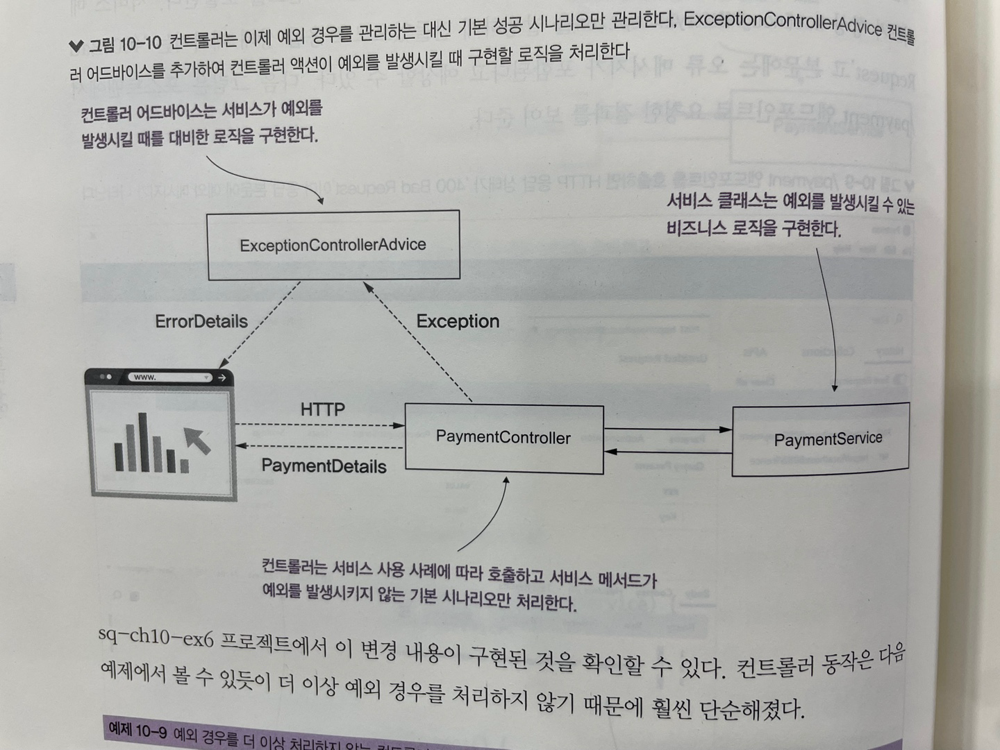

# 10장 - REST 서비스 구현
REST 서비스는 두 앱간 통신을 구현하는데 가장 자주 접하는 방법 중 하나로, 클라이언트가 호출할 수 있는<br>
엔드포인트를 이용하여 서버가 노출하는 기능에 액세스 할 수 있게 해준다 <br>

웹 앱에서는 REST 서비스를 이용하여 클라이언트와 서버 간 통신을 설정하지만 <br>
모바일 앱과 백엔드, 두 백엔드 서비스 간 통신을 개발하는데 REST 서비스를 이용할 수 있다 <br>

요즘은 백엔드 엔드포인트를 이용하여 백엔드 솔루션을 호출할 수 있다 <br>
백엔드 서비스 간에도 REST 웹 서비스 호출을 사용하여 통신할 수 있다 <br>

## REST 서비스를 이용한 앱 간 데이터 교환
REST 엔드포인트는 단순히 두 앱 간 통신을 구현하는 방법이며, HTTP 메소드와 경로에 매핑된 컨틀러로 액션을 구현하는 것만큼 간단하다 <br>
앱은 HTTP 로 이 컨트롤러 액션을 호출한다 <br>
앱은 웹 프로토콜로 서비스를 노출하는 방식을 따르기 때문에 우리는 이 엔드포인트를 웹 서비스 라고 한다 <br>

즉 스프링에서 REST 엔드포인트는 HTTP 메소드와 경로에 매핑된 컨트롤러 액션이다 <br>
일반 API 는 디스패처 서블릿이 뷰리졸버를 통해 뷰를 찾는데 <br>
REST 는 디스패처 서블릿이 뷰를 찾지 않는다 <br>
즉 뷰 리졸버를 찾지 않는다 <br>

서버는 컨트롤러의 액션이 반환하는 것을 클라이언트에 대한 HTTP 응답으로 직접 전송한다 <br>
1) http 요청 받음
2) 톰캣이 요청을 받아 스프링 앱에 전달
3) 디스패처 서블릿이 받아서 핸들러 매핑 호출
4) 핸들러 매핑이 어느 컨트롤러 호출할지 매핑
5) 뷰 리졸버를 가지않고 디스패처 서블릿으로 바로 값 리턴 함.
6) 톰캣이 응답받아 클라이언트로 전달

위 순서를 가진다 <br>

REST API 의 단점<br>
- 컨트롤러 작업이 완료되는데 오랜 시간이 소요된다면 엔드포인트에 대한 HTTP 호출이 타임아웃 되어 통신이 중단될 수 있다.
- 한번의 호출에 대량의 데이터를 전송하면 호출이 타임아웃 될 수 있음
- 네트워크에 영향을 많이 받기에 호출이 실패할 수 있다.
- 동시 호출이 과도하면 앱은 지나치게 많은 부하를 받아 실패할 수 있다.

## REST 엔드포인트 구현
@ResponseBody 어노테이션은 컨트롤러의 액션이 뷰 이름이 아니라 HTTP 응답으로 <br>
직접 전송된 데이터를 반환한다는 것을 디스패처 서블릿에 알려준다 <br>

```java
@Controller
public class HelloController {

	@GetMapping("/hello")
	@ResponseBody
	public String hello() {
		return "Hello";
	}
}

```

화면에 Hello 가 응답이 될 것이다 <br>

위 처럼 작업을 하면 모든 http 메소드에 @ResponseBody 를 붙여야 한다 <br>
위 수고를 덜기 위해 스프링에서 @ResponseBody 를 내포하는 어노테이션을 만들었다 <br>

@RestController 를 사용하여 모든 액션이 REST 엔드포인트라고 스프링에 지시할 수 있다 <br>
```java
@RestController
public class HelloController {

	@GetMapping("/hello")
	public String hello() {
		return "Hello";
	}
}

```

위 두코드는 같은 응답을 가진다 <br>

엔드포인트를 검증하는 도구가 있다.<br>
1) postman
2) curl
3) 크롬 플로그인
4) 인텔리제이 .http 파일

## HTTP 응답 관리
HTTP 응답은 클라이언트 요청에 따라 백엔드 앱이 클라이언트에 데이터를 재전송하는 방식이다.
- 응답 헤더: 응답에 포함된 작은 데이터 조각이다.
- 응답 본문: 백엔드에서 응답으로 보내야 하는 많은 양의 데이터
- 응답 상태: 요청 결과를 간략하게 표현한 내용이다.

### 객체를 응답 본문에 전송
응답으로 클라이언트에 객체를 보내려면 컨트롤러의 액션이 해당 객체를 반환하게 만들기만 하면 된다 <br>

두 앱간에 전송되는 데이터를 모델링하려고 할때 사용하는 객체를 DTO(데이터 전송 객체) 라고 한다 <br>

@RestController 를 추가하면 스프링 컨텍스트에 빈으로 추가하고 <br>
디스패처 서블릿이 메소드가 반환될 때 뷰를 찾지 않도록 지시하는 것이다.

```java
public class Country {
	private String name;
	private int population;

	public Country () {
	}

	public Country (String name, int population) {
		this.name = name;
		this.population = population;
	}

	public String getName () {
		return name;
	}

	public void setName (String name) {
		this.name = name;
	}

	public int getPopulation () {
		return population;
	}

	public void setPopulation (int population) {
		this.population = population;
	}

	public static Country of(final String name, final int population) {
		Country country = new Country();
		country.setName(name);
		country.setPopulation(population);
		return country;
	}
}

```

```java
@RestController
public class CountryController {

	@GetMapping("/france")
	public Country france() {
		Country c = new Country("france",10000);
		return c;
	}

	@GetMapping("/all")
	public List<Country> all() {
		Country countries = Country.of("France",1000);
		Country countries2 = Country.of("Germany",2000);
		Country countries3 = Country.of("Greece",3000);

		return List.of(countries3,countries2,countries);
	}
}
```

JSON 을 사용하는 것은 REST 엔드포인트로 작업할 때 객체를 표현하는 가장 일반적인 방법이다 <br>

### 응답 상태 및 헤더 설정
기본적인 스프링은 공통 HTTP 상태 설정
- 200 OK
- 404 Not Found
- 400 Bad Request
- 500 Server Internal Error

하지만 대표적인 위 상황 말고 사용자가 직접 정의를 해야 할 때가 있다 <br>

HTTP 응답을 사용자 정의할 때 가장 쉽고 일반적인 방법은 ResponseEntity 클래스를 사용하는 방법이다 <br>
스프링에서 제공하는 이클래스를 사용한다면 HTTP 응답, 본문,상태,헤더를 지정할 수 있다.
```java
	@GetMapping("/france")
	public ResponseEntity<Country> france() {
		Country c = new Country("france",10000);
		return ResponseEntity
			.status(HttpStatus.ACCEPTED)
			.header("continent","Europe")
			.header("capital","Paris")
			.header("favorite_food","cheese and wine")
			.body(c);
	}
```

```java
HTTP/1.1 202 
continent: Europe
capital: Paris
favorite_food: cheese and wine
Content-Type: application/json
Transfer-Encoding: chunked
Date: Thu, 11 Jul 2024 15:49:53 GMT

{
  "name": "france",
  "population": 10000
}
```

위 응답을 얻을 수 있다. <br>

### 엔드포인트 수준에서 예외 관리
컨트롤러의 동작이 예외를 발생시키면 어떤일이 발생할지 고려하는 것이 중요하다 <br>
많은 경우 예외를 사용하여 특정한 상황을 알린다, 이 중 일부는 비즈니스 로직과 관련이 있다 <br>

예외를 관리하는 방법 중 하나는 위에서 설명했던 방식처럼, ResponseEntity<> 로 클래스를 감싸섯 예외가 발생했을 때 응답을 다르게 구성한다 <br>

```java
@RestController
public class PaymentController {
	
	private final PaymentService paymentService;

	public PaymentController (PaymentService paymentService) {
		this.paymentService = paymentService;
	}
	
	@PostMapping("/payment")
	public ResponseEntity<?> makePayment() {
		try {
		PaymentDetails paymentDetails = paymentService.processPayment();
		
		return ResponseEntity
			.status(HttpStatus.ACCEPTED)
			.body(paymentDetails);

		} catch (Exception e) {
			ErrorDetails errorDetails = new ErrorDetails();
			errorDetails.setMessage("Not enough Money to make the payment");
			return ResponseEntity
				.badRequest()
				.body(errorDetails);
		}
	}

}
```

컨트롤러 로직 흐름에 따라 어떤 객체를 반환할지 어떻게 결정할 수 있을까? <br>
예외가 발생하지 않을 때(앱이 결제를 성공적으로 완료하면) 'Accepted' 상태인 PaymentDetails 타입으로 Http 응답을 반환하려고 한다 <br>

위 방식은 개발자가 예외 사례를 관리하기 좋고, 많이 사용된다. <br>
하지만 더 복잡한 애플리케이션에서는 예외 관리의 책임을 분리하는 것이 더 편할 수 있다 <br>

1) 여러 엔드포인트에 대해 동일한 예외를 관리해야 할 때가 있는데, 코드 중복을 피하고 싶다
2) 특정한 사용 사례가 어떻게 동작하는지 이해해야 할 때 예외 로직을 한곳에서 모두 찾을 수 있게 관리한다.

위 이유로 컨트롤러 동작으로 발생하는 예외를 가로채고 가로챈 예외에 따라 사용자 로직을 적용하는 @RestControllerAdvice 를 추천한다

컨트롤러는 이제 예외 경우를 관리하는 대신 기본 성공 시나리오만 관리하고, 예외 케이스는 advice 가 가로채서 관리한다 <br>
 <br>

위 사진이 AOP 처럼 예외를 가로채는 것에 대한 아키텍쳐 이다 <br>

```java
@RestControllerAdvice
public class ExceptionControllerAdvice {
	
	@ExceptionHandler(value = NotEnoughMoneyException.class)
	public ResponseEntity<ErrorDetails> exceptionNotEnoughMoneyHandler() {
		ErrorDetails errorDetails = new ErrorDetails();
		errorDetails.setMessage("Not enough Money to make the Payment");
		return ResponseEntity
			.badRequest()
			.body(errorDetails);
	}
}
```

## 요청 본문을 사용하여 클라이언트의 데이터 가져오기
HTTP 요청 본문에서 클라이언트가 전송한 데이터를 가져오는 방법을 설명한다 <br>
http 요청에는 요청 본문이 있으며 이를 사용하여 클라이언트에서 서버로 데이터를 전송할 수 있다는 것이다 <br>
rest 엔드포인트에 http 요청 본문은 자주 사용된다 <br>
더 많은 양의 데이터를 전송해야 한다면 요청 본문을 사용한다 <br>

요청 본문을 사용하려면 @RequestBody 를 매개변수에 달기만 하면 된다 <br>
기본적으로 스프링은 사용자가 어노테이션한 매개변수를 표현하는데 JSON 을 사용한다고 가정하고 디코딩을 시도한다 <br>

만약 디코딩을 할 수 없으면 400 Bad Request 에러를 응답한다 <br>

```java
@RestController
public class PaymentController {
	private Logger log = Logger.getLogger(PaymentController.class.getName());
	
	private final PaymentService paymentService;

	public PaymentController (PaymentService paymentService) {
		this.paymentService = paymentService;
	}

	@PostMapping("/payment")
	public ResponseEntity<PaymentDetails> makePayment(@RequestBody PaymentDetails paymentDetails) {
		log.info("Received payment : " +  paymentDetails.getAmount());
		
		return ResponseEntity
			.status(HttpStatus.ACCEPTED)
			.body(paymentDetails);

	}

}
```

Http get 엔드포인트를 호출하는데 요청 본문을 사용할 수 있을까? <br>
2014년 이전에는 http 프로토콜 명세에서 http get 호출에 대해 요청 본문이 사용이 허용되지 않았다 <br>
클라이언트나 서버 측의 어떤 구현체도 Http Get 호출에 요청 본문을 사용할 수 있도록 허용하지 않았다 <br>

즉 http get 메소드에는 @RequestBody 를 쓰면 안된다 <br>
ex) RFC 7231


개인적인 질문 <br>
1) 자프링이 REST API 로 기능을 다 만들면, 모바일 쪽은 UI 를 만드는것만 하는건가?
2) 요즘 웹 앱이 많이뜨던데, 그건 어떻게 구성을 하는것일까?
   - 플러터? 웹으로 들어가도 모바일처럼 화면이 구성이되는데 플러터가 웹 UI 를 감싸는식인가?